# Coded UI Testing with VS Enterprise 2017

## Overview

**[Coded UI](https://msdn.microsoft.com/en-us/library/dd286726.aspx)** tests provide a way to create fully automated tests to validate the functionality and behavior of your application’s user interface. In this lab, you will gain a basic understanding of coded UI tests by creating a new test and adding validation logic to it.

<p align="center">
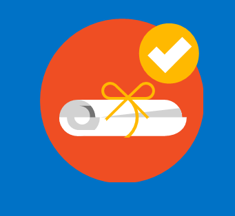
</p>

## Pre-requisites

- Visual Studio 2017 Enterprise
	- Ensure that you selected Coded UI during the install process, it is NOT installed by default. 
- Chrome, IE and Firefox browsers - depending on which you want to show running the Coded UI Tests.
- Download the **Selenium Components** from [here](https://marketplace.visualstudio.com/items?itemName=AtinBansal.SeleniumcomponentsforCodedUICrossBrowserTesting) and follow the same document for the required setup

## Demo steps

> **Talking Point**: <br />Coded UI tests provide a framework to create fully-automated tests that will validate the functionality and workflow of an application's user interface (UI). This is especially important because if new changes to the UI are deployed to an application, it is necessary to ensure that those changes will not break the application or cause unexpected behavior for the end-users. Since Coded UI tests rely on the validation of elements in the user interface, if the elements' identifiers are changed or removed and the tests are not updated, the tests may fail. However, the Coded UI tests will continue even if elements are moved around the view so as to remain flexible. In this demo, we will use the **Coded UI Test Builder** to generate test code for the Parts Unlimited Web application and modify the generated code in order to enable Cross Browser testing.

1. Open the *PartsUnlimited.sln* in Visual Studio.
    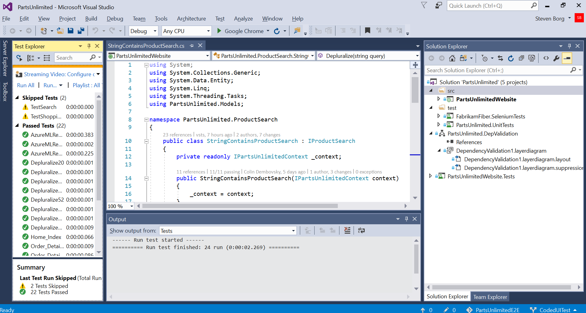

> **Talking Point**: <br />Let's start by adding a new Coded UI Test project to the solution. We'll use this to drive a browser as we search for various items in the catalog.

2. Create a new Coded UI Test Project by right-clicking on the "tests" folder in the PartsUnlimited solution, then selecting **Add -> New Project...**
	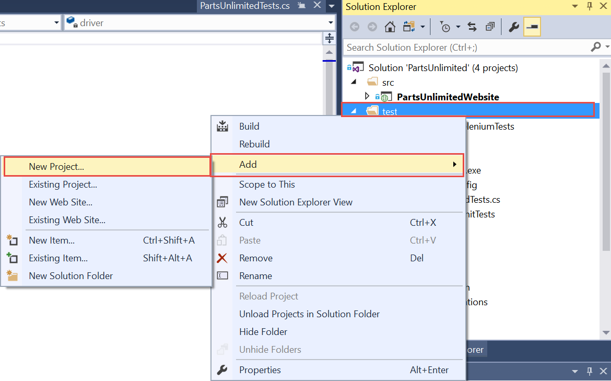
 
3. Name the Coded UI Test Project **PartsUnlimited.CodedUI** and then press **Create.**
	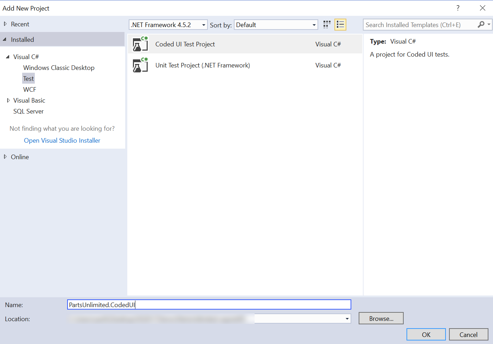

> **Talking Point**: <br />As you can see, just after the project is created, a pop-up window appears and prompts us to either use an existing action recording or record actions using the Coded UI Test Builder. We'll select "Record actions using the Coded UI Test Builder" so that we can record our actions in a browser. Now, if a manual tester had already run this test manually, we'd be able to simply generate the code from their test case execution. 

1. Click OK. <br />*Troubleshooting*: If the window doesn't open automatically, in the CodedUI.cs file, right-click in CodedUITestMethod1() and select "Generate code for Coded UI test."
	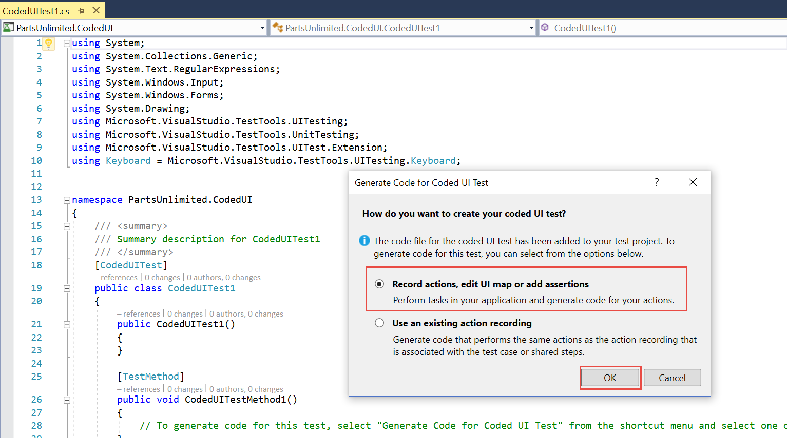
 
5. You should see the **Coded UI Test Builder** at the right bottom of your screen. Click on **Start Recording** (red square on the left in the Test Builder panel) and browse to the Parts Unlimited site (either [https://partsunlimitede2edemo.azurewebsites.net](https://partsunlimitede2edemo.azurewebsites.net) or [http://localhost](http://localhost) depending on where you are running the demo) through Internet Explorer. *Note: You may want to pin Internet Explorer to the taskbar to simplify the action recording before starting the recording.*
	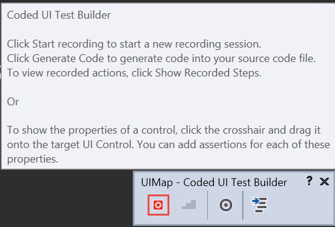

> **Talking Point**: <br /> At this point, we can start recording our Coded UI test using the Coded UI Test Builder. After navigating to Parts Unlimited, we are going to search in the upper-right text field for the keyword, "battery," then press the search button. It should return two results and we will validate that those two batteries exist.

6. In Parts Unlimited, search for "battery" in the search text field at the top of the page, then press "Enter" or click on the search button. Then press the pause button in the Coded UI Test Builder to stop recording. 
	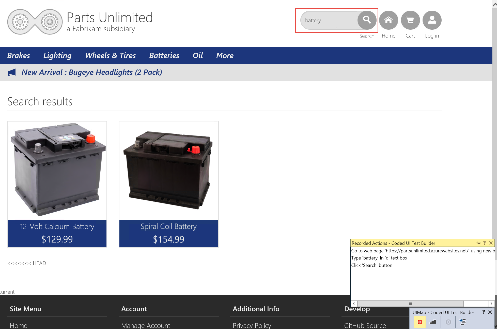

> **Talking Point**: <br /> Once we've completed a set of related actions we'll want to generate code. Each time we stop and generate code a new method will be created in our coded UI test.

7. Click on **Generate code** in the Test Builder to generate the code for your recorded steps. Name the method something descriptive then click on "Add and generate."
	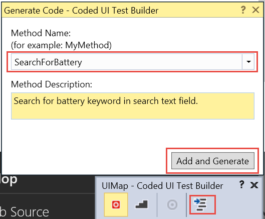

> **Talking Point**: <br />Now we need to validate that two batteries were shown in the test results. We do that through an assertion. <br />To assert the result of our search, we drag the target button to the Calcium battery search result element from the Test Builder. Then, we add an assertion that the "Exists" property of the battery is equal to true. We're going to do this for the spiral coil battery as well. Once again, we'll generate code, this time for the assertions. 

1. Drag the target button to the Calcium battery search result element from the Test Builder. Then, click on the "Exists" property of the Calcium element so that it is higlighted and then the "Add assertion" button at the top of the panel for the elements to add an assertion that the "Exists" property of the battery is equal ("AreEqual") to true. Repeat this for the spiral coil battery. After adding both assertions, click on the generate code button to add a method named **CalcumAndSpiralCoilBatteriesExist** to validate these elements. 
	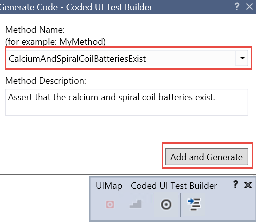

> **Talking Point**: <br />Let's go back to Visual Studio and view the two methods that we just created. 

1. Go back to Visual Studio, double-click on the UIMap.uitest file in Solution Explorer in the Coded UI test project. 
	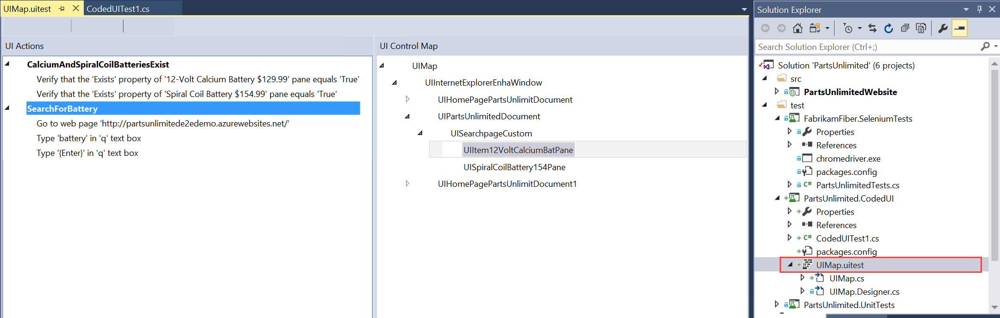

> **Talking Point**: <br />It's a good idea to rename out generated method to something more descriptive. 

9. In the **CodedUITest1.cs** file in the Coded UI test project, rename the **CodedUITestMethod1** method to something descriptive such as **TestForSearchBattery**.
	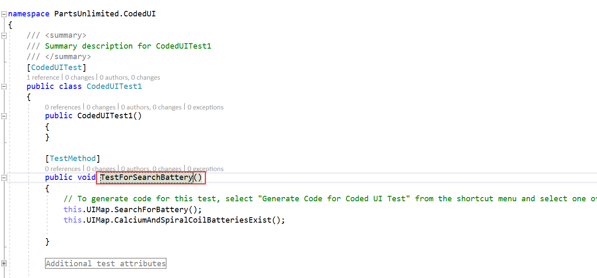

> **Talking Point**: <br />OK. Let's run our tests! 

10. In the same method, right click and select "Run tests" to run the Coded UI test that you just created. A window should open and walk through the steps of the test.<br />
	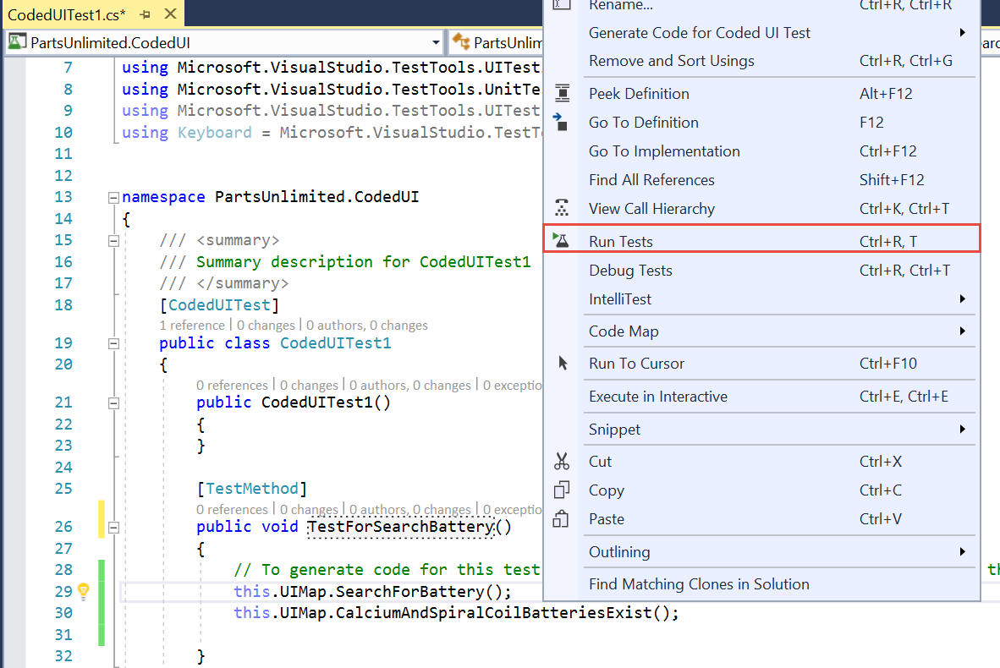

11. After the test completes, the results will appear in the Test Explorer window in Visual Studio. 
	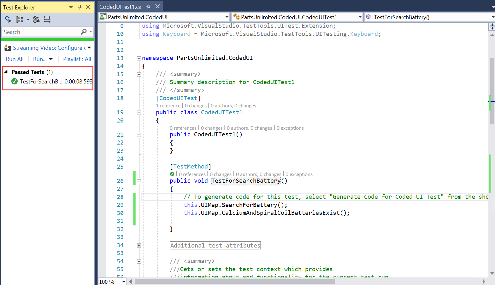

> **Talking Point**: <br /> You can see the true value of automated UI tests by running the one that we just created. By recording this test once, we can run this same testing scenario as many times as we want without having to manually run through the test steps. What if we want to run this test as one of many of our automated regression tests? We can either add this to an existing playlist of tests or we can create a new one and add our Coded UI test to it.<br /><br />Let's add our test to a regression suite of tests.

12. In the Test Explorer window, right-click on the Coded UI Test that we just ran and select **Add to playlist -> New Playlist**.
	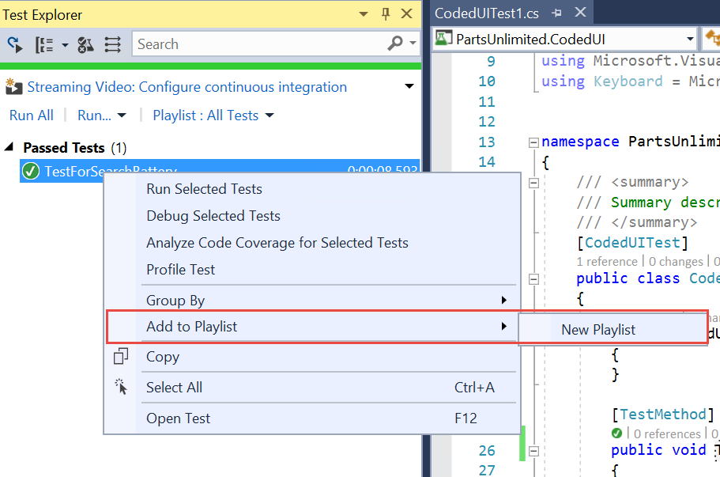

13. Create a new playlist file in the test folder named **RegressionTests**, then click on the "Save" button. 
	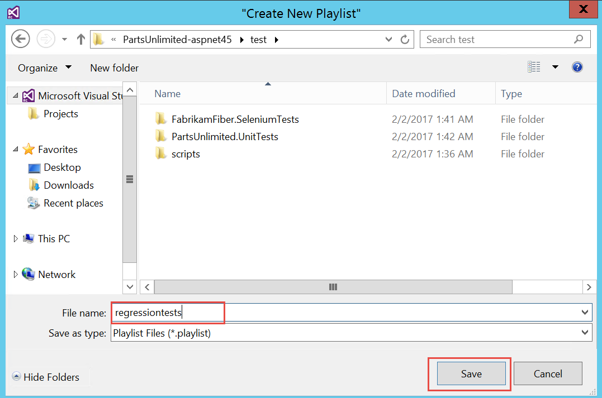

14. Select the playlist in Test Explorer and re-run the test to view results. 
	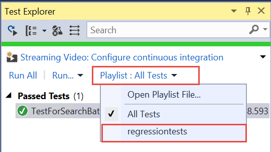
	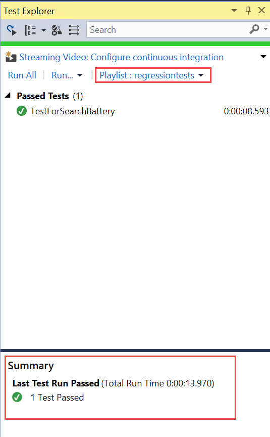
 
> **Talking Point**: <br /> Coded UI tests can automate testing for web applications by recording your tests using **Internet Explorer**. You can then customize your test and play it back using  **Internet Explorer** or other browsers. For instance, we can use Chrome, instead.

15. Open the CodedUI test method you just created, and add **BrowserWindow.CurrentBrowser = "Chrome";** snippet in your **Test Method** as shown. 
	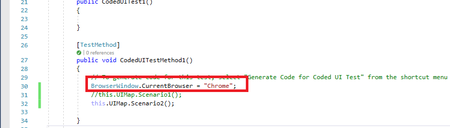

16. You can see the tests are executing in Chrome. You can use **IE, Firefox, Edge** as well to run the tests. 
	
 
17. To run the tests in **Internet Explorer**, just replace **Chrome** with **IE** in the above code snippet. And you should see the tests running in **IE**.
  ````
  BrowserWindow.CurrentBrowser = "IE";
  ````
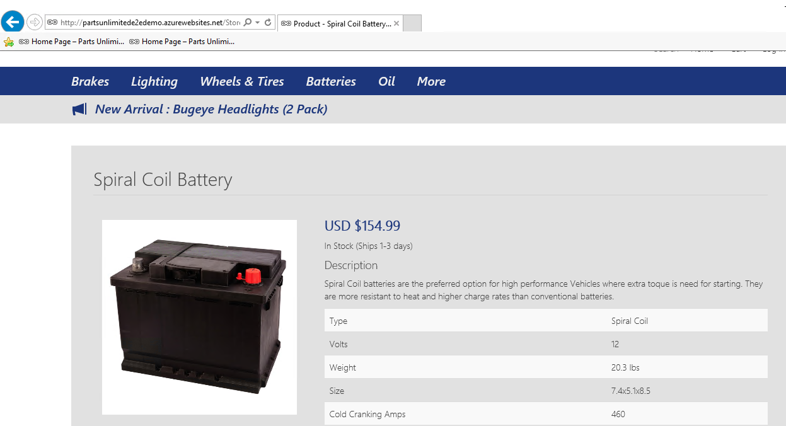
 
18. To run the tests in **Firefox**, just replace **Firefox** in the above code snippet. And you should see tests running in **Firefox**.
  ````
   BrowserWindow.CurrentBrowser = "Firefox";
  ````	
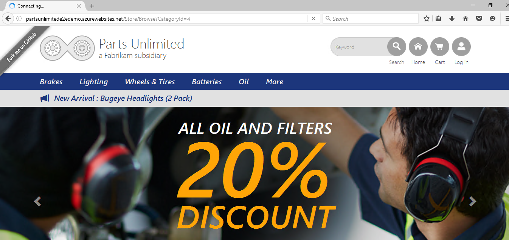

--------
## Conclusion
Coded UI tests will help you increase testing coverage and improve the quality of your code so that UI changes are quickly validated. You will receive fast feedback from breaking changes to your code if you also use automated UI tests with Continuous Deployments to verify that recent deployments have not broken the application. 