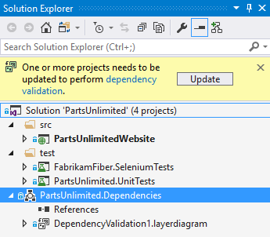
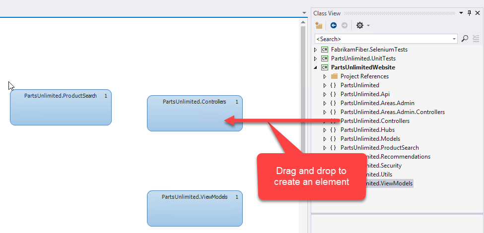
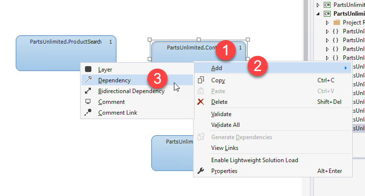
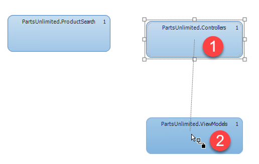
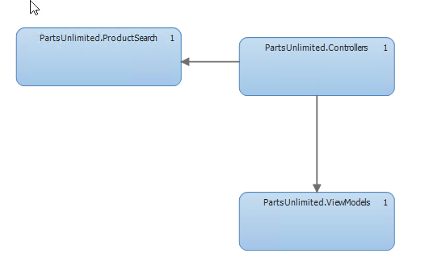

# Dependency Validation

## Overview
Most modern applications have some sort of layered or decomposed architecture. One of the challenges with such layering is keeping track of the dependencies between layers or components within the system. Traditionally this has been _tribal knowledge_ - in other words, this knowledge resides in someone's head. However, Visual Studio 2017 allows you to capture the dependencies between components in a dependency diagram - what used to be called a _layer diagram_ in Visual Studio 2010, 2012, 2013 and 2015. Not only can you express the dependencies between components, but VS 2017 enforces these dependencies _in real time_ giving you live feedback as you code. This ensures that you adhere to the rules without having to even open up the diagram explicitly.


## Pre-Requisites   
- Running on VSE 2017 Demo VM
- Checkout `DependencyValidation` branch

## Create a Dependency Diagram

> **Talking Point**:<br/> Rather than trusting to developers to somehow know which components can reference other components, we want to be able to enforce our dependencies. The first step in enforcing the dependencies is to create a dependency diagram.

> **Note**: Visual Studio Enterprise is required to author and edit diagrams, but Visual Studio Pro and Community can be used to open the diagrams in read-only mode.

1. Open the PartsUnlimited solution from `C:\source\VS2017Demo\PartsUnlimited-aspnet45\PartsUnlimited.sln`

2. Click `Architecture->New Dependency Validation Diagram`. Enter `PartsUnlimited.Dependencies` for the project name and press OK.

3. In the Solution Explorer, you should see a yellow information block telling you to update your projects for dependency validation. Press the Update button.


_Update the projects for Dependency Validation_

> **Note**: The reason for this update is that VS 2017 now uses Roslyn analyzers to perform the dependency validation. Updating the projects installs the analyzers. It will also create a _linked_ item to the dependency diagrams (they will appear in other projects but there is still only a single copy of the diagram - the one in the dependency validation project itself).

4. Open the diagram (`DependencyValidation1.layerdiagram`).

> **Talking Point**:<br/> There are many ways to draw dependencies. You can add solution folders, assemblies or methods. For this demo, we are going to add namespaces.

5. Click the link to `Class View` on the diagram surface to open the Class View.

6. Expand the PartsUnlimitedWebsite node to show all the namespaces in the PartsUnlimitedWebsite project.

7. Drag `PartsUnlimited.Controllers`, `PartsUnlimited.ViewModels` and `PartsUnlimited.ProductSearch` namespaces onto the diagram.


_Drag namespaces onto the diagram_

> **Talking Point**:<br/> Now that we have some namespaces on the diagram, we can express dependencies between them.

8. Right-click the `PartsUnlimited.Controllers` element and click `Add->Dependency`. This creates a dependecy line originating in the `PartsUnlimited.Controllers` namespace. Now left-click the `PartsUnlimited.ViewModels` element.


_Click to add a new dependency_


_Click on the target element to create the dependency_

9. Save the diagram. If you are prompted that "There are validation errors, continue save?" press Yes.

> **Talking Point**:<br/> We now see errors in the Error List window. The error codes are prefixed with `DV` (dependecy validation).

10. Double-click on the top error to open `SearchController.cs`.

> **Talking Point**:<br/> Not only do we see the errors in the Error List window, we can see them in the code as squigglies!

9. Now add a dependency from `PartsUnlimited.Controllers` to `PartsUnlimited.ProductSearch` to complete our architecture. Rebuild the solution and ensure that there are no errors.

> **Talking Point**:<br/> Now that we have completed our architecture, we can build with a clean bill of health.


_The completed diagram_

## Live Dependency Validation

> **Talking Point**:<br/> We don't even need to have the diagram open in order to see dependency violations.

1. Close the dependecy diagram.

2. In the solution explorer, open `PartsUnlimitedWebsite\ProductSearch\StringContainsProductSearch.cs`.

3. Note the comment on line 19, just above the `Search` method.

> **Talking Point**:<br/> What happens if we're coding as part of our day-to-day work and we change violate dependencies? Before, we would be unaware until much later in the process, assuming we uncover the error at all. However, now that we have a diagram in place, we can rely on Live Dependency Validation to quickly warn us about violations as we code.

4. Violate a dependency unintentionally

Change line 20 from
```
public async Task<IEnumerable<Product>> Search(string query)
```

to

```
public async Task<IEnumerable<ProductViewModel>> Search(string query)
```

and resolve the namespace.

5. Hover over the ProductViewModel object (with the squigglies) and read the error.


_Violations are highlighted immediately_

> **Talking Point**:<br/> Right as we code we're prevented from violating dependencies. We can now amend the diagram or table the change - either way, Dependency Validation has saved us from inadvertently violating dependencies.

> **Talking Point**:<br/> Once the code is committed to the source control repository, the whole team to benefit from the dependency validation **including in Visual Studio Pro and Community where dependency diagrams cannot be created but can be viewed as read-only.**

------------

## Summary
You can express your dependencies in a Dependency Validation diagram. This improves productivity by:

- ***Moving depenency knowledge from somone's head to your project***: Without Dependency Validation Diagrams, there would be no effective way to describe your dependencies.

- ***Providing real-time dependency violation errors***: Getting violation errors as you code ensures that you don't violate dependencies - saving time and increasing quality early in the development cycle.


