# Introduction to IntelliTest

## Overview

**[IntelliTest](https://msdn.microsoft.com/en-IN/library/dn823749.aspx)** explores your **.NET code** to generate test data and a suite of unit tests. For every statement in the code, a test input is generated that will execute that statement.
A case analysis is performed for every conditional branch in the code. For example, **if statements, assertions, and all operations** that can throw exceptions are analyzed. This 
analysis is used to generate test data for a parameterized unit test for each of your methods, creating unit tests with high code coverage.

When you run IntelliTest, you can easily see which tests are failing and add any necessary code to fix them. You can select which of the generated tests to save into a test project to provide a regression suite. As you change your code, rerun IntelliTest to keep the generated tests in sync with your code changes.

## Pre-requisites
- Visual Studio 2017 (download [here](https://www.visualstudio.com/vs/visual-studio-2017-rc/))
- Download the Parts Unlimited project [here](https://github.com/Microsoft/PartsUnlimited/tree/aspnet45)

## Setup
 - Download and extract the zip file
 - Open the PartsUnlimited.sln solution in **Visual Studio 2017**

### Task 1: Running IntelliTest

1. Open the **Test Explorer** window. (You should see 14 unit tests that already exist.) 
1. Open the **StringContainsProductSearch.cs** file 
1. Scroll down to the **ProductSearch | Depluralize method** file. 

> **Talking Point**: 
Let's take a quick look at the Depluralize method. This method is responsible to return singular form of a string value. For example: if you search using a keyword **Batteries**, it returns **Battery**. This is a naive version of 'stemming' which can assist in searching.  By looking at the Code Lens line above it, we can see that there are currently no Unit Tests testing this method. That's not good. However, as a good developer, I want to be sure to leave the code better than I found it, so I'm going to cover it with unit tests.  
Rather than write my own, I'm going to use a feature called **IntelliTest** to help me generate a suite of appropriate tests.

1. Right Click within the method **Depluralize** and then select **IntelliTest | Run IntelliTest**
    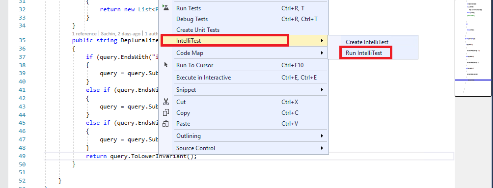

> **Talking Point**: 
After running IntelliTest, I now have **8 unit tests** with a pretty decent amount of **code coverage (14/17 blocks)**. Of those, 2 are failing and 6 are passing. Looks like we may have some work to do!
    
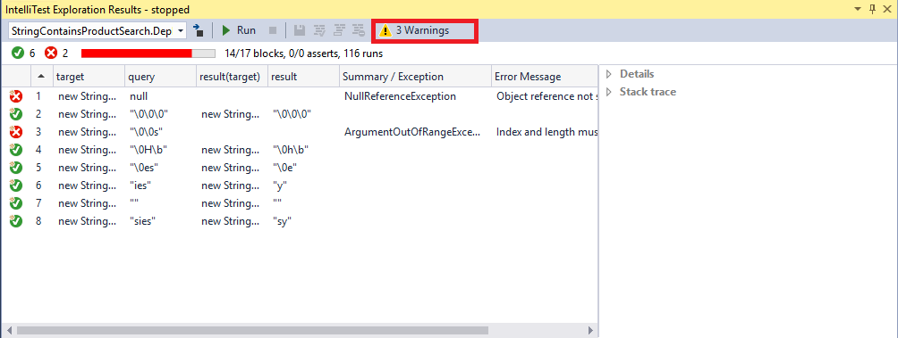

### Task 2: Understanding IntelliTest warnings

> **Talking Point**: 
Before going too much further, however, notice that we have **3 Warnings** reported. Let's take a look at those.

1. Click on **warnings** button.
    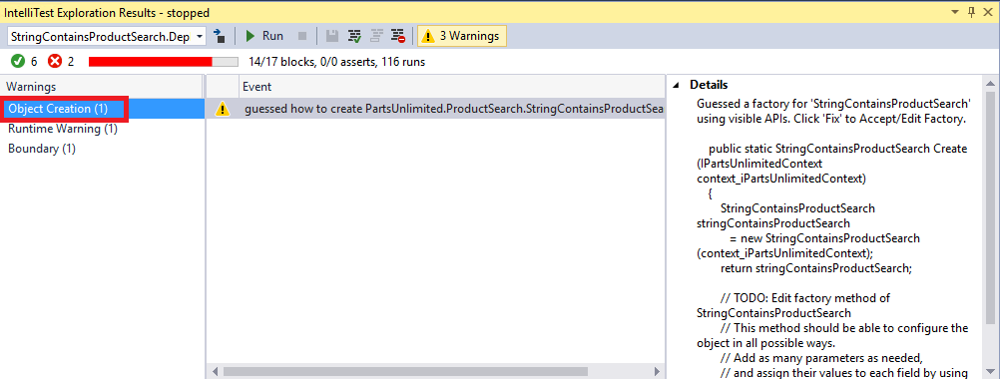

3. Select the **Object Creation** warning category. 
    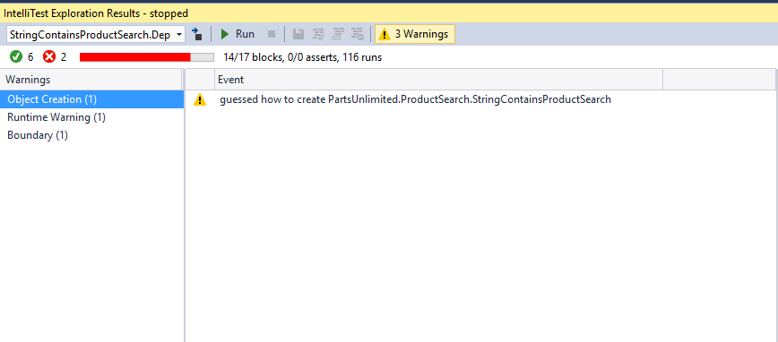

> **Talking Point**: IntelliTest has discovered our publicly accessible API, and guessed how to create an instance for us. It warns us because sometimes it guesses wrong. In those cases, we need to go over to the generated Unit Tests and give IntelliTest a hint. But in our case, it guessed exactly right.

1. Select the **Runtime** warning category from the list.
    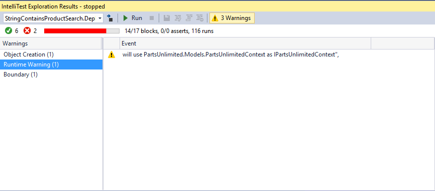

> **Talking Point**: This warning indicates that IntelliTest will use **PartsUnlimited.Models.PartsUnlimitedContext** as the concrete class to implement **IPartsUnlimitedContext**. Once again, if IntelliTest had gotten it wrong, we'd be able to give it a hint.
  This information is important to note, because IntelliTest works by [instrumenting code and monitoring execution](https://blogs.msdn.microsoft.com/visualstudioalm/2014/12/11/smart-unit-tests-a-mental-model/). However, it does not instrument the entire universe of code for two reasons: 
    - It cannot know a **priori** what comprises that universe of code and  - That would make the system very slow

1. Select the **Boundary warning** category from the list.
    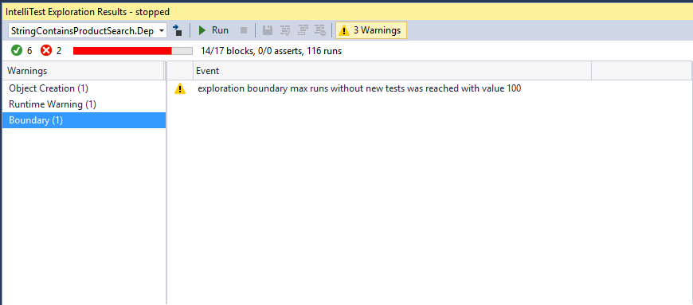

> **Talking Point**: When the number of branches in the code path that IntelliTest is exploring is large, it can trip an internal boundary that has been  configured for fast interactive performance. Hence, it raises a warning and stops the exploration.

1. Point out the failing tests
    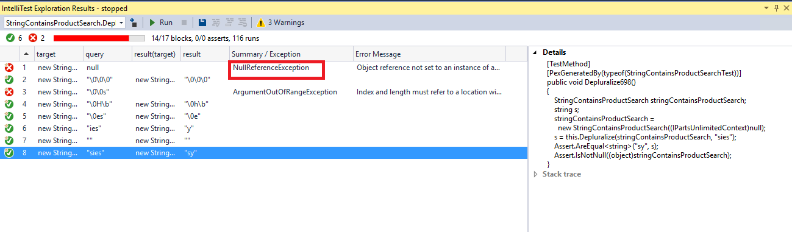

> **Talking Point**: If you see the **IntelliTestExplorationResults** window, we have **2** failing tests. The **1st** test is failing because we are passing a string query which is null and hence we have **NullReferenceException**.  Normally, you'd definitely want to handle this case - after all this is one of the most common dangers faced in C#. However, instead of fixing it I want to show you how failing tests can be specified as being the expected behavior.

1. Right click the NullReferenceException and click **allow**.

> **Talking Point**: By clicking **allow** we are letting IntelliTest know that this is the expected behavior for our test. When we regenerate the tests, it will change the test to allow categorize this behavior as throwing an expected *NullReferenceException*.

1. Point out the **ArgumentOutOfRangeExcption**.
    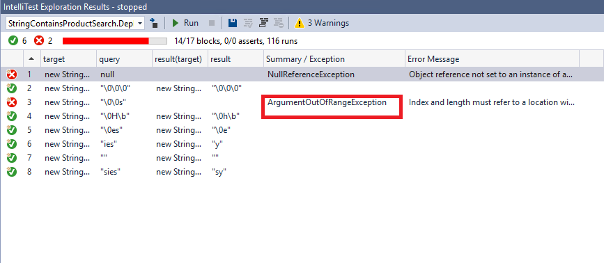 

> **Talking Point**: In the 3rd test, you can see we have **ArgumentOutOfRangeException** being thrown.   Note that if you ran the IntelliTrace demo, you can mention the following: It seems the **Intellitrace** has picked up the same exception that we found in the **ITracefile** from our **[Intellitrace](/Feature Demos/IntelliTrace/)** Lab.

1. Select all the tests and click **save** button to save as **Regression Suite**. This creates a **New Project** named **PartsUnlimitedWebsite.Tests** with the generated Parameterized Unit Test found in **StringContainsProductSearchTest.cs**.
    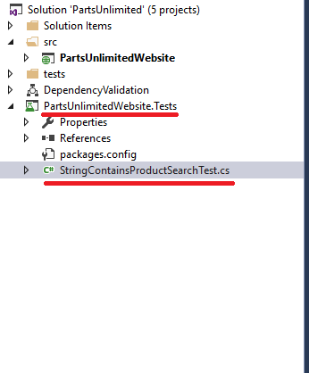

1. Build the project and you should see a new set of Tests generated in your **Test Explorer**. 
    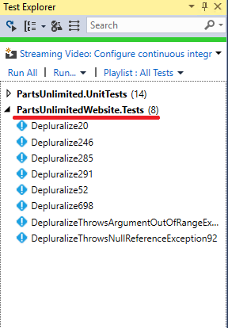 

> **Talking Point**: **IntelliTest** generated a new project for us, along with 8 new tests, which you can see in the **Test Explorer**.

1. Run the newly created tests manually from your **Test Explorer**. 
    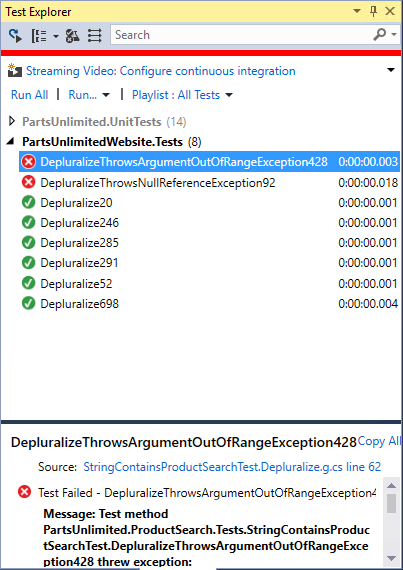

> **Talking Point**: When we run the tests from the **Test Explorer** you can see that 2 tests are failing. These were the errors that were produced in our **IntelliTrace** file during our debugging. Glad that the same were reproduced by **Intellitest**.

1. Open **StringContainsProductSearch.cs** file and go to **Depluralize ()**. 
    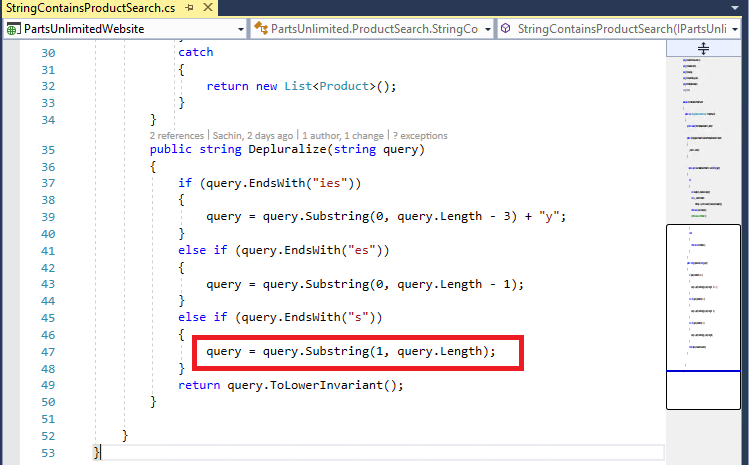

> **Talking Point**: Let's fix the code. It looks like there is an error potentially causing a substring to exceed the actual length of the string. Let's correct that.

1. Replace the code snippet with **query = query.Substring(0, query.Length - 1)**.
    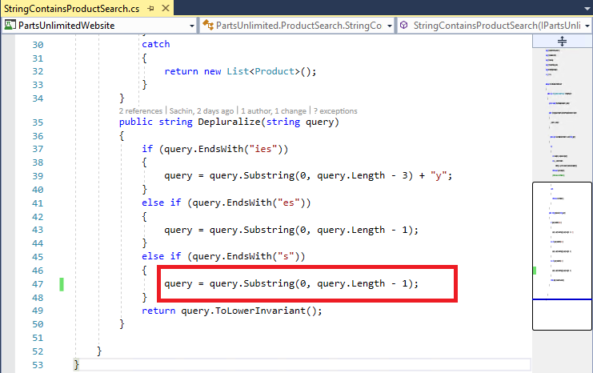 

12. After the changes, re-run the tests from your **Test Explorer**. 
    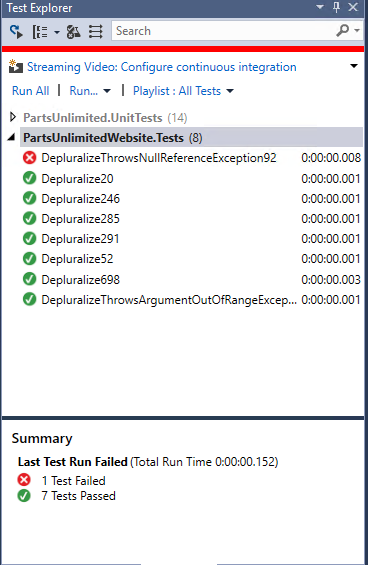

> **Talking Point**: The failing *ArgumentOutOfRangeException* test is now passing. However we still have 1 more failed test (NullReferenceException). It's failing even though we earlier told **IntelliTest** that it was OK to throw that acception. In order to re-create the unit tests, we'll need to re-run **IntelliTest**.
 
13. Re-run the **IntelliTest** so that we have all the Tests passed as we had **allowed** NullReferenceException in our **step 6.**
    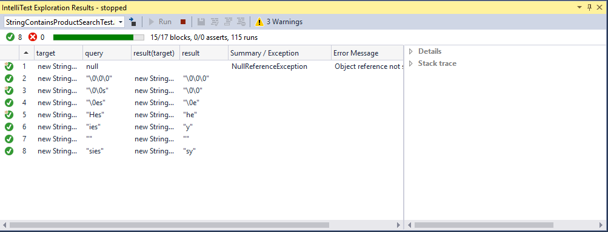

14. Re-build the solution, and look at the **Test Explorer**

 >**Talking Point**: As you can see in the **Test Explorer**, all the tests are now passing and we have fully covered our Dupluralize code with unit tests. 
    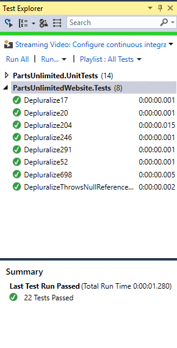

## Bonus Demo
You can dive more deeply by showing the actual generated unit tests before marking one of the failed tests **allowed** and fixing the other. Then show the unit tests again after the fixes and re-running **IntelliTest**. The two impacted unit tests have changed to reflect the new information. 
 

