## Overview

In this lab, you will learn about the IntelliTrace debugging feature in Visual Studio Enterprise. Before the addition of IntelliTrace,
debugging was done from a specific point in time going forward. If you wanted to find out more information for a previous call, you
would set a breakpoint and then re-run the application. IntelliTrace enables you to seek to a large number of execution points, that
occurred in the past, and drill into any of them, comparing variables, call stacks, etc. in order to help pinpoint causes of
issues without having to reproduce the problem.


## Exercises

This hands-on lab includes the following exercises:

<!-- -->

1.  Introduction to IntelliTrace

2.  Using IntelliTrace with Call Information


Estimated time to complete this lab: **30 minutes**.

-----
### **Exercise 1: Introduction to IntelliTrace**


 In this exercise, you will see how IntelliTrace can help debug an XML data failure on an ASP.NET website.


1.  Launch **Visual Studio 2015** from the taskbar and open **Team Explorer**.

1.  Select the **Connect to Team Projects** button.

1.  In **Team Explorer – Connect**, double-click on the **Tailspin Toys** project.

        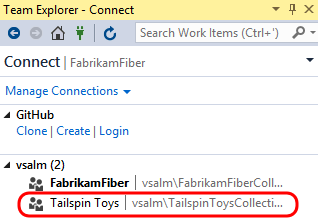

1.  In Team Explorer – Home, **double-click** on the third **TailspinToys** solution (associated with the **Main** branch).

    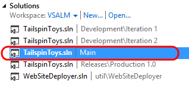

1.  Rebuild the solution (**Build | Rebuild Solution** from the main menu). This step will take a few moments to complete.

2.  Open the **Options** window from **Tools | Options...** and click on the **IntelliTrace** node.

3.  Ensure that the **Enable IntelliTrace** checkbox is checked and that it is set to “**IntelliTrace events only**”. This is the default
    setting because it has minimal performance implications.

    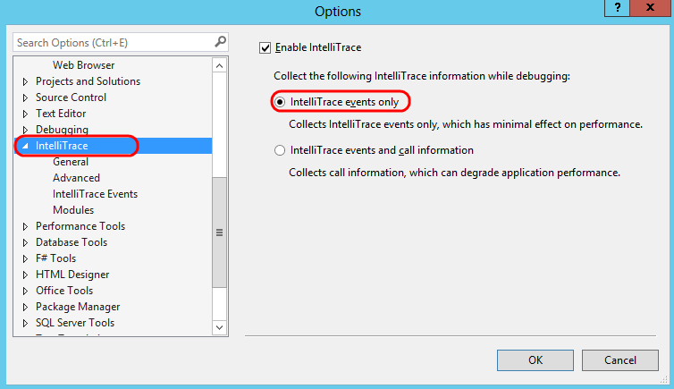

    ```
    **Note:** IntelliTrace records events to an IntelliTrace file, which has an .iTrace extension. These files can be saved and used later in
    order to perform debugging with IntelliTrace, enabling testers to attach this detailed debugging information directly to bug reports.
    ````
1.  Select the **IntelliTrace Events** node on the left and then select the **File** check box to have IntelliTrace record file events.
    
    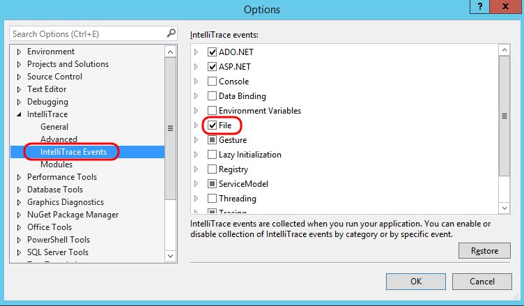

1.  Select the **Debugging** node on the left and then select **de-select** the **Enable Just My Code option**. We would like to
    record events that occur in the .NET Framework code as well. Select the **OK** button.

    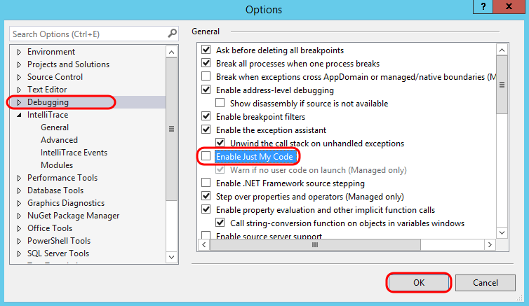

**Task 2: Using IntelliTrace Events to Debug**
    
1.  Start a debugging session by pressing **F5**. This will load the default page for the fictional Tailspin Toys company.

    ```` 
    **Note:** If the Tailspin.Web project is not set as the startup project, right-click on the Tailspin.Web node in Solution Explorer
    and select the “Set as StartUp Project” option.
    ````
    

1. Select the **About Us** hyperlink in the footer of the page. This will generate an exception and show a custom ASP.NET error page for
    the Tailspin Toys application.

    

    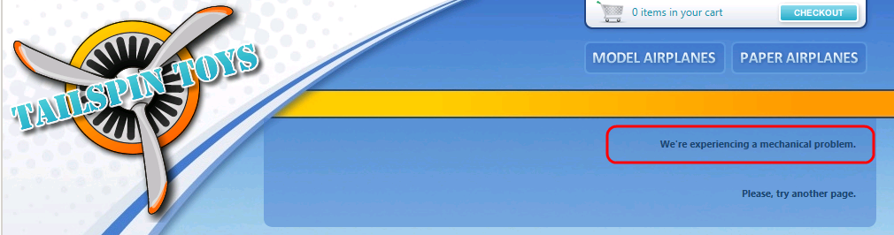

1.  Switch back to Visual Studio, select the **Break All** button.
    
    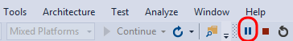

1.  Since we’re interested in what is going on with the server code and not the script errors on the web page, select the **iisexpress.exe**
    process from the **Process** drop-down box.

    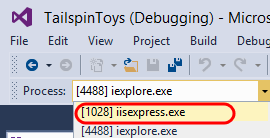

1.  IntelliTrace events used to be shown in their own window, but are now integrated into the **Diagnostic Tools** window within the
    **Events** tab. As you just saw, the Diagnostic Tools window is shown by default when you debug an application from within
    Visual Studio.

    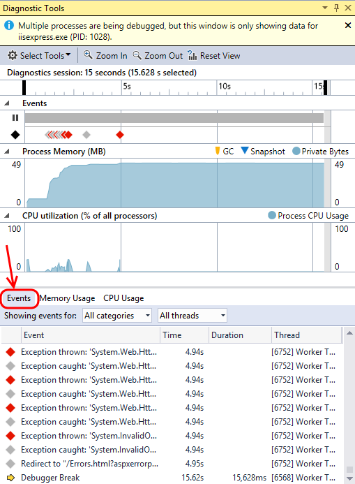

1.  The **Events** window shows a sequential list of events that have been collected since you started the debugging session, with the
    most recent being at the bottom. Note that these events are also represented on the Diagnostic Tools timeline. Some event categories
    have different colors, e.g. Exceptions are shown with red color.

    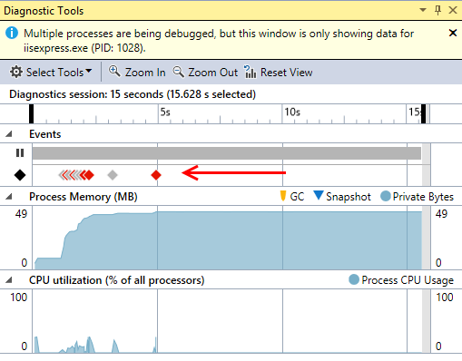

1.  Note that there are quite a few events shown in the Events tab. Let’s use the timeline to help filter out the older events that
    aren’t likely to be associated with the error that we saw with the website. Use the mouse to highlight a window of time that just
    includes the most recent exception.

     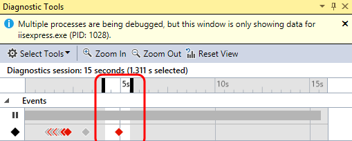

1.  In the **Events** tab, locate and select event that starts with
    “**Exception thrown: ‘System.Xml.XmlException**”. You may need to
    scroll up some in order to locate it. The details of this exception
    reports that there is a problem with an XML file on line 10, column
    49, but it does not tell us which XML file this is in referring to.

    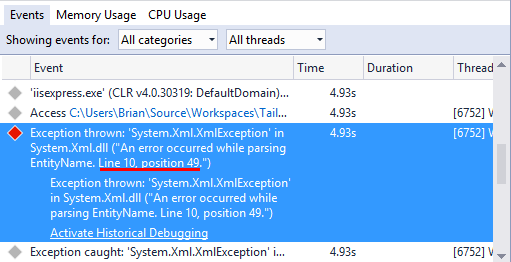

1.  Select the **File Access** event that precedes the exception to see the file that was accessed just before the exception occurred.

2.  Open the **Ads.xml** file by clicking on the provided link.
    
    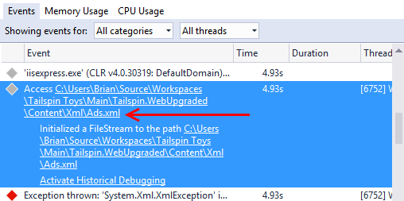

1.  Observe that there is a red squiggly line under the “***&b=1***” characters, which are invalid in this context. Note that this is on
    line 10, column 49 just as the XML exception reported.

    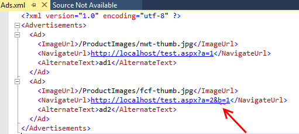

1.  Remove the invalid characters and **save** the file. The final URL
    should be **http://localhost/test.aspx?a=2**.

1.  Press **Ctrl+Shift+F5** (or use Debug | Restart from main menu) to
    restart the debugging session and select the **About Us** link again
    to make sure it is now working as expected.

    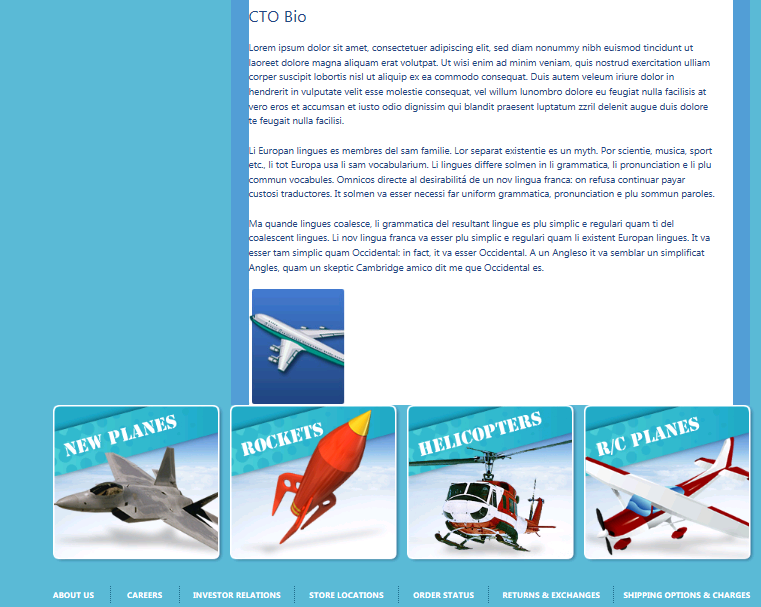

1.  Stop the current debugging session in Visual Studio (**Debug | Stop
    Debugging**).

1.  Disable the **File** IntelliTrace events that you previously enabled
    by returning to **Tools | Options | IntelliTrace | IntelliTrace
    Events**. We will not need these extra events in the next exercise.

1.  **Re-enable** the “**Just My Code**” option before moving on to the
    next exercise.

### Exercise 2: Using IntelliTrace with Call Information
-------------------------------------------------------------------------------------------------------------------------------------------------------------------------------------------------

In this exercise, you will learn how to use IntelliTrace to collect
    additional call information in order to solve a more complicated
    user code error.

```
**Note:** Ensure that you have re-enabled the “Just My Code” feature as instructed at the 
end of the previous exercise before moving on.
````

#### Task 1: Configuring IntelliTrace to Record Call Information

1.  By default, only IntelliTrace events are collected when debugging,
    but we can also opt to collect data at every method enter/exit and
    call site. To enable this, select **Tools | Options** from the main
    menu in Visual Studio, locate the **IntelliTrace** node, and select
    the “**IntelliTrace events and call information**” option.

2.  Select the **OK** button to continue.

    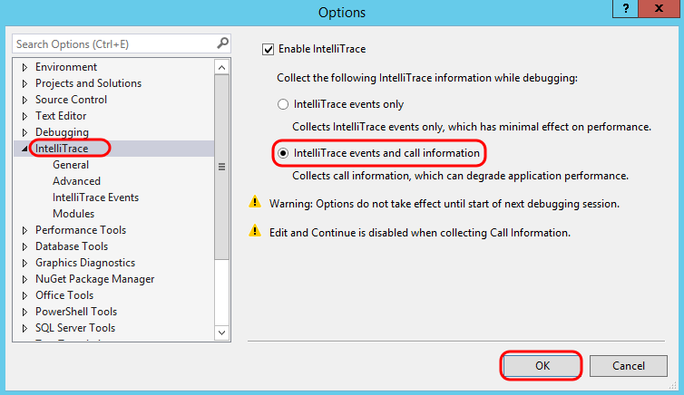

#### Task 2: Using Call Information to Debug

1.  Start a debugging session by pressing **F5**.

1.  Let’s test out the shopping cart functionality by adding a couple of
    products to the cart. Select the “**Paper Airplanes**” button to see
    a catalog of planes.

    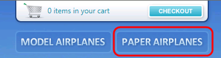

    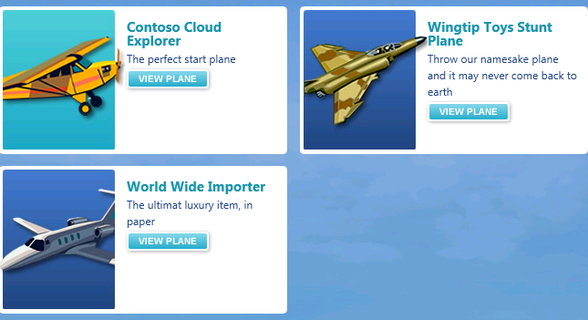

1.  Next, select the “**View Plane**” button for the **Contoso Cloud Explorer.**

    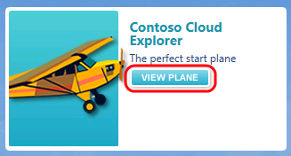
    
    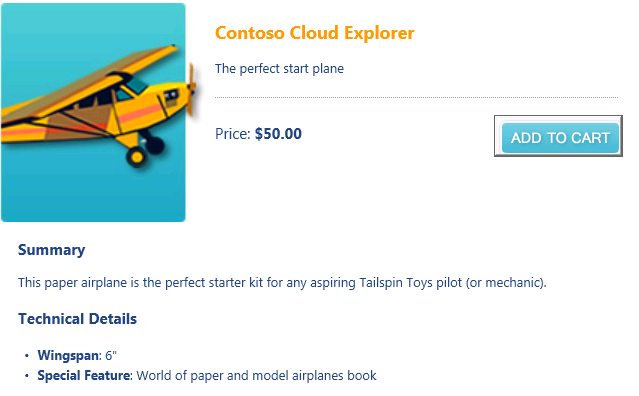

1.  Select the “**Add To Cart**” button and verify that the Quantity of
    the item in the cart is 1.

    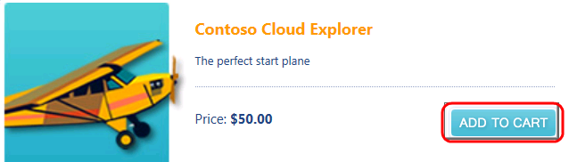

    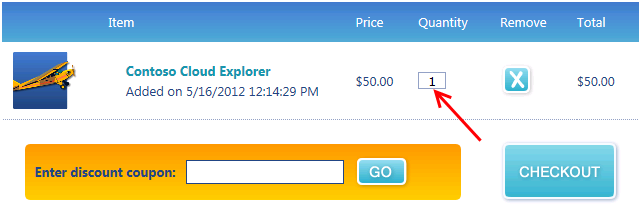

1.  Add another “Contoso Cloud Explorer” to the shopping cart by
    selecting the “**Contoso Cloud Explorer**” hyperlink.
    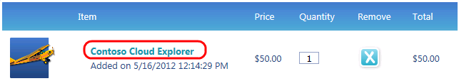

1.  Select the “**Add To Cart**” button once again, but note that the
    **Quantity** value is still 1 even though we added 2 products.

    

    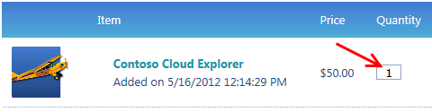

1.  Return to Visual Studio and select **Break All** button. By default,
    we see the Events window showing the sequence of recorded events
    leading up to the debugger break.

2.  Since we’re interested in what is going on with the server code and
    not the script errors on the web page, select the **iisexpress.exe**
    process from the **Process** drop-down box.

    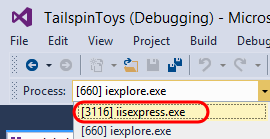

1.  Select the **Categories** filter and select the
    **ASP.NET** category.
    
    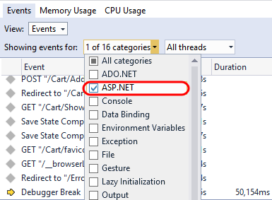

1.  Scroll up from the bottom until you locate the first **POST** event
    for “**Cart/AddItem**”. This event is associated with our action of
    adding the second product to the shopping cart, and we will use this
    as a reference point to aid in navigating to the associated
    call stacks.

    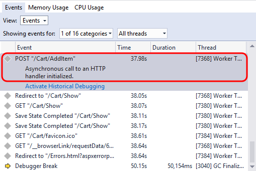

1.  Click the link to Activate Historical Debugging.
    
    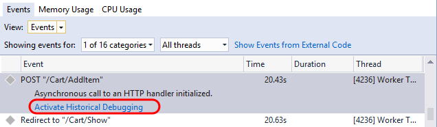

1.  With the **POST** event still selected, switch to the
    **Calls** view.
    
    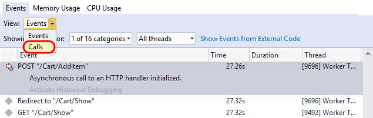

1.  The top frame of the calls view shows the stack for the
    current request. **Double-click** on the call to
    **Tailspin.Web.App.Controllers.CartController.AddItem(string sku
    = “papcce”)**.
    
    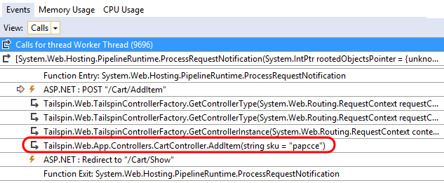

    ````
    **Note:** Each time you double-click on a call in the bottom half of the calls view, the call 
    is popped to the bottom of the top frame and the Instruction Pointer syncs in the code editor 
    to the method entry point of the call just like in live debugging.
    ````

1.  In the IntelliTrace calls view, **double-click** on the call
    “**Tailspin.Model.ShoppingCart.AddItem(Tailspin.Model.Product produt
    = {Tailspin.Model.Product})**”.

    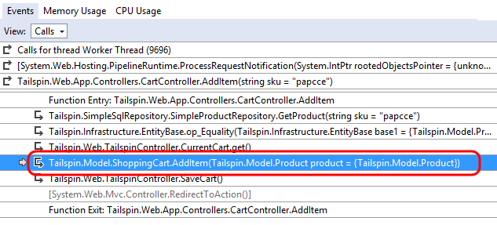

1.  In the IntelliTrace calls view, **double-click** on the call to
    **AddItem** that shows “**Tailspin.Model.Product product =
    {Tailspin.Model.Product}, int quantity = 1)**” as the parameter.

    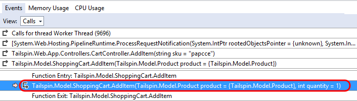

1.  In the IntelliTrace calls view, **double-click** on the call to
    **AddItem** that shows “**Tailspin.Model.Product product =
    {Tailspin.Model.Product}, int quantity = 1, System.DateTime
    dateAdded = …)**” as the parameter. Navigating through the calls
    view is a quick way to gain an overview of the call hierarchy and to
    make large jumps across the call hierarchy without stepping through
    line by line.

    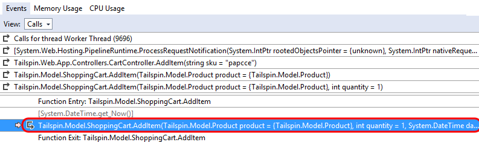

1.  In the **Locals** window, expand the “**AddItem**” function call to
    validate that the correct product was being added to the cart and
    that the quantity being added was 1.

    ````
    **Note:** You can look at the collected variables at any point during historical debugging in 
    the Autos/Locals/Watch window or by using the datatips in the editor.
    ````
    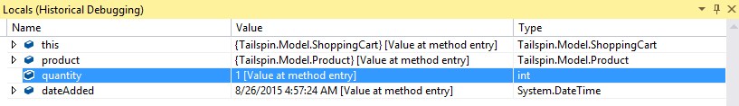

1.  Step forward two calls by pressing **F10 twice**. Keep in mind that
    since we are in historical debugging mode, we are stepping through
    recorded events and call sites, not line by line of code.

    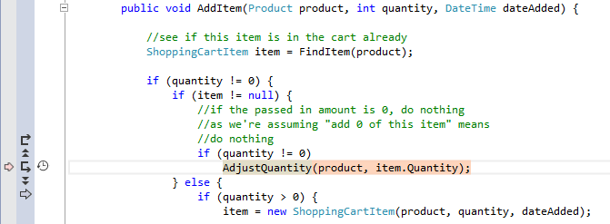

    ````
    **Note:** You can also use the set of “VCR” style controls shown in
    the gutter of the source code window.
    ````

1.  In the IntelliTrace calls view, **double-click** on the call to
    **AdjustQuantity**.

    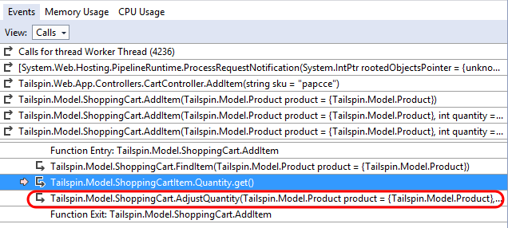

1.  In the **Locals** window, look to see what quantity the cart is
    being set to after adding the second product. Since we are expecting
    the adjusted quantity to be **2**, we have found the location of
    the bug.

    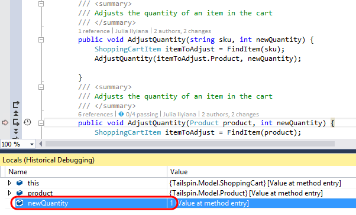

    ````
    **Note:** You can also save the IntelliTrace events to a file if needed. Select Debug | IntelliTrace | Save IntelliTrace Session
    from the main menu. You do not need to save this file for the purposes of this lab, however.
    ````
1.  Stop the current debugging session (**Debug | Stop Debugging**).

2.  Change the **AdjustQuantity**(…) call so that it adds in the new
    quantity passed to the AddItem method.

    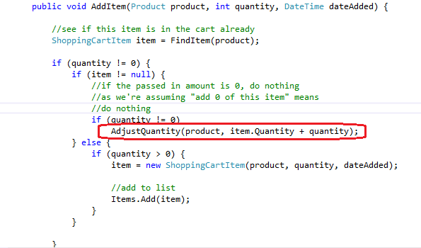

1.  Verify the fix by adding the same product twice to ensure that the
    shopping cart quantity shows the value **2**.

    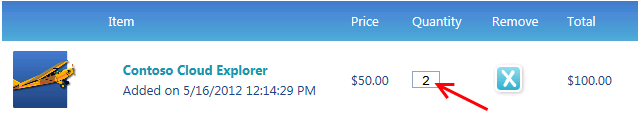
