# Diagnosing Issues in Production with IntelliTrace

## Overview   
IntelliTrace – first released in Visual Studio 2010 – changed the game for debugging by allowing developers to step “back in time” to see how an application got into its current state. By exposing events such as file and registry access, exceptions, and method calls, an IntelliTrace file can provide a detailed view into application behavior. In this lab, you will learn how Visual Studio 2015 extends the capabilities of IntelliTrace beyond the development and testing organizations by providing IT administrators with the
ability to capture IntelliTrace files running from production servers. These files can then be analyzed by developers to help diagnose production issues.

<p align="center">

</p>

## Exercise 1: Using IntelliTrace in Production
-----------------------------------------------------------------------------------------------------------------------------------------------------------------------------------------

In this exercise, you will learn how to deploy and use IntelliTrace in production to capture trace information for an
ASP.NET application.

1.  Typically, the first step in determining the root cause of an error like this would be to check logs and perhaps a stack trace for details. If that does not provide enough information, and the error is not easily reproduced in a development environment, 
the development team may end up taking a long time to determine the root cause and fix the problem. Installing Visual Studio or other debugging tools in a production environment may not be an option.
But thanks to IntelliTrace, teams can now easiy debug their apps in production or other environments using the stand-alone IntelliTrace collector. 

1.  Let’s look at how to deploy and use IntelliTrace in a production environment to collect historical debugging data. Open a Windows Explorer window and navigate to the root of the C: drive. Note that 
there are two folders here that were created ahead of time for our   use in this lab, **c:\\IntelliTrace** is where the standalone
IntelliTrace files are placed and **c:\\LogFileLocation** is where the IntelliTrace files will be written to later on in this lab.

    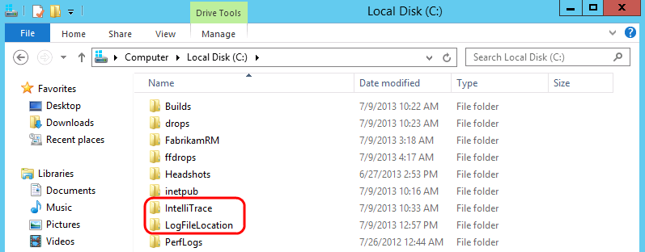

1.  In the **Explorer** window, right-click on the **LogFileLocation** folder and select **Properties** to open the Properties window. We
need to make sure that the IIS application pool has permission to use the LogFileLocation folder.

1. Select the **Security** tab and then scroll down the existing list of groups and user names to find **FabrikamFiber.Extranet.Web.**
    Permissions were added ahead of time in this VM, but in a production environment, you would need to make sure to perform this
    step yourself.

    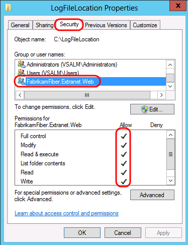

1.  Press the **Escape** key to close the Properties window.

1.  IntelliTrace can be deployed to a production environment simply by performing an xcopy of the contents found in the **IntelliTrace
    Collector for Visual Studio 2015** package.

    ````
    **Note:** You can find the **IntelliTraceCollection.cab** package within your installation of Visual Studio 
    Enterprise 2015 at %programfiles(x86)%\\Microsoft Visual Studio 14.0\\Common7\\IDE\\CommonExtensions\\Microsoft\\IntelliTrace\\14.0.0.
    Additional setup instructions, which were performed ahead of time on the virtual machine, can be found
    [here](https://msdn.microsoft.com/en-us/library/vstudio/hh398365(v=vs.140).aspx)
    on MSDN.
    ````
    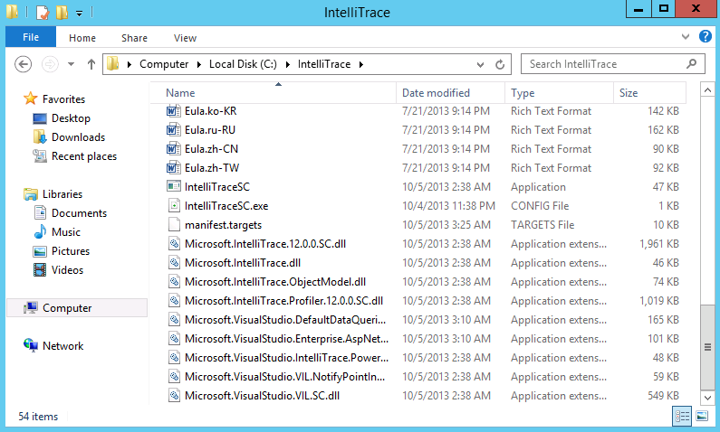

1.  Extracted contents of IntelliTraceCollection.cab file

#### Task 3: Initiating IntelliTrace Collection and Repro

Now we will start IntelliTrace so that we can gather some diagnostic data from the web application. You have two options here, you can
    follow steps **12** through **17** or you can run the
    *StartIntelliTraceDemo.cmd* file found within the **Scripts** folder
    on the **Desktop** (run as administrator) and skip ahead to step
    **18**.

1. Open a **PowerShell** window from the taskbar by **right clicking**
    on the icon and selecting the option to ‘**Run as Administrator**’.

    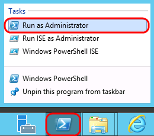

1.  Type the following command to import the IntelliTrace PowerShell
    module:

    ````
    **Import-Module c:\\IntelliTrace\\Microsoft.VisualStudio.IntelliTrace.PowerShell.dll**    
    ````

1.  To see the commands provided by IntelliTrace, using the following PowerShell command:

    ````
    **Get-Command \*IntelliTrace\***
    ````

    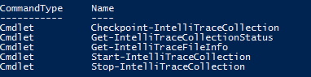

1.  **Note:** Commands are provided to start and stop an IntelliTrace
    collection, as well as to take checkpoints during collection.

1.  To get help for any of the PowerShell IntelliTrace commands, type
    something like the following:

1.  **Get-Help Start-IntelliTraceCollection**


1.  **Note:** You may be prompted to download and install the help files, so if you don’t want to wait for this to complete, simply skip this step and move on.


1.  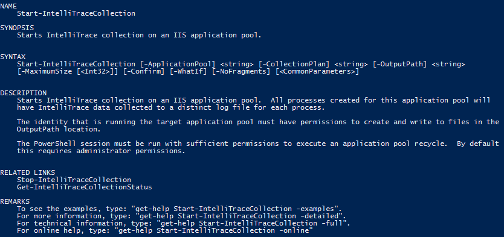


1.  **Note:** The REMARKS section from the help listing describes how
    you can get more detailed examples of command usage.

1.  We are now ready to start IntelliTrace collection. Type the
    following PowerShell command to start collecting data from the
    *FabrikamFiber.Extranet.Web IIS* application pool and store the
    resulting .iTrace log files in the folder we previously created.


1.  **Start-IntelliTraceCollection "FabrikamFiber.Extranet.Web"
    c:\\IntelliTrace\\collection\_plan.ASP.NET.trace.xml
    c:\\LogFileLocation**


1.  **Note:** You can hand-edit the collection plan file if you want to
    make changes.


1.  


1.  When asked to confirm, type “**Y**” and then press the **Enter** key
    to continue.


1.  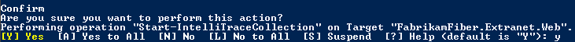


1.  Figure


1.  Confirming the request to start a collection


1.  


1.  **Note**: If you see an error having to do with the app pool not
    having a writable user environment key, go ahead and try the same
    command again to start the collection.


1.  


1.  Launch **Internet Explorer** and click on the **FF Customer Portal**
    button in the favorites bar to load
    [http://www.fabrikam.com](http://www.fabrikam.com/).

2.  IntelliTrace is now setup to gather the debugging data specified in
    the collection plan configuration file. Select the service tickets
    to reproduce the error that we saw before. As soon as you see the
    error, **close** Internet Explorer.


1.  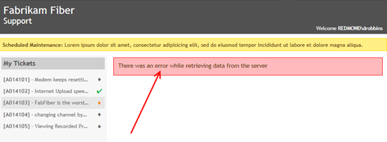


1.  Figure


1.  Reproducing the error


1.  


1.  Now we will stop the IntelliTrace collection to return the
    production server into its normal state. You have two options here,
    you can follow steps **21** through **23** or you can run the
    *StopIntelliTraceDemo.cmd* file found within the **Scripts** folder
    on the **Desktop** (run as administrator) and skip ahead to step
    **24**.

2.  Return to the PowerShell window and type the following command to
    get the current collection status.


1.  **Get-IntelliTraceCollectionStatus -ApplicationPool
    "FabrikamFiber.Extranet.Web"**


1.  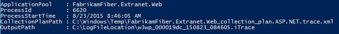


1.  Figure


1.  Collection status


1.  


1.  Type the following command to stop gathering IntelliTrace data for
    the *FabrikamFiber.Extranet.Web* application pool. Confirm the
    action when prompted.


1.  **Stop-IntelliTraceCollection "FabrikamFiber.Extranet.Web"**


1.  **Note:** As an alternative to stopping an IntelliTrace collection,
    it is also possible to get a copy of the current log by using the
    *Checkpoint-IntelliTraceCollection* command. This allows you to look
    at the data you have captured so far while continuing to collect
    additional data.


1.  When asked to confirm, type “**Y**” and then press the **Enter** key
    to continue.


1.  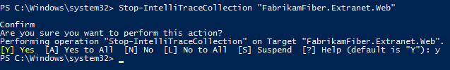


1.  Figure


1.  Confirming the request to stop a collection


1.  


1.  In a real-world scenario, it is at this point that the IntelliTrace
    file would be sent to a developer or tester for a more
    detailed look.


1.  


1.  


1.  In this exercise, you will see how we can use the IntelliTrace file
    that was generated on a production server to aid in debugging the
    error that we saw in the previous exercise.


1.  Returning to our scenario, let’s assume that we have already taken
    this IntelliTrace file and transferred it to a development machine
    that has Visual Studio Enterprise 2015 installed. **Double-click**
    on the IntelliTrace file to load it in Visual Studio.


1.  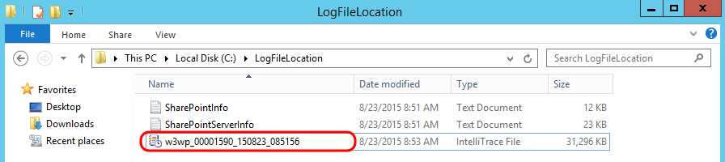


1.  Figure


1.  Loading the IntelliTrace file


1.  


1.  After opening the IntelliTrace Summary window, take a look at the
    **Exception Data** section. Here you can see a grid showing all
    exceptions that occurred. By default, they are sorted by most recent
    event time to the oldest.


1.  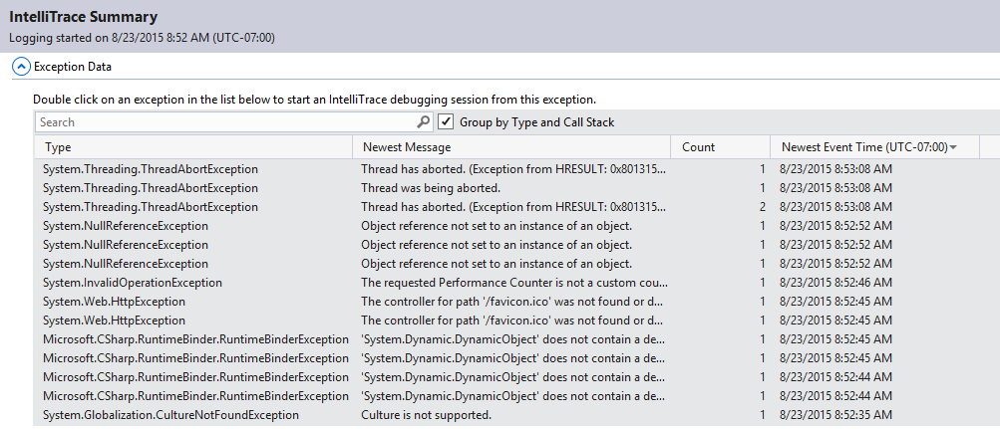


1.  Figure


1.  Exception Data section of IntelliTrace summary


1.  


1.  Select the last **System.NullReferenceException** found in the list
    (technically the first one that was thrown) and then select the
    **Debug Newest Exception in Group** button to start an IntelliTrace
    debugging session.


1.  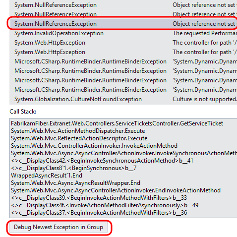


1.  Figure


1.  Start debugging at a specific event


1.  


1.  After the IntelliTrace file loads, you will see that you are in
    Historical Debugging mode, where you can examine the historical
    state of Locals, Call Stack, and events collected during
    IntelliTrace session.


1.  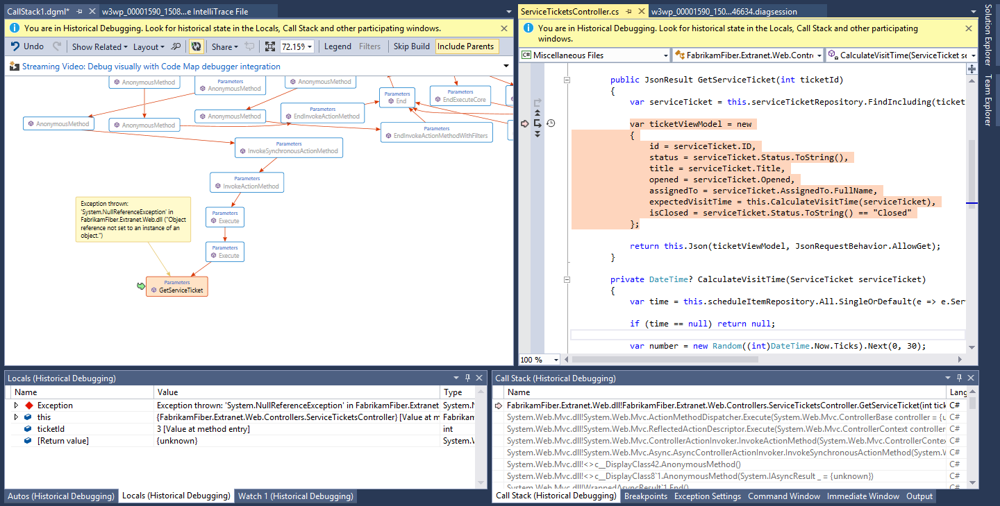


1.  Figure


1.  Debugging the thrown exception


1.  


1.  In the **Locals** window, note that there was a
    **NullReferenceException** event in the GetServiceTicket controller
    method, and that this was associated with **ticketId** value **3**.
    At this point, we could file a bug in Team Foundation Server and
    attach the IntelliTrace file to help the development team make the
    appropriate fix.


1.  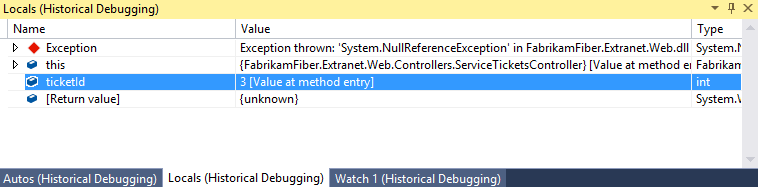


1.  Figure


1.  Finding root cause for exception


1.  


1.  There is also a diagnostic session data window open in the
    right-hand tab group (.**diagsession**). Select it to activate it.


1.  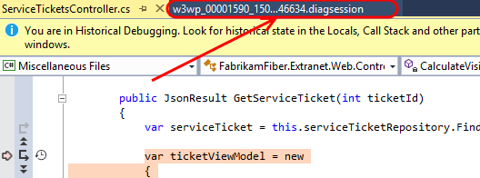


1.  Figure


1.  Viewing diagnostic session data


1.  


1.  All of the recorded diagnostic events are shown here. The one that
    we are currently viewing is the NullReferenceException when it was
    first thrown. This view can help us put the error into context with
    other events that were occurring just prior to the exception. For
    example, perhaps there was a problem with the SQL query that
    was used. In that case, we could get the query that was used simply
    by viewing the previous event.


1.  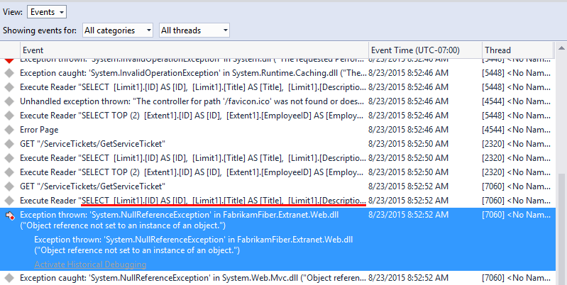


1.  Figure


1.  Viewing full diagnostic session event data


1.  
