# Debugging with IntelliTrace

## Overview
The idea around DevOps is to deliver high quality applications, to do it at speed and with ease.   The problem is that IT has bought into a ideal that holds them back from getting there. This ideal is that the measure of success is better Mean Time to Repair (MTTR). MTTR has been touted as the measuring stick of operational efficiency. Conventional wisdom has stated that the faster you can find a problem and fix it, the better IT performs. <cite>[The Chains that Bind IT -Stephen Wilson ](https://turbonomic.com/blog/on-technology/devops-challenge-mttr-chain-binds/)</cite>


Many developers still rely on traditional or live debugging techniques which shows only your applications current state with limited data about past events. You either have to guess what happened based on your current state, or you have to recreate these events by rerunning your app. Developers rely on breakpoints to try capturing some of the errors that might appear because of unknown events, sometimes even a breakpoint won’t be able to reach the issue – after all, maybe the breakpoint won’t be hit at all.

IntelliTrace expands this traditional debugging experience by recording specific events and data at these points in time. This lets you see what happened in your application without restarting it, especially if you step past where the bug is. IntelliTrace enables you to seek to a large number of execution points, that occurred in the past, and drill into any of them, comparing variables, call stacks, etc. in order to help pinpoint causes of issues without having to restart the application to reproduce the problem. IntelliTrace automatically collects various events in your application (e.g. ASP.NET, ADO.NET, etc), enabling you to view the historical state of the application at those points in time. 

> **NOTE**: There are two demos in this file. The first is for running IntelliTrace against a production web site, and then interpreting the collected file in VS 2017. The second shows using F5 Debugging with IntelliTrace. (The first depends on the VSE2017 Demo VM, while the other can be run on any machine with VS2017 and appropriate setup.)
 
## Pre-Requisites   
- Visual Studio 2017 Enterprise - download [here](https://www.visualstudio.com/vs/visual-studio-2017-rc/)
- Download the Parts Unlimited project [here](https://github.com/Microsoft/PartsUnlimited/tree/aspnet45)
- Running on VSE 2017 Demo VM

## Demo 1 of 2 - Collecting and Using IntelliTrace in Production

> **Talking Point**:<br/> Business has asked us to determine why we are seeing a drop in the sales of particular items from the past few days. We know that the last deployment was extended functionality to the Search capabilities of our site. Perhaps we can start there and see if this caused an issue?

### Generate a Historical Debugging File from Production
> **Talking Point**:<br/> We have some idea of where the bug may be - in the search functionality. But how do we debug in Production? Ideally, we want some way of stepping through the Production code _without affecting production_. This means we don't want to attach Visual Studio! However, what if we could create a log that we could open up and "debug" - stepping through the code as if it was live?<br /><br />Using IntelliTrace we can capture a log of code running in production. Let's get started! The first thing we have to do is attach an IntelliTrace collector to the running process. We have an IIS server running the Parts Unlimited ASP.NET application on this machine.

1. Open a PowerShell prompt and enter the following commands:
```
cd \intellitrace
Import-Module .\Microsoft.VisualStudio.IntelliTrace.PowerShell.dll
```

> **Talking Point**:<br/> This imports the IntelliTrace cmdlets so that we can create a trace of what is happening in production.

1. Start the collection with the following command. Enter 'y' when prompted to start the trace.

```
Start-IntelliTraceCollection -ApplicationPool DefaultAppPool -CollectionPlan .\collection_plan.ASP.NET.trace.xml -OutputPath .\logs\
```

> **Talking Point**:<br/> This starts IntelliTrace, gathering diagnostic logs on the `DefaultAppPool`. We specified the `trace.xml` collection plan which will give
us a verbose log and have a slightly heavier impact on performance (hence we only want to run this for short periods). For a lighter log, we could have used the `default.xml` collection plan.

1. Leave the PowerShell prompt open. Open a browser and browse to `http://localhost` to open the Production site. Perform the following steps:

> **Talking Point**:<br/> Now we're going to simulate some activity on the website ourselves. Often, you can just let normal usage drive the **IntelliTrace** collection, but we're going to have to simulate it here.  By the way, attaching the IntelliTrace collector to the app pool recycles it, which is why the first load takes a bit longer.

| Step | Script |
|-----|----------|
| Enter `battery` into the search box | We check that a singular search term produces results. |
| Enter `batteries` into the search box | We check that a plural search term produces results. |
| Enter `jumper lead` into the search box | We check that a singular search term produces results. |
| Enter `jumper leads` into the search box | We note that for some reason the plural `jumper leads` produces no results. |

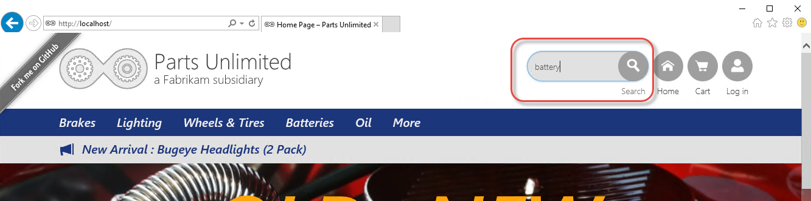
_Entering search terms in the Production site_

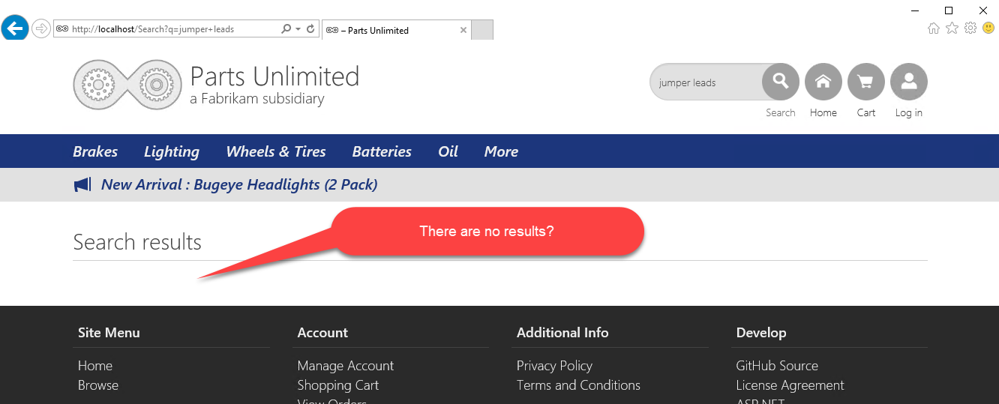
_There are no results for jumper leads_

1. Close the browser and return to the PowerShell prompt. Enter:

```
Stop-IntelliTraceCollection -AppPool DefaultAppPool
```

> **Talking Point**:<br/> This stops the trace on the `DefaultAppPool` so that we don't impact performance any more than necessary. It also removes
the lock on the log file. (If we wanted to continue logging we could have used `CheckPoint-IntelliTraceCollection` to instead release the log file and start logging to a new file).

1. Open an explorer window to `c:\intellitrace\logs`. Note that there is a new iTrace file in this folder (called something like `w3wp_00001200_170131_073315.iTrace`).
This is the log that the IntelliTrace collector created.

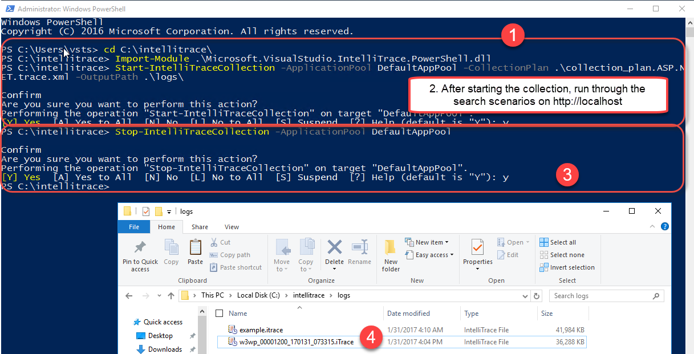
_Commands to collect IntelliTrace in Production_

> **Note**: If for some reason this does not work, you can use the file at `c:\intellitrace\logs\example.itrace` and continue the walkthrough. It is a working iTrace file that's already been collected.

### Find the Bug by Debugging the iTrace File
> **Talking Point**:<br/> Now that we have an iTrace file, we can open it in Visual Studio and diagnose what is going on in Production. We'll see call stacks, locals and variable values as though we were debugging the Production site!

1. Double-click the newly collected iTrace file to open it in Visual Studio.

1. Shrink the `Exception Data` section and expand the Web Requests section. Click on the top request (the one with `q=jumper+leads` in the request).  Click on the Request Details button.

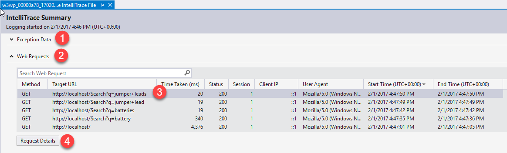
_Navigate to the Web Request_

> **Talking Point**:<br/> We can see all the requests that were logged during the session. Let's drill into the detail for this request.

1. Note the Exception (they are the same - the events are for the throw and for the catch of the exception). Click on the `Exception thrown` event.

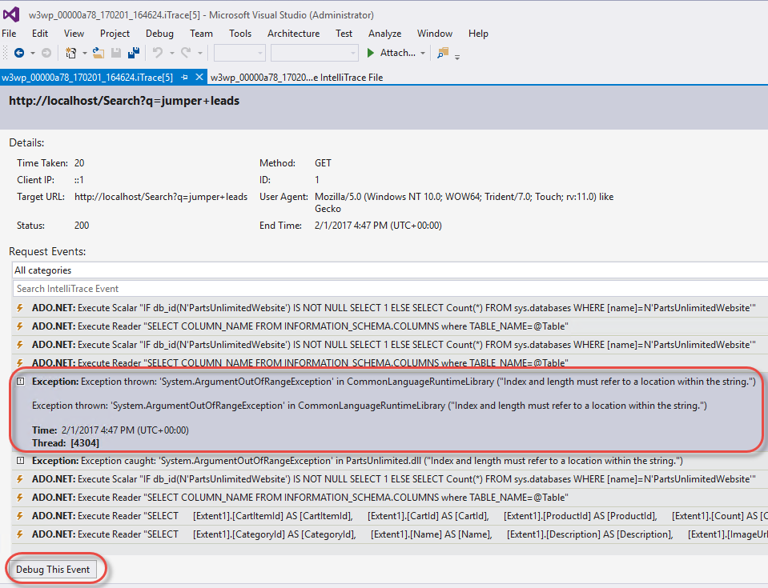
_Notice the exception within the session_

> **Talking Point**:<br/> We can see the exception being thrown - but the site doesn't report an error. This is a really hard scenario to debug if we don't have IntelliTrace since it's an intermittent issue (the search worked for `batteries` but not for `jumper leads`). We can see that the exception is a `System.ArgumentOutOfRangeException`.

3. Click on the Debug this Event button.


_It looks like we're debugging - but this is disconnected from Production!_

> **Talking Point**:<br/> It looks like we're debugging, but in fact this is showing history from the data captured in Production. By clicking on Debug, we are taken to the exact line of code that caused the exception. We can view the Call Stack and locals - and even see what value variables had at this point in the log.

1. Mouse-over `query` somewhere in the `Depluralize` method to show the tooltip with the value.

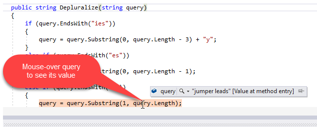
_Tooltips for variables - from the log_

4. Generate a Code Map for the call stack
Right-click on the line of code that is highlighted and click `Code Map->Show Call Stack on Code Map`.

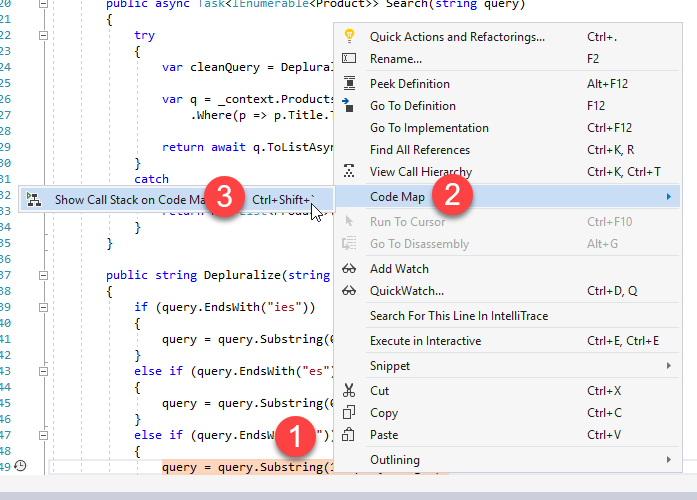
_Generate a Code Map from the Call Stack_

> **Talking Point**:<br/> We may want to visualize how we got to this point in the code. Let's generate a Code Map from the Call Stack.

1. Zoom in and show how the exception is pointed out on the map. <br />

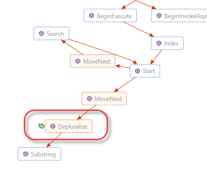<br />
_Visualizing the exception on the Code Map_

1. Stop Debugging
Click on the Stop icon in the Toolbar to stop debugging. You should close Visual Studio completely since the source file is not in a solution (it was opened via the symbol indexing when we started debugging from the IntelliTrace).

> **Talking Point**:<br/> We now know where the problem is - we're indexing past the length of the string. This is a classic off-by-one error. We can now stop debugging and figure out how to fix the bug.

-------

## Demo 2 of 2 - IntelliTrace inside VS 2017 ('F5' IntelliTrace)

> **Talking Point**:<br/>To use historical debugging we need to set up the Options to enable IntelliTrace. We'll enable both event and call information, as this gives us the most detail.

1. Enable IntelliTrace to collect events and calls information. Tools -> Options -> IntelliTrace -> General.
    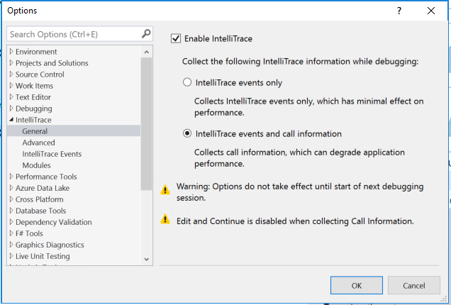

> **Talking Point**:<br/>Next we'll run the application right in our development environment, and run through some searches that we believe might be problematic.

1. Run the PartsUnlimited website (branch aspnet45) to start debugging. (F5)

1. Type "coils" into the Search bar on the homepage.
    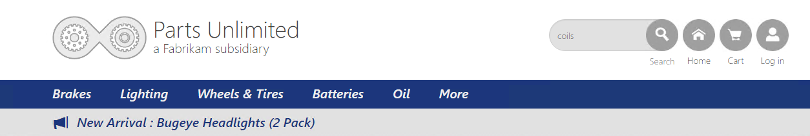

1. PartsUnlimited will return no search results. 
    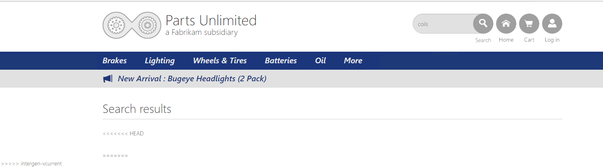

> **Talking Point**:<br/>We should be able to get a result for the 'coils' search, since we know a search for 'coil' returns a product. So why doesn't it show up? Let's take a look at the Diagnostic tools.

1. Inside Visual Studio, view the Diagnostic Tools Window. Note that in the Summary Tab (new in VS 2017), there are 2 Exceptions that occurred in the application, and the corresponding red diamonds in the Events track.  
    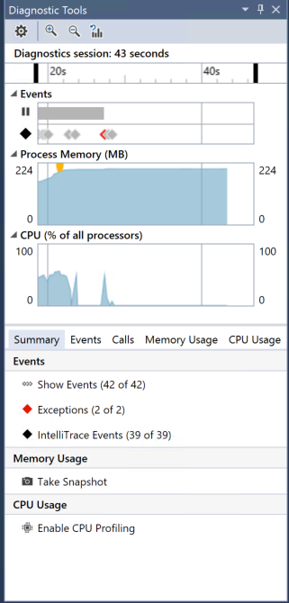

1. Click Show Events to be taken to the Events Tab.
1. Filter the Events view to show only the 2 exceptions.
    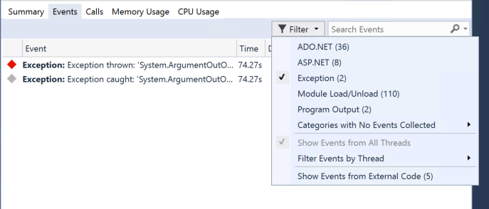

1. Double click on the red Exception thrown event.
    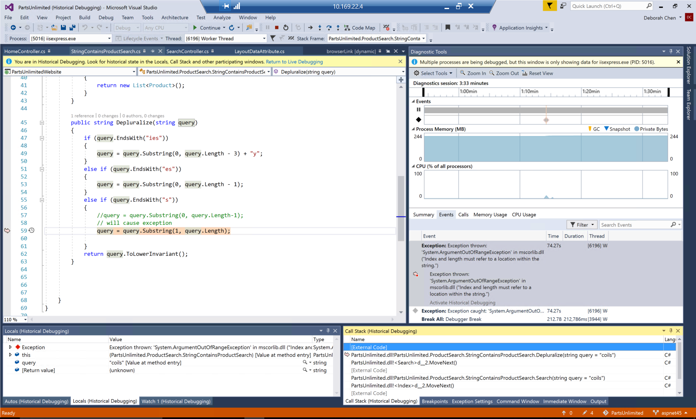

> **Talking Point**:<br/>Visual Studio takes you to the line of source code at which the exception was thrown. Right now Visual Studio is in "Historical Debugging" mode. You can see that in the Locals window, where the value of the query variable is "coils" -- the input we typed into the search bar. Note the pink arrow at Line 59, indicating we are in that historical time context. <br /><br />
From reading the description of the exception, it looks like we have an index out of range error. Let's fix that.

1. Replace `query = query.Substring(1, query.Length) with query = query.Substring(0, query.Length-1);`

1. Restart the application and search for 'coils' 
    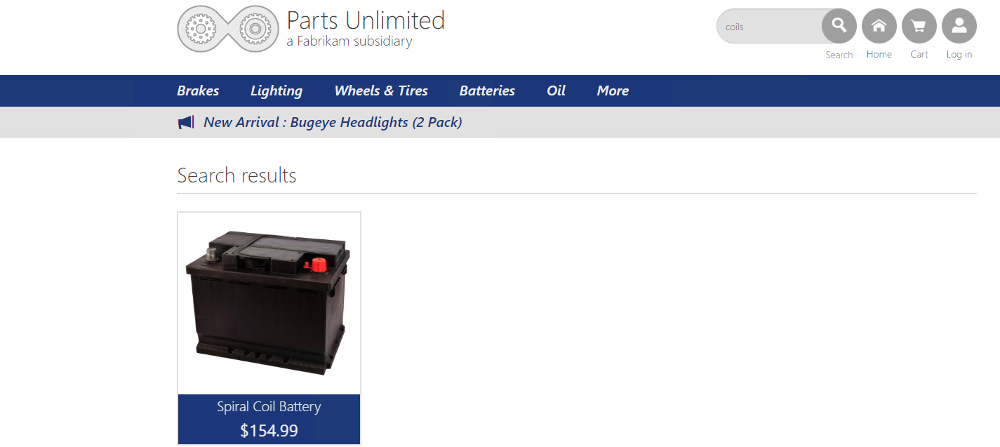

> **Talking Point**:<br/>Once we've fixed the bug, searching for "coils" now returns the correct result. With IntelliTrace, we were able to go from an exception directly to the source code, where we could fix the code almost immediately. Contrast that with regular debugging, where we would have had to guess where the relevant line of code is, set a breakpoint, step through the code, and continue until we find the bug. 


> **Talking Point**:<br/>In the above steps, we debugged the problem as we were developing locally. But suppose you repro'd the error, and wanted to send the problem to another developer to debug. We can save an iTrace file with a repro of this problem.

1. Click Debug -> IntelliTrace -> Save IntelliTrace Session. Save the IntelliTrace file. 
   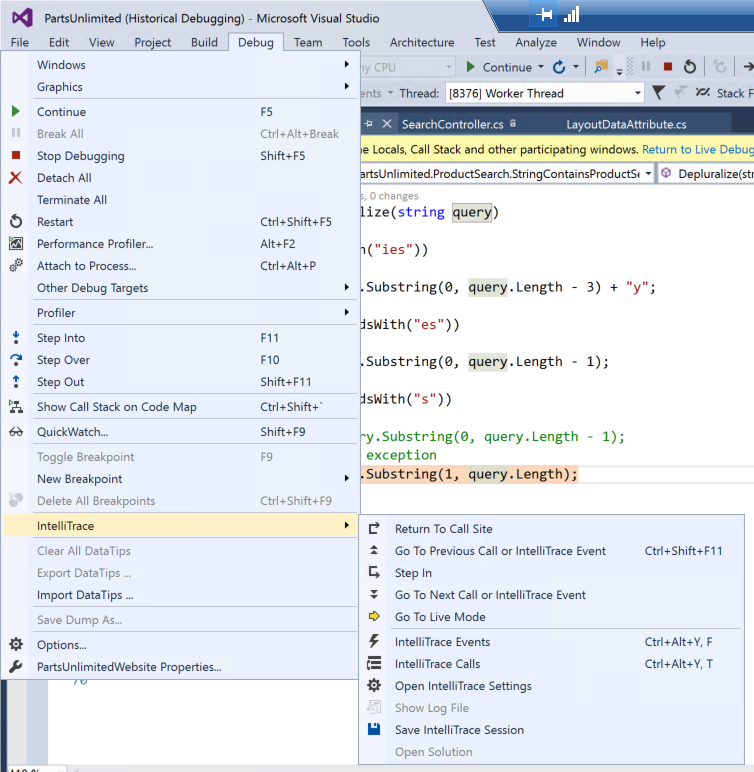

1. Bouble-click the saved iTrace file to open in Visual Studio. Double click on the Exception under Exception Data to be taken to Source code. 
   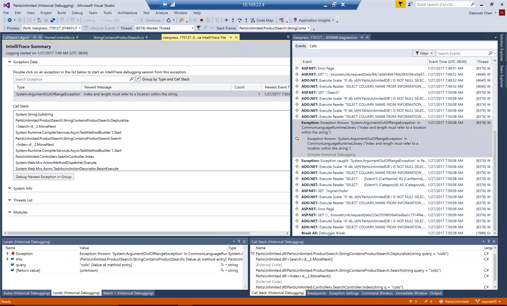

> **Talking Point**:<br/>Lastly, we can open up a shared iTrace file and do the same debugging. <br />

> **NOTE**: In a real world use case, the source and symbols locally must match the source and symbols on the machine on which the application was deployed. In this case, we created and recorded the iTrace file locally, so all the source and symbols will match. 

------------

## Summary
You can spend less time debugging your application when you use IntelliTrace to record and trace your code's execution history. You can find bugs easily because IntelliTrace lets you record specific events and debug errors that are hard to reproduce or that happen in deployment 

Here are some examples of how IntelliTrace can help you with debugging:
- ***Your application has corrupted a data file, but you don't know where this event happened***: Without IntelliTrace, you have to look through the code to find all possible file accesses, put breakpoints on those accesses, and rerun your application to find where the problem happened. With IntelliTrace, you can see all the collected file-access events and specific details about your application when each event happened.

- ***An exception happens***:Without IntelliTrace, you get a message about an exception but you don’t have much information about the events that led to the exception. You can examine the call stack to see the chain of calls that led to the exception, but you can’t see the sequence of events that happened during those calls. With IntelliTrace, you can examine the events that happened before the exception.

- ***Your application crashes on a test computer but runs successfully on a development computer*** or ***A bug or crash happens in a deployed application***: You can configure IntelliTrace data collection before you publish the application. While your application runs, IntelliTrace saves data to an .iTrace file or use Microsoft Monitoring Agent, either alone or with System Center 2012, to save IntelliTrace data to an .iTrace file.


