# On-prem Load Testing using Visual Studio

Find performance issues before you release your app by running load tests with with **Visual Studio Enterprise**. In this exercise, we will use the web performance tests that we created in the previous exercise as the basis of a load test.
Building one or more web performance tests that accurately reflect a user scenario is critical to the foundation of a useful load test. To create a load test we will define user load, specify the web performance tests to use, the type 
of network and browser simulation to use, and the performance counters and other metrics that we want to collect for the duration of the test.

### To run load tests on Cloud using **VSTS** follow [this](https://github.com/Microsoft/VSE2017-SalesEnablement-Demos/blob/master/Feature%20Demos/Load%20Testing/CloudLoadTesting.md)

### Task 1: Adding Load Test

1. Select **Project | Add Load Test** from the main menu in Visual Studio.

2. In the New Load Test Wizard, select **On-premise Load Test** and click **Next** to start defining the load test scenario.

 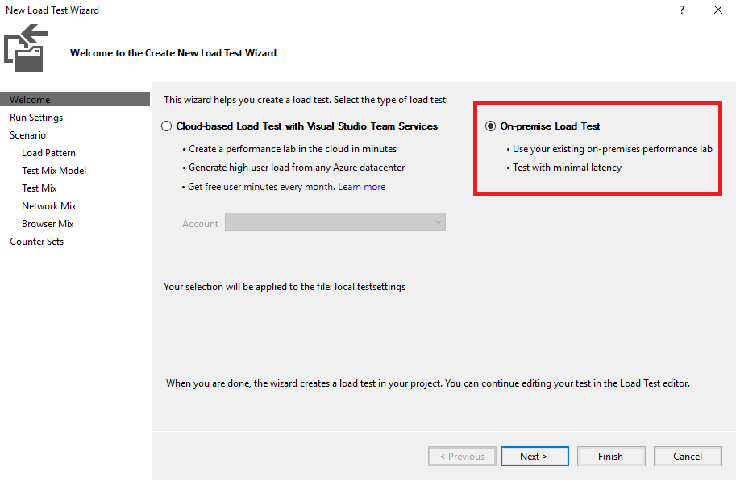
 
3. The Run Settings for a load test allow you to specify how long the test should run using either time duration or a specific number of test iterations. We will use a time duration, but change it to **1 minute** for demo purpose. The default sampling rate of **15 seconds** is fine here, and it is a good choice in general for shorter test runs. If you want to run longer tests, consider sampling less often as it will generate a lot less data to store in the load test database. Click **Next** to continue.

 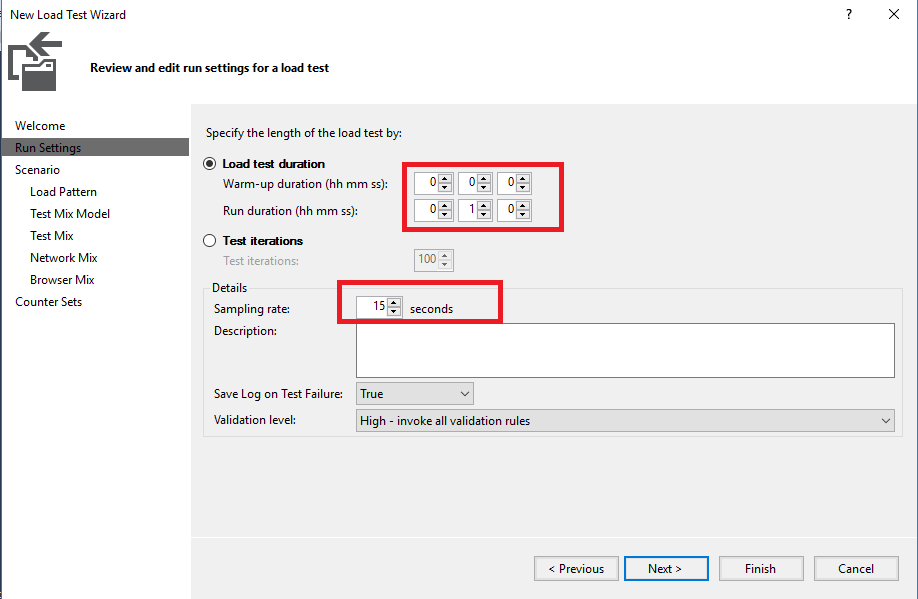
 
4. Enter a name for the scenario like **“BrowseAndOrderProduct”** but leave the default think time profile in place. The default uses the think times of the web performance tests as a median value with a normal distribution used to generate some variation. The goal is a more realistic generation of load on the web site. Click the **Next** button to continue on to the Load Pattern definition screen.
 
 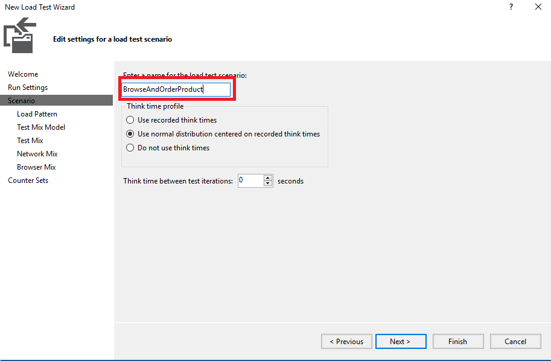
 
5. Use the **Constant load** option (the default) for this load test, but change the User Count to **5 users** since we are operating within a virtual machine. It is important to keep the simulated user count low enough such that the machine has enough resources to properly run IIS and the load test on the same machine. Depending upon the web site under test, using a step load to ramp up usage of the web site may be more realistic, but it also requires longer test runs. Click **Next** to continue on to the Test Mix Model definition screen.

 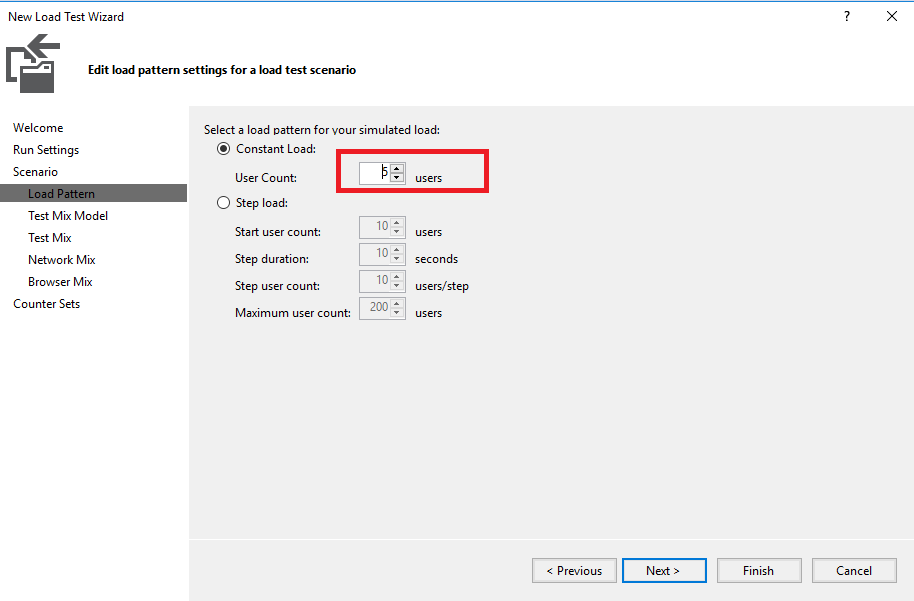
 
 
6. Read the description of each test mix model by clicking on it and viewing the description that appears on the right-hand side. Let’s say that our current production site gives us some indication of the percentage of browsing users that end up making purchases. Select the first option that models the test mix based on the total number of tests and then click **Next** to continue on to the Test Mix screen.

 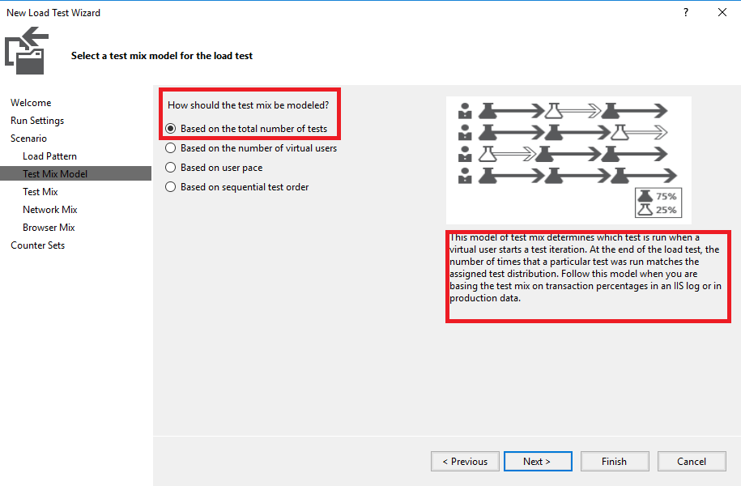
 
7. Click **Add** to load the Add Tests window.

 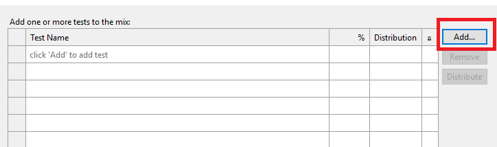
 
8. **Select** both tests, add them to the test mix, and then click OK.

 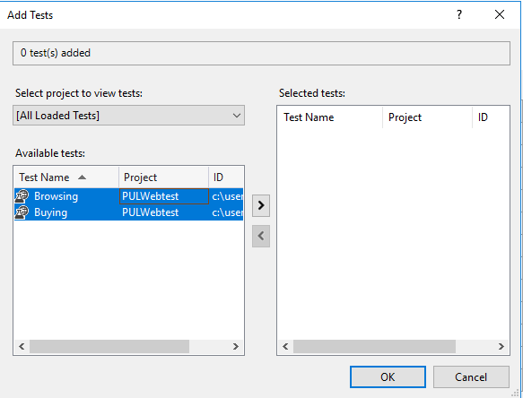
 
 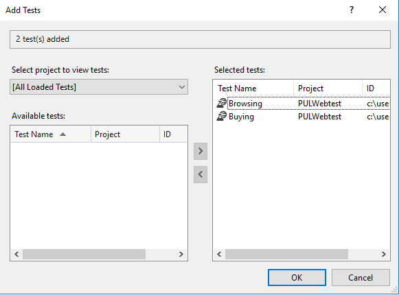

 **Note:** Load tests can include a mix of coded UI tests, web performance tests, and even other test types such as unit tests. It is important to note that for Coded UI tests, you need one virtual or physical machine per user that you are simulating since it assumes that it has control over the entire user interface.
 
 
9. Let’s say that our production logs tell us that **25% of users** browsing the site will end up buying something. Change the Distribution to reflect this knowledge and then click **Next** to continue on to the Network Mix screen.

 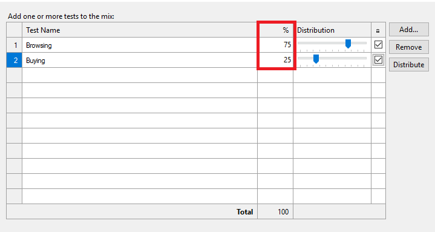
 
10. The Network Mix screen allows you to choose one or more network types and specify the distribution of those types across the tests to be executed by the virtual users. Select the **Network Type** dropdown to see the available options.

 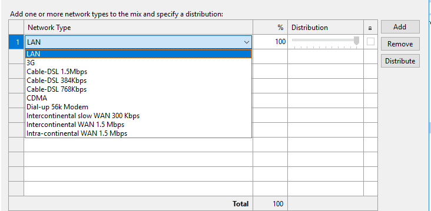
 
11. Leave the default Network Type of **LAN** in place and click **Next** to continue on to the Browser Mix screen.

 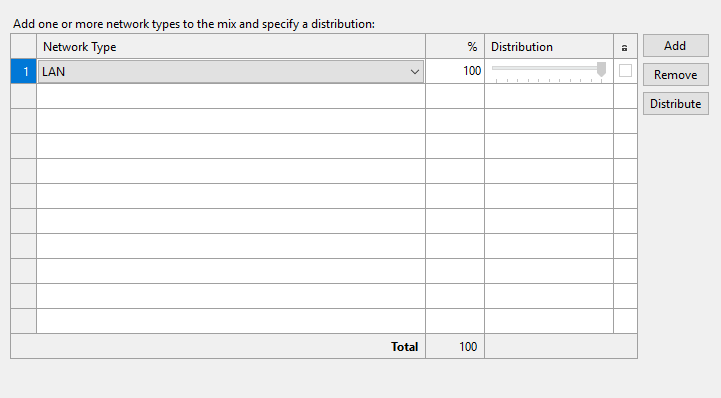
 
 **Note:** Network emulation will not work when operating within the virtual machine environment because the URL under test loops back to localhost

12. The **Browser Mix** screen allows you to specify one or more browser types and specify the distribution of those types across the tests to be executed by the virtual users. Just like the network mix, this allows us to more realistically model how the users interact with the web site. For the purpose of this exercise leave the default at **100% Internet Explorer 9.0** and click Next to continue on to the Counter Sets screen.

 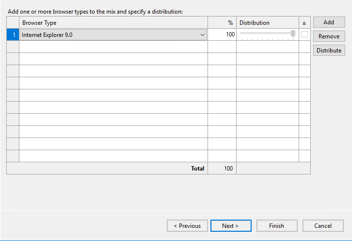
 
13. The **Counter Sets** screen allows you to specify the computers and counter sets to gather performance counters during the load test. Click the **Add Computer** button and type the computer name.

14. Select the **ASP.NET** and **SQL** counter sets to monitor since we are load testing a website. Note that **Controller Computer** and **Agent Computers** collect some data by default, and that both of these represent the same machine in this case. Once the counter sets have been set click **Finish** to save the configuration.

 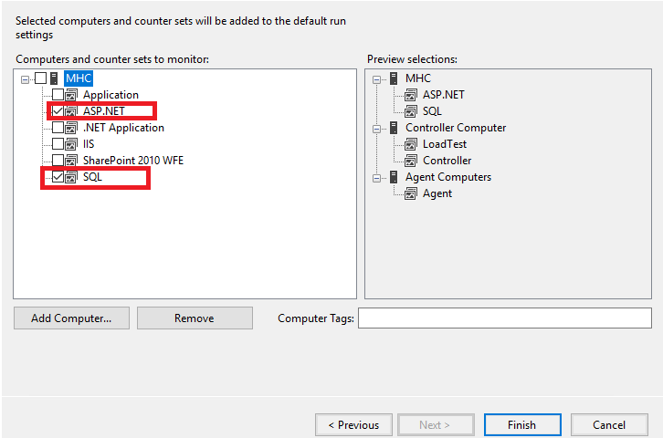
 
 **Note**: It is possible to modify or add counter sets to be used during load tests by working directly with the **.CounterSet XML files** located in the **%programfiles(x86)%\Microsoft Visual Studio\2017\Enterprise\Common7\IDE\Templates\LoadTest\CounterSets** directory. The LoadTest directory also contains **Network and Browser** definitions.
 
15. Let’s take a quick look at the **test settings** file. In Solution Explorer, **double-click** on the **Local.testsettings** file.

 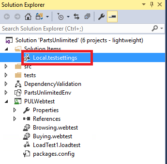
 
16. Note that you could perform test runs using **Visual Studio Team Services**, but for the purpose of this lab, we will run them locally. Select the **“Run tests using local computer or a test controller”** option if not already selected.

 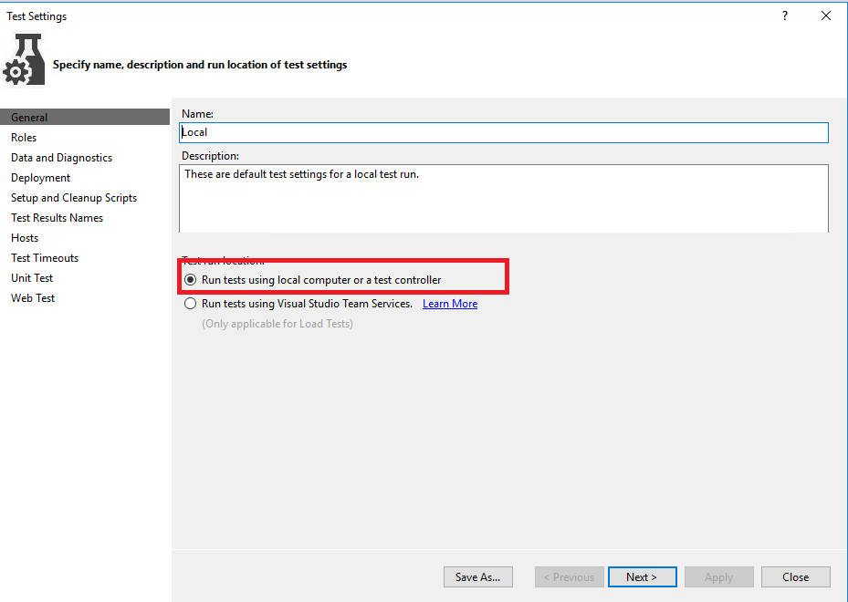
 
17. In the **Test Settings** window, select the **Data and Diagnostics** option to see the available adapters. Options include an **ASP.NET Profiler, Event Log, IntelliTrace, Network Emulation**, and more. No adapters are selected by default because many of them have a significant impact on the machines under test and can generate a large amount of data to be stored over the course of long load tests.

 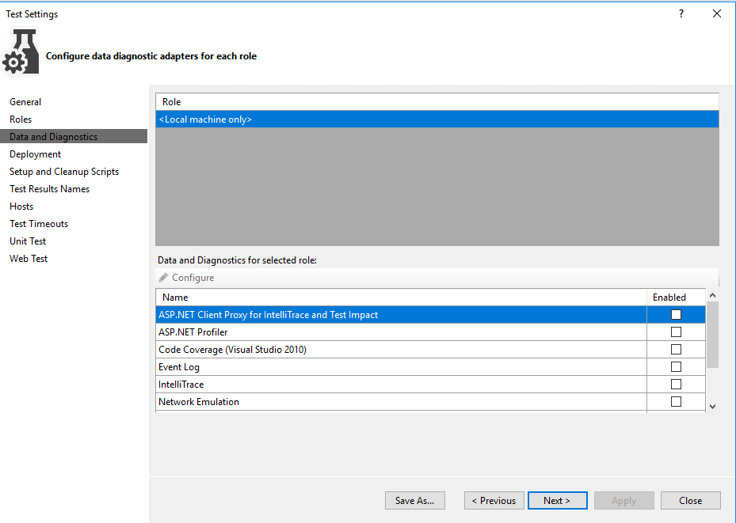
 
18. Close the **Test Settings** window and click **Yes** to save changes if asked.

### Task 2: Configuring Test Controller

1. Open the load test that we defined in the previous demo by **double-clicking** on it in Solution Explorer.

 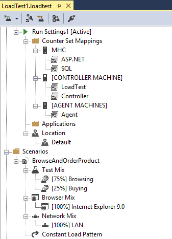
 
2. Click the **Manage Test Controllers** button in the Load Test Editor toolbar.

 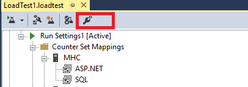
 
3. Note that the selected Controller is set to **Local – No controller**. Click the ellipses button to setup the connection string to the load test results store.

 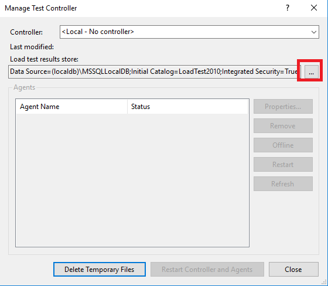
 
4. Leave the settings to the default as shown below-

 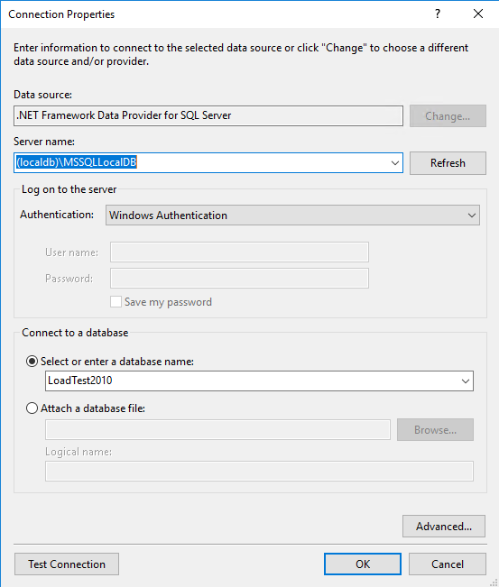
 
5. Click **Close** to exit out of the Manage Test Controller window.

### Task 3: Executing and Monitoring Load Test

1. Start the load test by clicking the **Run Test** button from the toolbar.

 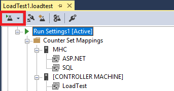
 
2. Once the load test initializes and starts a **1-minute** test run, the load test results window will load with the **Graphs view** visible. By default, you should see **four panels** showing some key statistics, with some key performance counters listed below that. Data is sampled every **5 seconds** by default, but that can be changed in the load test settings.

 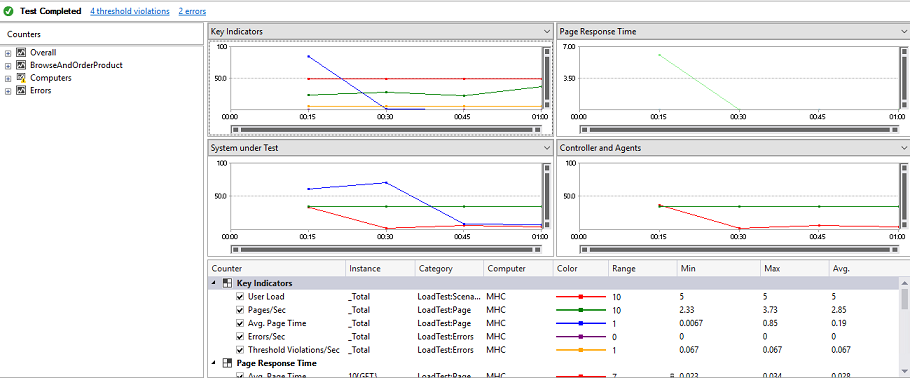
 
**Note:** Screenshots showing statistics and graphs may vary widely from those that you see during your walkthrough of this lab. This is due to the different hardware that you are running this virtual machine on. In addition, you may see some threshold violations that result from the VM being busy during test. In a real world situation, in which you want to drive more virtual users, you would probably be served by using multiple machines during test, not only to generate the load but also for each component of your system, as it will be deployed in production.

### Task 4: Viewing Load Test Results

1. After the load test run finishes, it will automatically switch to the Summary view. The Summary view shows overall aggregate values and other key information about the test. Note that the hyperlinks to specific pages open up even more details in the **Tables view**.

 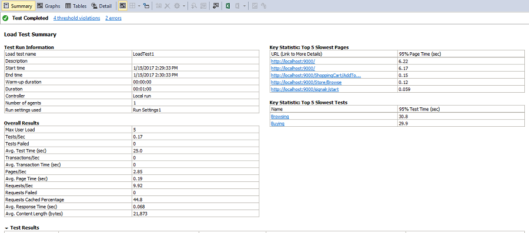
 
2. Switch to the **Graphs** view by clicking on the **Graphs** button in the toolbar. Note that you can manipulate the graphs that you view. Select the panels drop down control in the toolbar and select the **Two Horizontal Panels** option.

 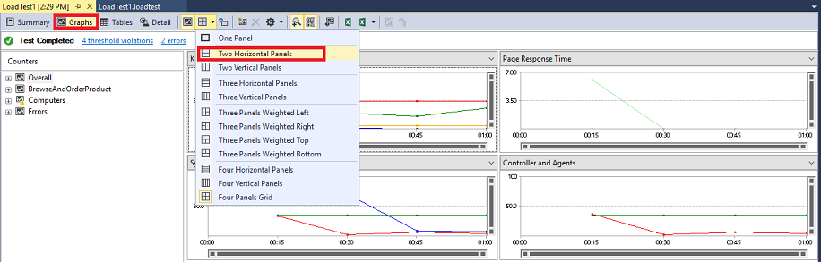
 
3. By default, the top graph will show **Key Indicators** and the bottom graph will show **Page Response Time**. Two very important sets of data for any web application.

 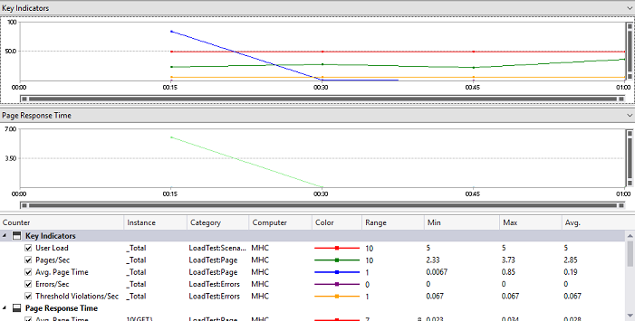
 
4. Click on one of the **Key Indicator graph lines or data points** and select it. This will also highlight the counter that it is associated with the below graphs. The red line from the screenshot below represents the **User Load** at different points during the load test.

 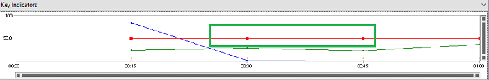
 
5. Click on the **Pages/Sec** row from the Key Indicators section of the counter grid to highlight it in the graph. In the screenshot shown below we can see that the **average number of pages per second** over the duration of the test was 2.85 (this may vary for you).

 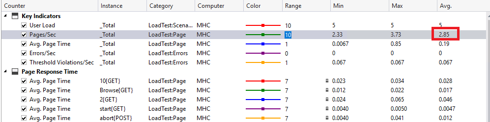
 
### Task 5: Generating and Viewing Load Test Trend Reports

1. Even though the initial load test may result in some numbers that don’t seem to provide a wealth of information it does provide a good baseline and allow us to make relative measures between test runs to help measure performance impacts of code changes. For example, if we had seen a relatively high level of batch requests per second during our initial load tests, perhaps that could be addressed by adding in some additional caching, and then re-testing to make sure that the request per second goes down.

2. Run the load test one more time so that we have at least two test results to work with so that we can see how to perform some trend analysis.

3. When the second load test is complete, click the **Create Excel Report** button from the toolbar to load Excel.

 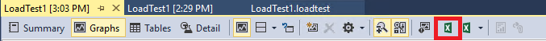

4. In the **Generate a Load Test** Report window within Excel make sure that the **Create a report** option is selected and then click **Next** to continue.
 
  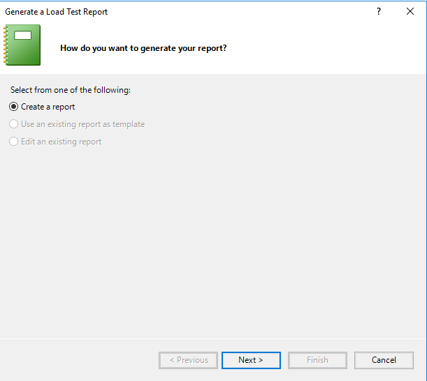
  
5. When prompted for the type of report to generate, select **Trend** and click Next.
 
  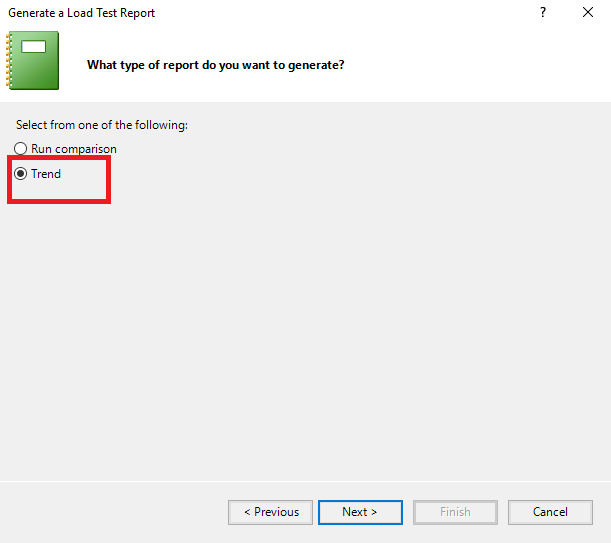
  
6. For Report Name, enter **LoadTestTrend** and click **Next** to continue.
 
  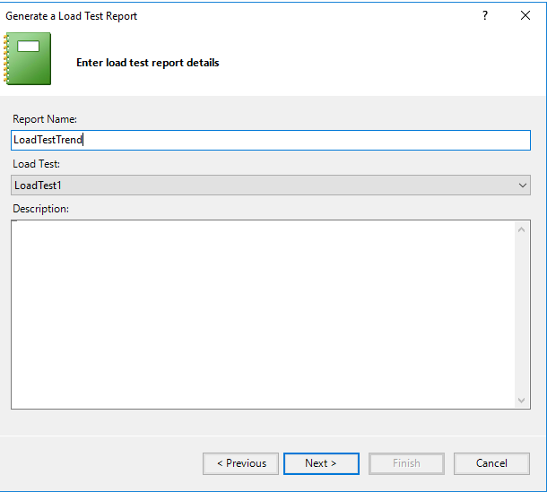
  
7. Select at least two load test runs to generate the trend report and then click **Next** to continue.
 
  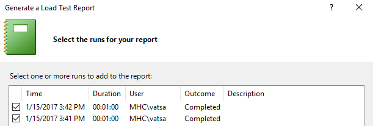
  
8. When prompted for counters to add to the report note that there will be a number of pre-selected defaults. Leave those defaults in place and click **Finish** to generate the report.
 
  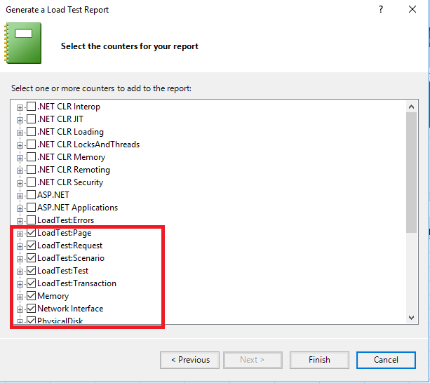
  
9. After the report is generated a table of contents will be displayed that provides hyperlinks to specific report sheets. Click the **Avg. Page Time** link.

 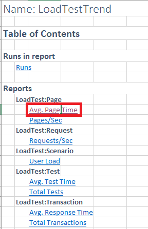
 
10. The **Avg. Page Time graph** shows the average page time taken over the entire load test for each test run that you selected for trend analysis. The page time is a measure that includes all requests that were made for a web page so it is a useful performance indicator to measure. Since we did not make any modifications to the application under test we do not expect to see significant differences between the test runs.

 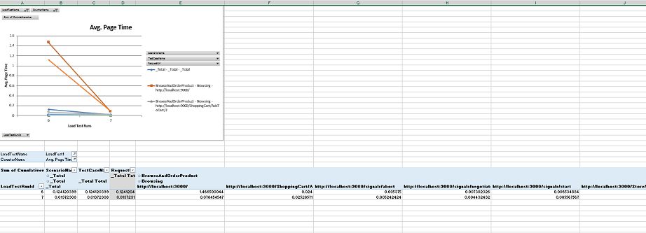
