# Web Application Load and Performance Testing

 

## Overview

### Performance Testing in the DevOps World   
 A properly functioning webpage or mobile application is the connection between your brand and your target customer, and if it doesn’t load properly or in a timely manner, you may lose a customer to a competitor. Performance testing ensures the user doesn’t experience slowdowns or the dreaded downtime, which is often the result of a poorly functioning back-end system. Performance testing is also important not just because of its easy integration into DevOps practices and how it fits into the CD pipeline, but the overall customer experience as well.Performance testing and DevOps are not opposing forces; and performance tests run automatically within the tool chain save time, rather than consuming more. The reality is that during this age of rapid software delivery, testing is the glue that keeps the development process on track and high quality. Performance testing should be part of every software delivery workflow, and DevOps is allowing that to happen.   
-- <cite>Michael Sage - https://devops.com/performance-testing-the-unexpected-missing-link-in-devops/</cite>

### Load and Performance Testing with Visual Studio Enterprise
One of the biggest performance testing challenge for enterprises is that the cost of running full-scale production environments
isn’t practical for most organizations. But with Microsoft Visual Studio Enterprise and Azure-Powered Cloud Load Testing, teams can easily test hundreds of thousands of users at a very affordable cost. The key features of 
Visual Studio Enterprise and Team Services enables team to:
- ***Load test web sites, apps and APIs*** - With authoring experiences in Visual Studio, Azure and Visual Studio Team Services you can quickly create load tests by specifying a website, referencing a JMeter test file or recording and replaying your actions. Run them or customize them using powerful tools in Visual Studio. You can even use existing unit or functional tests to generate load.
- ***Scale to hundreds of thousands of concurrent users*** - Generate hundreds of thousands of connections in minutes. Cloud-based load testing leveraging the power of Azure is like having a whole performance lab at your fingertips. 
- ***Deep analysis with rich diagnostics, trace and exception logging*** - View app performance with real-time charts and graphs. Teams can go even further with Application Insights, and correlate test results with server diagnostics.
- ***Generate load from multiple regions worldwide*** - Teams can run tests from one of many global Azure datacenter locations to minimize latency and simulate users' real-world conditions
- ***Easily load test an app with a public end point or an app behind the firewall*** - You can test any application irrespective of whether they are public or behind a firewall
### Latest Related Announcements 

- [Cloud-load testing service is hyper-scale ready](https://blogs.msdn.microsoft.com/visualstudioalm/2016/09/30/cloud-load-testing-service-is-hyper-scale-ready-lessons-from-generating-1m-concurrent-user-load/)
- [Run cloud-based load tests using your own machines (a.k.a. Bring your own subscription)](https://blogs.msdn.microsoft.com/visualstudioalm/2016/09/27/run-cloud-based-load-tests-using-your-own-machines-a-k-a-bring-your-own-subscription/)
- [Testing private/intranet applications using Cloud-based load testing](https://blogs.msdn.microsoft.com/visualstudioalm/2016/08/23/testing-privateintranet-applications-using-cloud-based-load-testing/)
- [Create, run and analyse load tests just using the browser](https://blogs.msdn.microsoft.com/visualstudioalm/2016/05/20/feature-preview-creating-load-tests-using-http-archive/)

## Demo Script/Hands-on-Lab:   
## Pre-requisites

- Visual Studio 2017 (download [here](https://www.visualstudio.com/vs/visual-studio-2017-rc/))
- Download the Parts Unlimited project [here](https://github.com/Microsoft/PartsUnlimited/tree/aspnet45)

### Task 1: Creating Web Performance Tests

1. Download and extract the zip file.

2. Open the solution in **Visual Studio 2017**.

3. Right click on the **Parts Unlimited** solution and click **Add New Project** and select **Web Performance and Load Test Project template from Visual C# | Test**. Name the project and click **OK**.
    
 

1. The new web and load test project is created with default test settings and a single web test definition file named **WebTest1.webtest**. Click the **Add Recording button** at the top of the Web Performance Test Editor to start recording as shown below
    
 

 
1. **Internet Explorer** and the **Web Test Recorder** now opens in **Record mode**. You can verify by looking at the toolbar at the top of the recorder window. You can also pause, stop, or reset the recording at any time.
    
 

  
1. In the next few steps, let's play a role of **customer** by browsing few products and drilling into the product details. The goal here is to create a profile that represents the typical browsing scenario for the site for a single user.

1. From your **Internet Explorer**, type [http://partsunlimiteddev.azurewebsites.net](http://partsunlimiteddev.azurewebsites.net) to launch the **Parts Unlimited website**. Note that the requests are logged in the **test recorder** as shown below-
    
 

    <pre>
      Note- If your application is hosted locally, you can access the local site or else you can use the azure hosted website http://partsunlimiteddev.azurewebsites.net
    </pre>
1. Once you complete browsing the products, click **stop** in your Test recorder. The web test detects all the **dynamic parameters** and runs your test producing a **pass/fail** result.

 
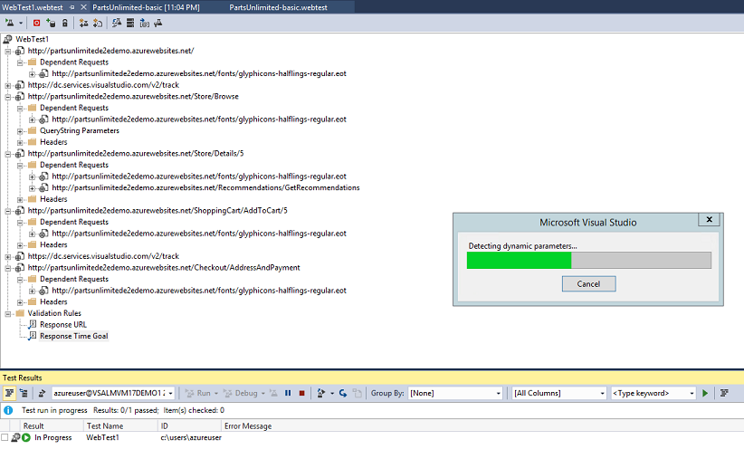 

 
 
 

 
 ------     
### Task 2: Working with Web Tests in Visual Studio

1. Once the Web Test Recorder stops recording and returns to Visual Studio, 2 tasks will commence.
 - **Dynamic Parameters**- that could not be identified and extracted during the recording will be identified. Examples of dynamic parameters include cookie values, ASP.NET view state, query string parameters, and post parameters. Extracting dynamic parameters when they are first used will allow the test to be run at any time in the future and therefore we will be able to utilize them as part of a load test.
 
 - **The recorded web performance test will run and display results.**

2. Take a moment to view the recorded web requests and see that query string parameters were automatically extracted. Visual Studio will also look and extract **hidden HTML fields** and **form post parameters** as shown below-

  
 

 
 **Note**- There are 2 types of rules that can be applied to the response for each HTTP request, **validation** and **extraction**.

  - **Validation rules**- can be used to verify that pages have specific text, tags, attributes, or form fields on them.
 
  - **Extraction rules**- can be used to store results in the test context as name value pairs. These rules can extract form fields, text, attributes, headers, regular expressions, and hidden fields.
 
3. In Solution Explorer, right-click on the **WebTest1.webtest** and select rename to change the name to **“Browsing.webtest”**. This will make it easier to keep track of the scenarios that we record.

 
 

 
4. Let’s take a look at the recorded think times to make sure they are appropriate. Click the **Set Request Details** button from the toolbar to open the Request Details window.

 
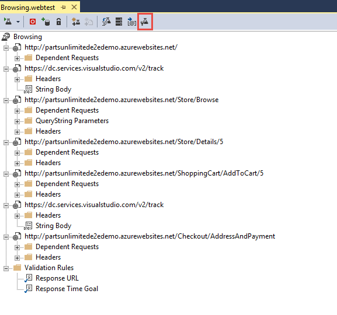 

 
5. The **Request Details** window shows a grid containing all requests along with a reporting name, think time (in seconds), and response time goals (in seconds). For the purpose of this lab, make sure that the sum of all think times is no more than about **15 seconds**. This will help us ensure that we can get good results when we create a load test later on. Click **OK** to continue if you made any changes.

 
 
  

--------------------------------------       
### Task 3: Recording an Additional Web Test Scenario

1. Now let’s add in another web test to represent a customer that browses and purchases a product from the Parts Unlimited website. Select **Project | Add Web Performance Test** from the main menu in Visual Studio. We could have created a single web test that included both the browsing and buying scenario, but composing the tests in this fashion will make constructing a realistic load test easier later on.

2. Navigate to the **Parts Unlimited** Website and **login**.

 
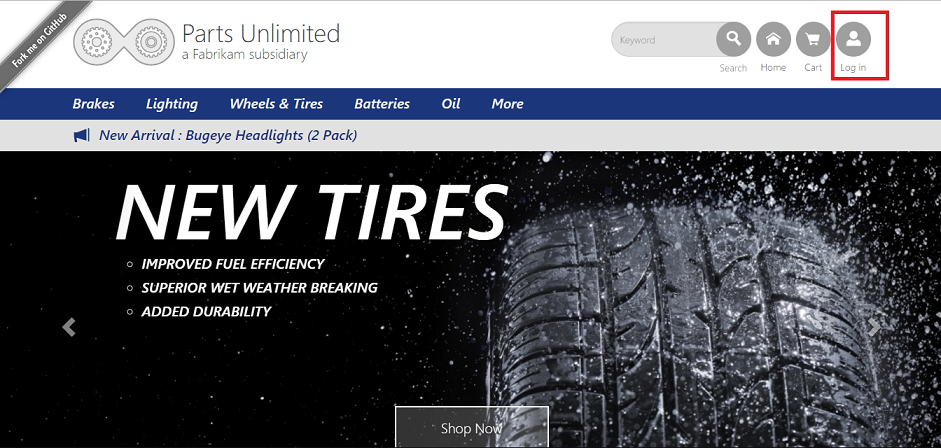 

 
3. You can register as a **new user** or you can use the default **Login Credentials**.
 
 - **Login credentials**: Username- **Administrator@test.com**, Password- **YouShouldChangeThisPassword1!**
 
 
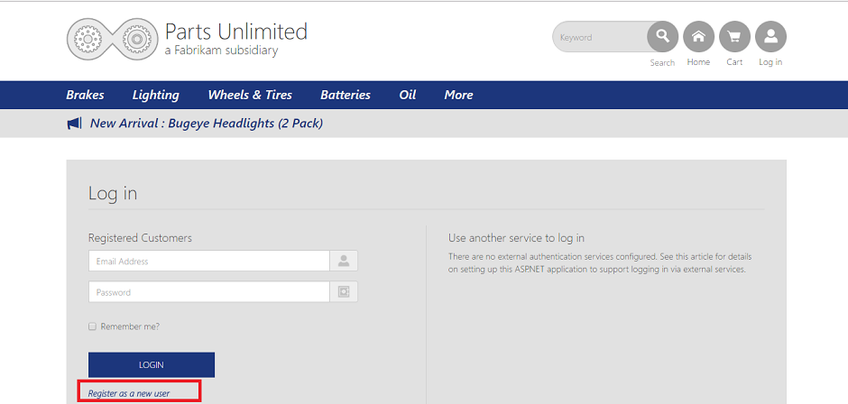 

 
4. Once logged in, click on **Brakes** as shown below.

 
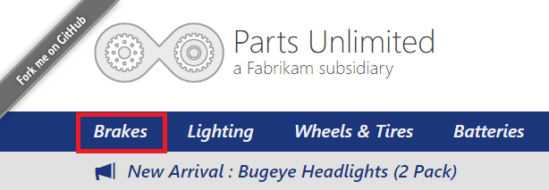 

 
5. Select **Brake Rotor**.

 
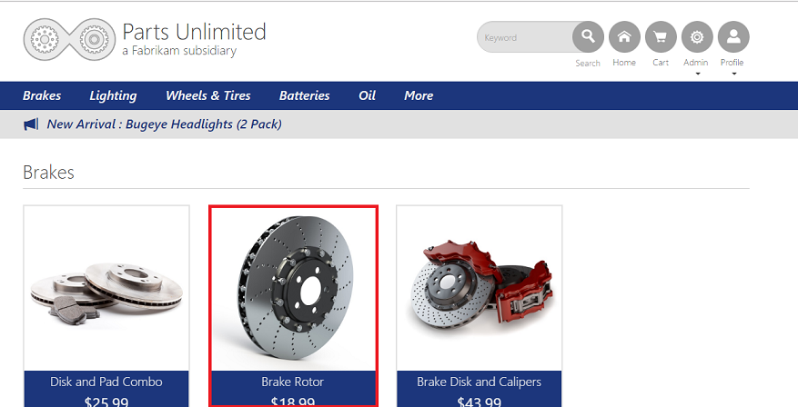 

 
6. Click **Add to Cart**.

 
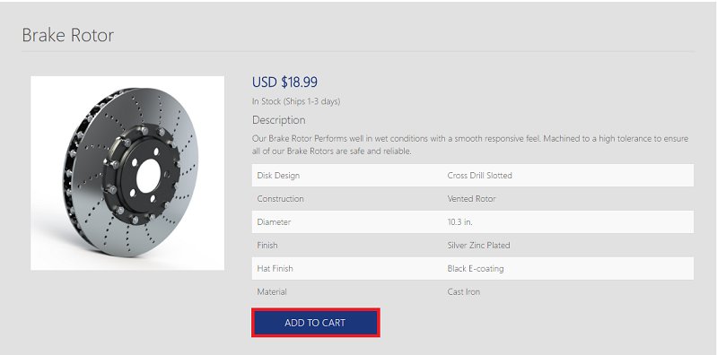 

 
7. Click **Checkout**.

 
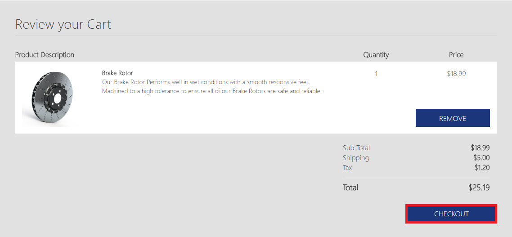 

 
8. Fill out the order form with some test data and click on **Submit Order**.

 
 

 
9. Once Checkout is complete, you can click on **view your order** to review your order details.

 
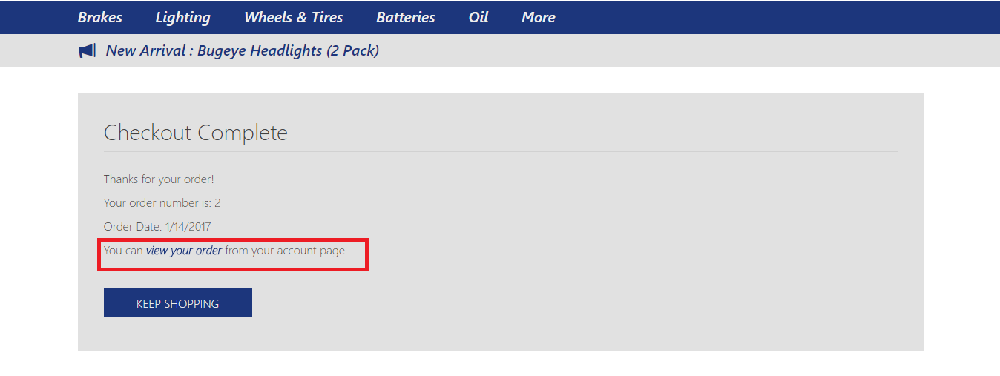 

 
 
 

 
10. Click **Stop** button in Web Test Recorder to return to Visual Studio.

11. From your **Solution Explorer**, right click on **WebTest1.webtest** and rename it to **Buying.webtest**.

 
 

 
----------------------     
### Task 4: Viewing Web Test Result details

1. Load the **Test Results** window and note that the test run that was automatically kicked off ended up failing. Double-click the test run to view the test result details.

 
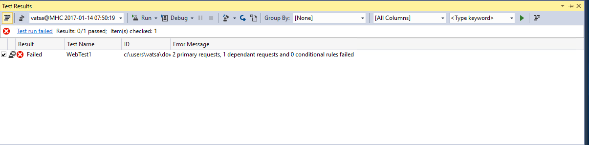 

 
2. The **Test Result** Details window shows the sequential list of HTTP requests, responses, some Visual Studio test context, and other details. Take a few minutes to familiarize yourself with the information available here.

 
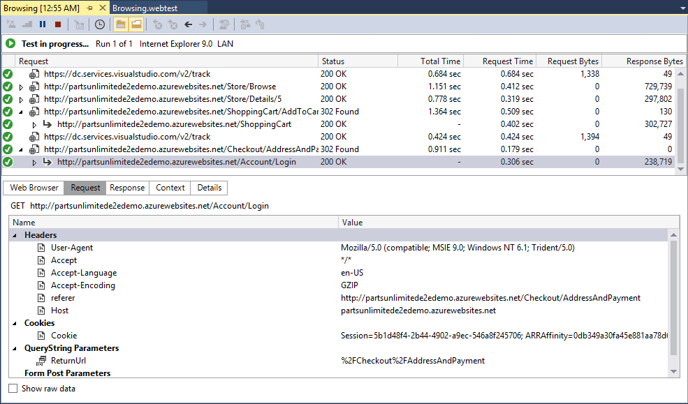 

 
3. Scroll down to the request that shows where the web performance test failed and select it. Note that the returned status code is a 200 and the Request and Response tabs look fine.

 
 

 
4. Response to **Details** and **Login** shows failure even though we have **HTTP 200**.

5. If you click on the **Details** tab, you will see that the test failed because a **Response URL Validation** rule was expecting to see the same response URL that was recorded during the Web Test definition.

 
 

 
6. Now that we understand why the web test failed, we can modify  the web test, so that it will succeed and still give us a good test representing a user browsing and ordering a product. Scroll down to the failed tests, **right click** and **go to web test** and delete the failed tests.

 
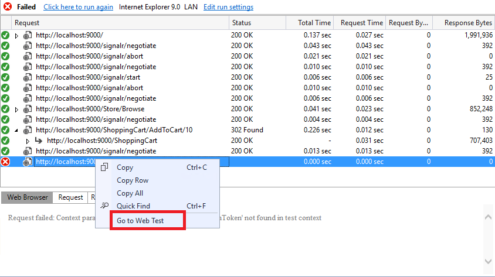 

 
 
 

 
7. You can see that the web test is passing after the modification as seen below-

 
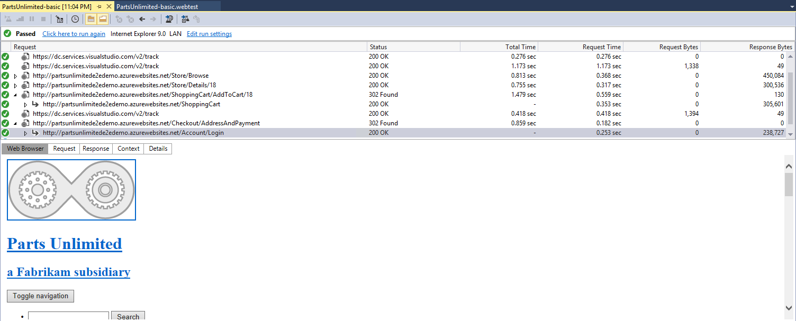 

 
8. Let's take a look at the recorded think times to make sure they are appropriate. Click the **Set Request** Details button from the toolbar to open the Request Details window.

 
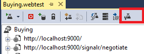 

 
9. Make sure that the sum of all think times are not more than about **30 seconds**. This will help ensure that we can get good results when we create a load test later on. Click **OK** to continue if you made any changes.

 
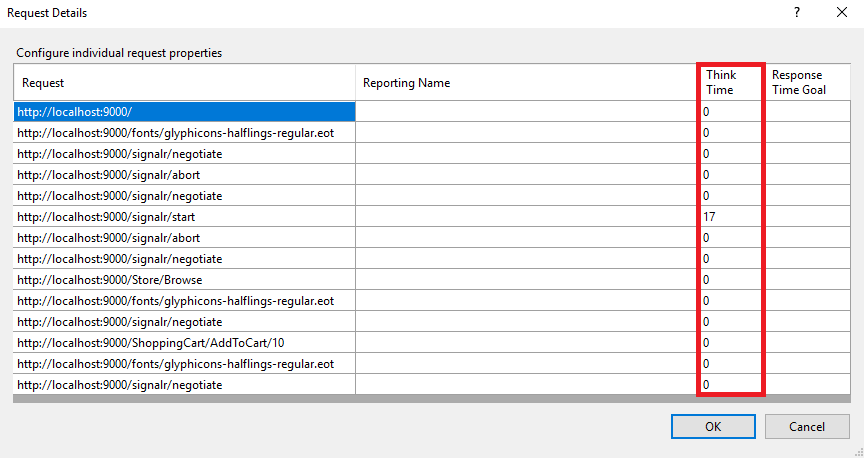 

 
 --------------------     
### Task 5: Adding Load test

Now, Let's add load test to the project and we will run the load test on the Cloud. If your customer prefers to do load testing on-premise - you can follow this lab - **[On-prem Load Testing using Visual Studio](On-prem%20load%20test.html)**

1. Select **Project | Add Load Test** from the main menu in Visual Studio.

2. In the New Load Test Wizard, select **Cloud-based Load Test with VSTS** and click **Next** to start defining the load test scenario.

 
 

 
3. Specify the **Azure datacenter** from where the load will be generated.

 
 

 
4. The Run Settings for a load test allow you to specify how long the test should run using either time duration or a specific number of test iterations. We will use a time duration, but change it to **3 minutes** for demo purpose. The default sampling rate of **15 seconds** is fine here, and it is a good choice in general for shorter test runs. If you want to run longer tests, consider sampling less often as it will generate a lot less data to store in the load test database. Click **Next** to continue.

 
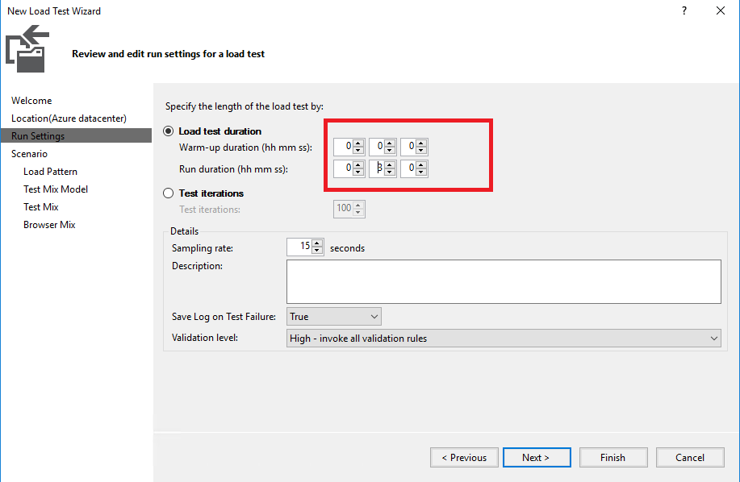 

 
5. Enter a name for the scenario like **“BrowseAndOrderProduct”** but leave the default think time profile in place. The default uses the think times of the web performance tests as a median value with a normal distribution used to generate some variation. The goal is a more realistic generation of load on the web site. Click the **Next** button to continue on to the Load Pattern definition screen.

 
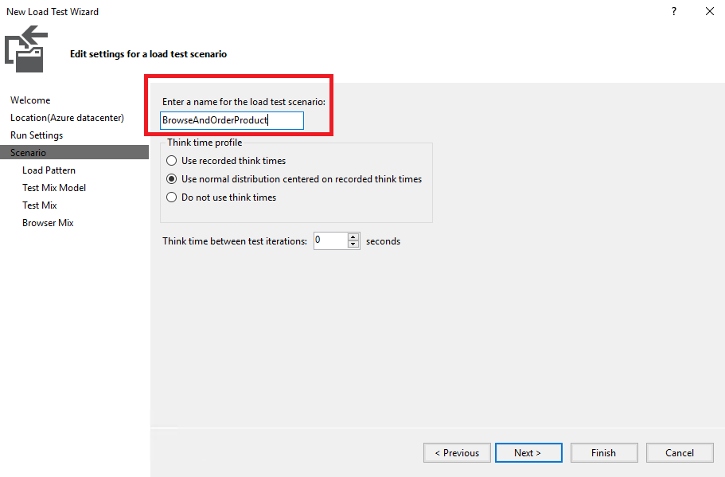 
 
 
6. The **step load pattern** is used to specify a user load that increases with time up to a defined maximum user load. For stepping loads, you specify the Initial User Count, Maximum User Count, Step Duration (seconds), and Step User Count. In our case we have considered **500 users**.

 
 

 
7. Read the description of each test mix model by clicking on it and viewing the description that appears on the right-hand side. Let’s say that our current production site gives us some indication of the percentage of browsing users that end up making purchases. Select the first option that models the test mix based on the total number of tests and then click Next to continue on to the Test Mix screen.

 
 

 
8. Click **Add** to load the Add Tests window. Select **both** tests, add them to the test mix, and then click **OK.**

 
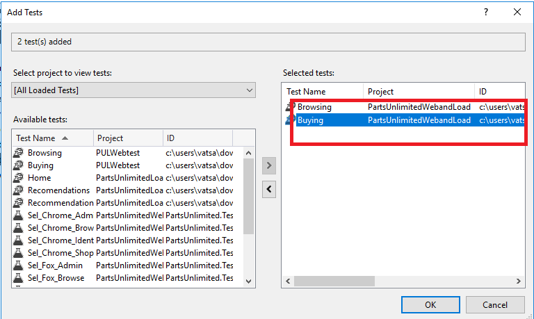 

 
9. Let’s say that our production logs tell us that **25% of users** browsing the site will end up buying something. Change the Distribution to reflect this knowledge and then click **Next** to continue on to the Network Mix screen.

 
 

10. The **Browser Mix** screen allows you to specify one or more browser types and specify the distribution of those types across the tests to be executed by the virtual users. Just like the network mix, this allows us to more realistically model how the users interact with the web site. For the purpose of this exercise leave the default at **100% Internet Explorer 9.0** and click **Finish** to continue on to the Counter Sets screen.

 
 

 
11. You should be seeing the **Load Test** that was configured from the above steps.

 
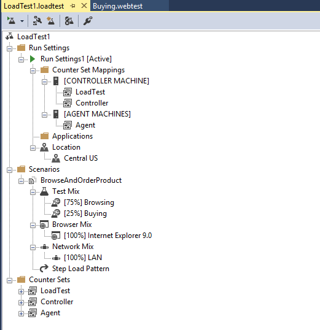 

 
12. Click on the **run** test from the above toolbar, you should see now that all the **resources are being acquired** on the cloud for your account.

 
 

 
13. You can see the test is **In Progress** in your **Visual Studio**

 
 

 
14. Once the test is completed, you can see the **Summary, Graphs, Throughput, Performance** and lot more information.

 
 

15. You can also login to your **VSTS account**, navigate to **Test | Load Test** hub and view your results. This test has run on **Azure datacenter** that we mentioned in the **Step 3**.

 
 

 -----      
 
### Task 6: Running load test from Visual Studio Team Services.

We have 4 ways to author load test on VSTS. They are **[Visual Studio Test](https://www.visualstudio.com/en-us/docs/test/performance-testing/run-performance-tests-app-before-release), [Http Archive based test](https://blogs.msdn.microsoft.com/visualstudioalm/2016/05/20/feature-preview-creating-load-tests-using-http-archive/), [URL based test](https://www.visualstudio.com/en-us/docs/test/performance-testing/getting-started/get-started-simple-cloud-load-test), [Apache JMeter test](https://www.visualstudio.com/en-us/docs/test/performance-testing/getting-started/get-started-jmeter-test)**.

1. Login to **VSTS account**. You should see the **Account home** page with the default Load Testing Virtual user minutes offering for free (20,000)

 
 

 
2. Navigate to **Load Test**. Click **New** and select **Visual Studio Test**

 
 

 
3. Remember we recorded the Web Performance test earlier in the **Demo 1**. Browse and navigate to any one of the **Tests(Browsing or Buying).**

 
 

 
4. You should be able to see as shown below once added.

 
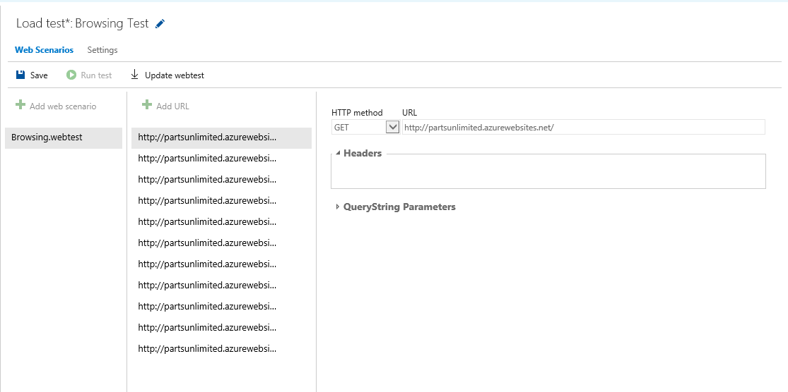 

 
5. Navigate to the **Settings** pane. You can configure the test settings from here. At this moment we are going with the **Constant load** of users **100**.

 
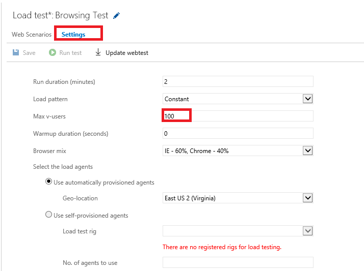 

 
6. You can see that the test is being **Queued**.

 
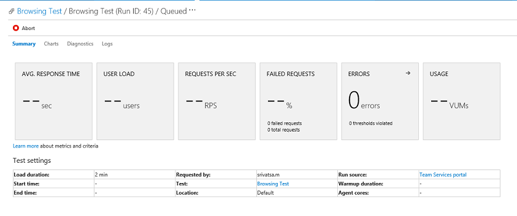 

 
 
 

 
7. Once the test is completed, you can see the **Summary, Diagnostics, Charts** etc as shown in the below screencshots.

 
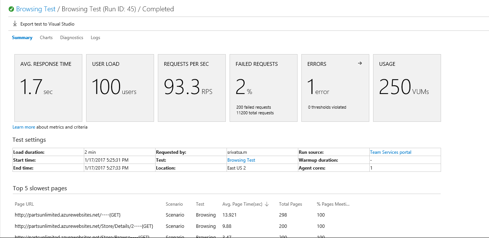 

 
 
 

 
 
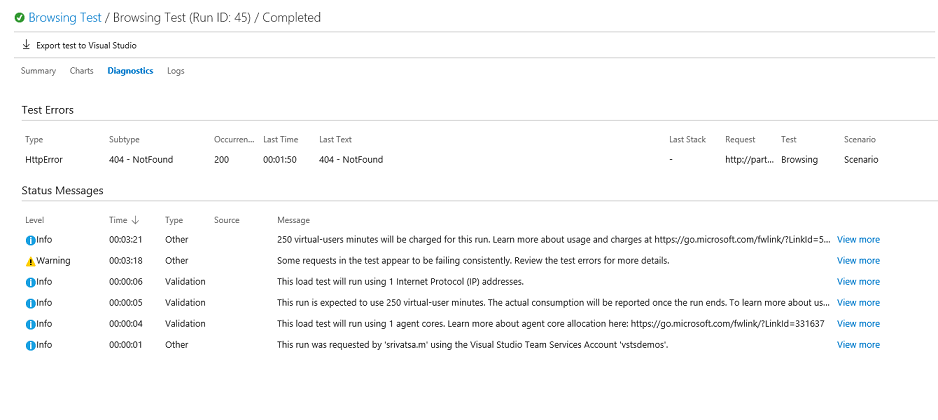 
   
 ------     

### Task 7: View and compare your load test runs
You can review past load test runs or current runs started by anyone on your team, at any time. You can also compare two test runs to see the gain or loss in performance, and other information.

1. If you are running load tests in Visual Studio, open your load test project, open the Load test menu, and choose Load Test Manager.
   
 
 
1. The Load Test Manager page shows all of the load test runs started by you and all of your team members.
    
 
 
1. To compare two test runs, select them in the list by holding CTRL while clicking with the mouse. Then choose the Compare two runs icon on the toolbar, or open the shortcut menu for one of the test runs and choose Compare.
       
1. In the comparison page you see the names of the two tests and, at the top of the page, a Summary section that lists the prime performance factors for each test, then the difference from the baseline as a percentage (the color of this text indicates a gain or loss in performance).
    
 

1. The **Charts** section of the page shows a graphical comparison of performance for the two test runs. The default is a chart for the response time and user load. Choose a different pair of factors from the dropdown menu to see more performance comparisons
    
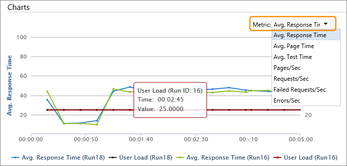 

1. The **Test settings** section shows the primary settings specified for the two test runs. 
    
 
