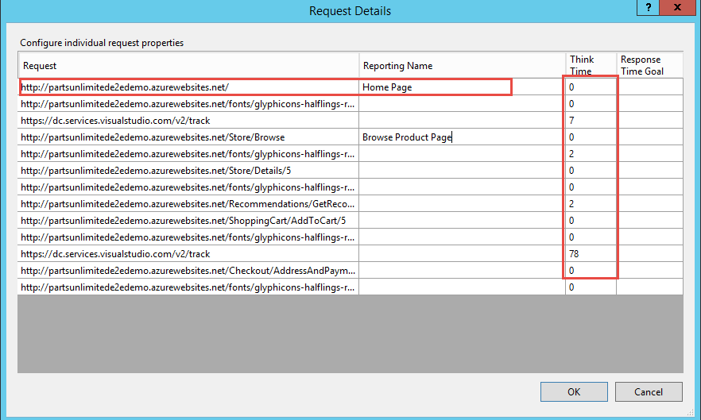

# Web Application Load and Performance Testing

## Overview

### Performance Testing in the DevOps World   
 A properly functioning webpage or mobile application is the connection between your brand and your target customer, and if it doesn’t load properly or in a timely manner, you may lose a customer to a competitor. Performance testing ensures the user doesn’t experience slowdowns or the dreaded downtime, which is often the result of a poorly functioning back-end system. Performance testing is also important not just because of its easy integration into DevOps practices and how it fits into the CD pipeline, but the overall customer experience as well.Performance testing and DevOps are not opposing forces; and performance tests run automatically within the tool chain save time, rather than consuming more. The reality is that during this age of rapid software delivery, testing is the glue that keeps the development process on track and high quality. Performance testing should be part of every software delivery workflow, and DevOps is allowing that to happen.   
-- <cite>Michael Sage - https://devops.com/performance-testing-the-unexpected-missing-link-in-devops/</cite>

### Load and Performance Testing with Visual Studio Enterprise
One of the biggest performance testing challenge for enterprises is that the cost of running full-scale production environments
isn’t practical for most organizations. But with Microsoft Visual Studio Enterprise and Azure-Powered Cloud Load Testing, teams can easily test hundreds of thousands of users at a very affordable cost. The key features of 
Visual Studio Enterprise and Team Services enables team to:
- ***Load test web sites, apps and APIs*** - With authoring experiences in Visual Studio, Azure and Visual Studio Team Services you can quickly create load tests by specifying a website, referencing a JMeter test file or recording and replaying your actions. Run them or customize them using powerful tools in Visual Studio. You can even use existing unit or functional tests to generate load.
- ***Scale to hundreds of thousands of concurrent users*** - Generate hundreds of thousands of connections in minutes. Cloud-based load testing leveraging the power of Azure is like having a whole performance lab at your fingertips. 
- ***Deep analysis with rich diagnostics, trace and exception logging*** - View app performance with real-time charts and graphs. Teams can go even further with Application Insights, and correlate test results with server diagnostics.
- ***Generate load from multiple regions worldwide*** - Teams can run tests from one of many global Azure datacenter locations to minimize latency and simulate users' real-world conditions
- ***Easily load test an app with a public end point or an app behind the firewall*** - You can test any application irrespective of whether they are public or behind a firewall
### Latest Related Announcements 

- [Cloud-load testing service is hyper-scale ready](https://blogs.msdn.microsoft.com/visualstudioalm/2016/09/30/cloud-load-testing-service-is-hyper-scale-ready-lessons-from-generating-1m-concurrent-user-load/)
- [Run cloud-based load tests using your own machines (a.k.a. Bring your own subscription)](https://blogs.msdn.microsoft.com/visualstudioalm/2016/09/27/run-cloud-based-load-tests-using-your-own-machines-a-k-a-bring-your-own-subscription/)
- [Testing private/intranet applications using Cloud-based load testing](https://blogs.msdn.microsoft.com/visualstudioalm/2016/08/23/testing-privateintranet-applications-using-cloud-based-load-testing/)
- [Create, run and analyse load tests just using the browser](https://blogs.msdn.microsoft.com/visualstudioalm/2016/05/20/feature-preview-creating-load-tests-using-http-archive/)

## Pre-requisites
- Visual Studio 2017 (download [here](https://www.visualstudio.com/vs/visual-studio-2017-rc/))
    - Be sure to select the Perf and Load Testing features during the install, as RC3 does NOT install them by default!
- Download the Parts Unlimited project [here](https://github.com/Microsoft/PartsUnlimited/tree/aspnet45)
- You must have your VS 2017 connected to a VSTS account to use the Cloud Load Testing. Also, you must have remaining Cloud Load Test minutes.

> **NOTE**: If your application is hosted locally, you can access the local site or else you can use the azure hosted website http://partsunlimiteddev.azurewebsites.net. We'll default to the hosted version, however using a locally hosted instance works fine, as well.

## Demo Script
### Task 1: Creating a Web Performance Tests

1. Open the **PartsUnlimited.sln** solution in **Visual Studio 2017**.

> **Talking Point**: We're going to start by creating a Web Performance and Load Test project to hold our tests.

1. Right click on the **Parts Unlimited** solution and click **Add New Project** and select **Web Performance and Load Test Project template from Visual C# -> Test**. Name the project and click **OK**.
    

> **Talking Point**: By default, we get a new web test called **WebTest1.webtest**. to start recording, we can simply click the *Add Recording button* on the menu bar. This will start a recording session for us, by spinning up IE with a Web test Recorder extension enabled. We have the ability to Stop, Start and Pause the recording as desired

1. The new web and load test project is created with default test settings and a single web test definition file named **WebTest1.webtest**. Click the **Add Recording button** at the top of the Web Performance Test Editor to start recording as shown below
    
 
1. **Internet Explorer** and the **Web Test Recorder** now opens in **Record mode**. 
    
  
> **Talking Point**: In the next few steps, let's play a role of a customer by browsing few products and drilling into the product details. The goal here is to create a profile that represents the typical browsing scenario for the site for a single user. Later we'll simulate purchase activity, but for now we're just looking at browsing.  As you can see, as we browse the site our actions are recorded in the **test recorder**.

1. From **Internet Explorer**, browse to  [http://partsunlimiteddev.azurewebsites.net](http://partsunlimiteddev.azurewebsites.net). Then browse through several different items, potentially searching for items and basically just clicking around.
    

> **Talking Point**: Once we're done browsing the products, we can stop the recording. The web test detects all the **dynamic parameters** and runs your test producing a **pass/fail** result. We now have a recorded web test we can use.

1. Click **stop** in your Test recorder. 
    
    
 
 ------
### Task 2: Working with Web Tests in Visual Studio

> **Talking Point**: Once the Web Test Recorder stops recording and returns to Visual Studio, you can see two tasks running:
 - **Dynamic Parameters**- that could not be identified and extracted during the recording will be identified. Examples of dynamic parameters include cookie values, ASP.NET view state, query string parameters, and post parameters. Extracting dynamic parameters when they are first used will allow the test to be run at any time in the future and therefore we will be able to utilize them as part of a load test.
 
 - **The recorded web performance test will run and display results.** This highlights whether the test can be executed by the engine itself without needing access to a browser.

> **Talking Point**: Let's take a moment to view the recorded web requests. Notice that query string parameters were automatically extracted. Visual Studio will also look and extract **hidden HTML fields** and **form post parameters** 

1. Point out the form post parameters.

  
 
 > **Talking Point**: Let's rename the WebTest to something a bit more human friendly.  As a side note, I should mention that here are 2 types of rules that can be applied to the response for each HTTP request: **validation** and **extraction**.
- **Validation rules**- can be used to verify that pages have specific text, tags, attributes, or form fields on them.
- **Extraction rules**- can be used to store results in the test context as name value pairs. These rules can extract form fields, text, attributes, headers, regular expressions, and hidden fields.

1. In Solution Explorer, right-click on the **WebTest1.webtest** and select rename to change the name to **“Browsing.webtest”**. This will make it easier to keep track of the scenarios that we record.

    

> **Talking Point**: Let’s take a look at the recorded think times to make sure they are appropriate. 

1. Click the **Set Request Details** button from the toolbar to open the Request Details window.

    
 
> **Talking Point**: The **Request Details** window shows a grid containing all requests along with a reporting name, think time (in seconds), and response time goals (in seconds). For the purpose of this demo, we're going to make sure that the sum of all think times is no more than about **15 seconds**. This will help us ensure that we can get good results when we create a load test later on. 

1. Click **OK** to continue if you made any changes.

      

-------------------------------------- 
### Task 3: Recording an Additional Web Test Scenario

> **Talking Point**: Now let’s add in another web test to represent a customer that browses and purchases a product from the Parts Unlimited website. For load testing we want to have a representative sample of user activity so that the load can be accurately modeled. 

1. Select **Project | Add Web Performance Test** from the main menu in Visual Studio. 

2. When the recording starts, navigate to the **Parts Unlimited** Website and **login**.
    
    
 
3. Log in using the following credentials:
 
 - **Login credentials**: 
    - Username: **Administrator@test.com** 
    - Password: **YouShouldChangeThisPassword1!**
 
    
 
4. Once logged in, click on **Brakes** as shown below.
    
    
 
5. Select **Brake Rotor**.

    
 
6. Click **Add to Cart**.

    
 
7. Click **Checkout**.

    
 
8. Fill out the order form with some test data and click on **Submit Order**.

    
 
9. Once Checkout is complete, you can click on **view your order** to review your order details.

    
 
    
 
10. Click **Stop** button in Web Test Recorder to return to Visual Studio.

> **Talking Point**: OK. Now we have another WebTest. Let's give this one a friendly name, too. 

11. From your **Solution Explorer**, right click on **WebTest1.webtest** and rename it to **Buying.webtest**.

    
 
----------------------
### Task 4: Viewing Web Test Result details

> **Talking Point**: Interestingly, this time we have a failure in the test run. 

1. Load the **Test Results** window and note that the test run that was automatically kicked off ended up failing. Double-click the test run to view the test result details.

    
 
> **Talking Point**: The **Test Result** Details window shows the sequential list of HTTP requests, responses, some Visual Studio test context, and other details. 

1. Take a few moments to familiarize the audience with the information available here.

    
 
3. Scroll down to the request that shows where the web performance test failed and select it. Note that the returned status code is a 200 and the Request and Response tabs look fine.

    
 
> **Talking Point**: Notice that the response to **Details** and **Login** shows failure even though we have **HTTP 200**.

> **Talking Point**: If you click on the **Details** tab, you will see that the test failed because a **Response URL Validation** rule was expecting to see the same response URL that was recorded during the Web Test definition.

1. Click on the **Details** tab
    
    
 
> **Talking Point**: Now that we understand why the web test failed, we can modify  the web test, so that it will succeed and still give us a good test representing a user browsing and ordering a product. In this example, we're simply going to remove the offending step, as opposed to editing it to make it pass.

1. Scroll down to the failed tests, **right click** and **go to web test** and delete the failed test step (includes **Checkout**). Then rerun the test.

    

    
 
> **Talking Point**: As you can see can see the web test is passing after our modification.

 
> **Talking Point**: Let's take a look at the recorded think times to make sure they are appropriate. 

1. Click the **Set Request** Details button from the toolbar to open the Request Details window.

    
 
9. Make sure that the sum of all think times are not more than about **30 seconds**. This will help ensure that we can get good results when we create a load test later on. Click **OK** to continue if you made any changes.

    
 
 --------------------
### Task 5: Adding Load test

> **Talking Point**: We're finally ready to create a Load Test, and add these represnetative user activities to it. We're going to be running these using Cloud Load Testing, but if you preferyou can also run load testing on-premises. As part of the test, we'll get to choose where we want our web load to come from.

1. Select **Project | Add Load Test** from the main menu in Visual Studio.

2. In the New Load Test Wizard, select **Cloud-based Load Test with VSTS** and click **Next** to start defining the load test scenario.

    
 
3. Specify the **Azure datacenter** from where the load will be generated. (Any will work.)

    
 
> **Talking Point**: The Run Settings for a load test allow you to specify how long the test should run using either time duration or a specific number of test iterations. We will use a time duration, but only run for **3 minutes** for demo purpose. The default sampling rate of **15 seconds** is fine here, and it is a good choice in general for shorter test runs. If you want to run longer tests, consider sampling less often as it will generate a lot less data to store in the load test database. 

1. Set Run duration to 3 minutes. Click **Next** to continue.

    

> **Talking Point**: Let's give the test a friendly name. We're also going to use the default think time setting, which uses the actual rercorded think times of the web performance tests as a median value, with some varation driven by a normal distribution around that median. The goal is a more realistic generation of load on the web site. 

5. Name the scenario **“BrowseAndOrderProduct”** . Click the **Next** button to continue on to the Load Pattern definition screen.

     
 
> **Talking Point**: The **step load pattern** is used to specify a user load that increases with time up to a defined maximum user load. For stepping loads, you specify the Initial User Count, Maximum User Count, Step Duration (seconds), and Step User Count. In our case we will go up to a maximum of **500 users**.

1. Leave defaults, but set Maximum user count to 500. (Note: given the 3 minute test, we're never going to get there.)
    
 
> **Talking Point**: We can select from many different test mix models. You can read the description of each test mix model by clicking on it and viewing the description. For our purposes, let’s assume that our current production site gives us some indication of the percentage of browsing users that end up making purchases. 

1. Select the **Based on the total number of tests** option, and  click Next to continue on to the Test Mix screen.

    
 
> **Talking Point**: Next we'll add in the two different types of user interaction with our site, and set the percentages of how they're called. Let’s say that our production logs tell us that **25% of users** browsing the site will end up buying something. 

1. Click **Add** to load the Add Tests window. Select **both** tests, add them to the test mix, and then click **OK.**

    
 
1. Change the Distribution to set **Buying** at **25%**. Click **Next** to continue on to the Network Mix screen.

    

> **Talking Point**: The **Network Mix** and **Browser Mix** screens allows us to specify the networks and browser type distributions that will be used when our virtual users run the tests against our system.  These  settings allow us to more realistically model how the users interact with the web site. 

1. Leave the default at **100% LAN** and **100% Internet Explorer 9.0** in the next two screens. Click **Finish** to continue on to the Counter Sets screen.

    
 
> **Talking Point**: We can now see **Load Test** we created. Let's go ahead and run our load test. We're using the cloud, so we have very little to set up. But we will need to wait a few seconds while the right resources are acquired.

1. Point out the various settings. If you like you can change any setting at this point.

    
 
1. Click on the **run** test from the  toolbar, you should see now that athe service is **Acquiring resources** 

    
 
> **Talking Point**: Once the test is running, we can begin to see the results coming back in. And once the test is complete we're able to see the overall results including **Summary, Graphs, Throughput, and Performance**

13. Point out that the test **In Progress** in your **Visual Studio** and note some of the metrics being collected.

    
 
14. Wait for the run to complete. (It should take just over 3 minutes.)

    

> **Talking Point**: You can also login to your **VSTS account**, navigate to **Load Test** hub and view your results. 

1. Open VSTS, navigate to **Test | Load Test** hub, and open most recent test run.
    
 
### Task 6: Running load test from Visual Studio Team Services.

> **Talking Point**: We have 4 ways to author load test on VSTS. They are **[Visual Studio Test](https://www.visualstudio.com/en-us/docs/test/performance-testing/run-performance-tests-app-before-release), [Http Archive based test](https://blogs.msdn.microsoft.com/visualstudioalm/2016/05/20/feature-preview-creating-load-tests-using-http-archive/), [URL based test](https://www.visualstudio.com/en-us/docs/test/performance-testing/getting-started/get-started-simple-cloud-load-test), [Apache JMeter test](https://www.visualstudio.com/en-us/docs/test/performance-testing/getting-started/get-started-jmeter-test)**.  Let's log into VSTS and run one of the web performance tests we created in Visual Studio as a load test directly from VSTS.

1. Login to **VSTS account**. You should see the **Account home** page with the default Load Testing Virtual user minutes offering for free (20,000, or whatever you have remaining).

    
 
2. Navigate to **Load Test**. Click **New** and select **Visual Studio Test**

    
 
3. Click browse and navigate to **Browsing.webtest** (on your local machine - it will be uploaded).

    
 
4. You should see the Load test, with the browsing test added. 

    

> **Talking Point**: We can also change some of the settings directly from VSTS prior to executing the load test.

5. Navigate to the **Settings** pane. You can configure the test settings from here. At this moment we are going with the **Constant load** of users **100**. Queue the locad test.

    
 
6. You can see that the test is being **Queued**.

    
 
    
 
7. Once the test is completed, you can see the **Summary, Diagnostics, Charts** etc as shown in the below screencshots.

    
 
    
 
       

### Task 7: View and compare your load test runs (optional)

> **Talking Point**: You can review past load test runs or current runs started by anyone on your team, at any time. You can also compare two test runs to see the gain or loss in performance, and other information. We're running in Visual Studio, so lets start there.

1. In Visual Studio, ensure your load test is open, then open the Load test menu and choose Load Test Manager.

     
    
> **Talking Point**: The Load Test Manager page shows all of the load test runs started by you and all of your team members.

1. Point out the various load tests. You will likely have at least a few from rehearsing this demo.

     

> **Talking Point**: We can easily compare two test runs by selecting them while holding CTRL and mouse clicking. Then choose the Compare two runs icon on the toolbar, or open the shortcut menu for one of the test runs and choose Compare.  In the comparison page you see the names of the two tests and, at the top of the page, a Summary section that lists the prime performance factors for each test, then the difference from the baseline as a percentage (the color of this text indicates a gain or loss in performance).

1. Select two test runs, by holding CTRL while clicking with the mouse. Then choose the Compare two runs icon on the toolbar, or open the shortcut menu for one of the test runs and choose Compare.

    

> **Talking Point**: The **Charts** section of the page shows a graphical comparison of performance for the two test runs. The default is a chart for the response time and user load. You can choose a different pair of factors from the dropdown menu to see more performance comparisons

1. Choose a few different sets of factors to compare.

    

> **Talking Point**: In the **Test settings** section you can compare the primary settings specified for the two test runs. 

1. Open the **Test settings** tab.
    