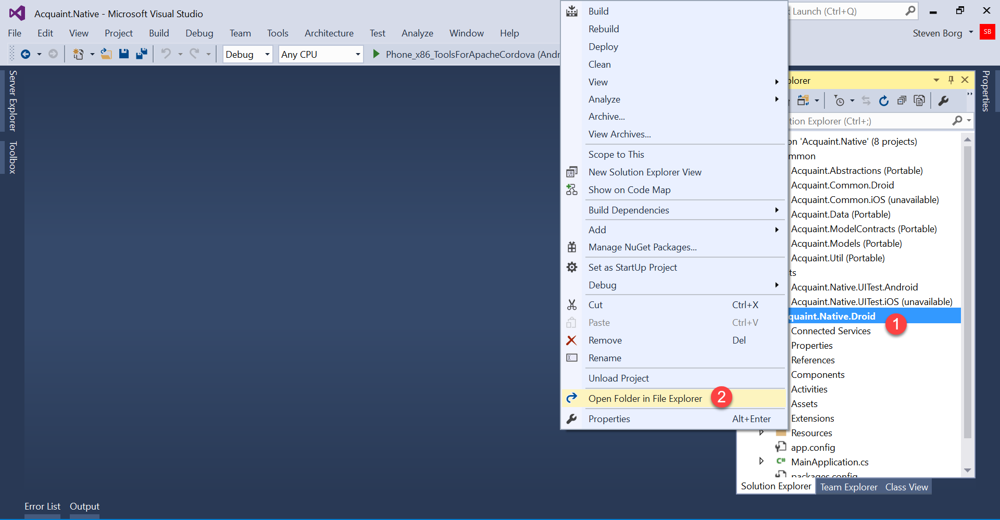
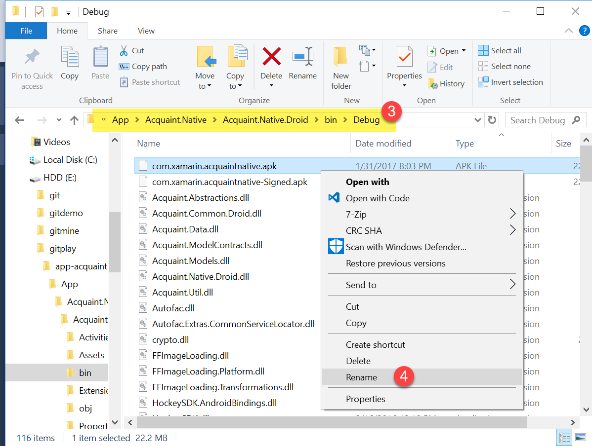
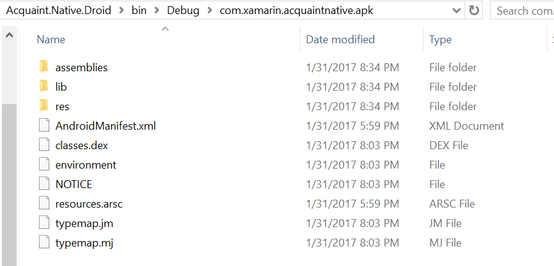
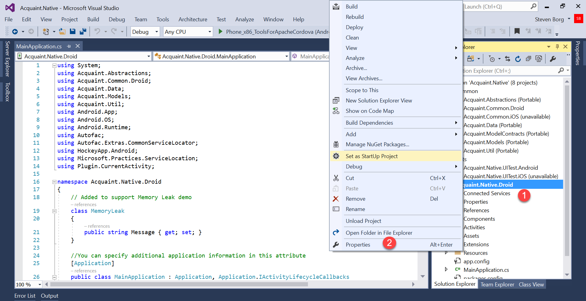
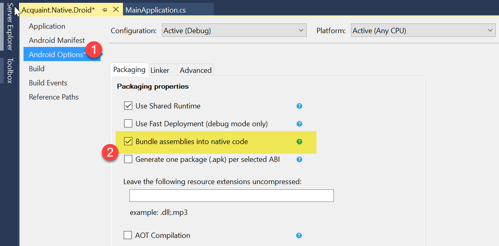
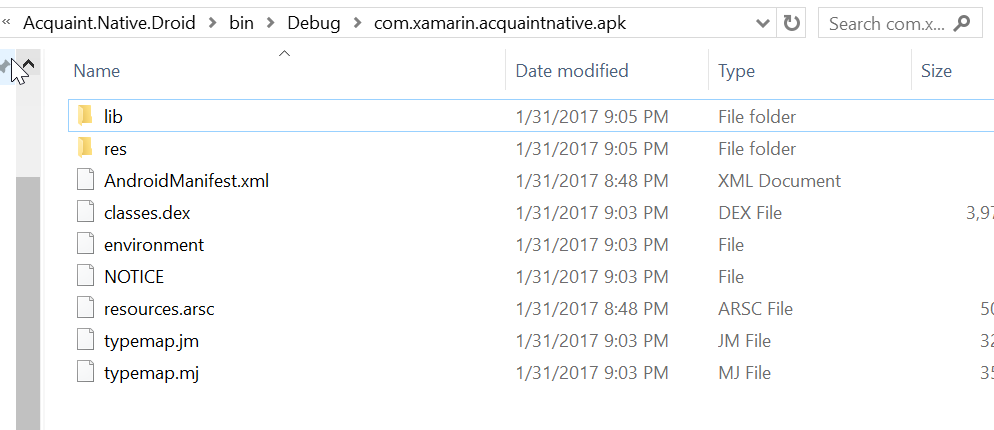
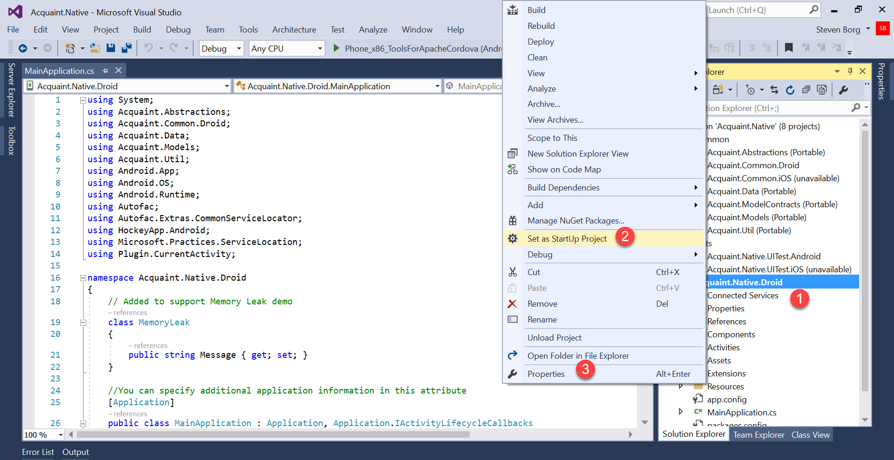
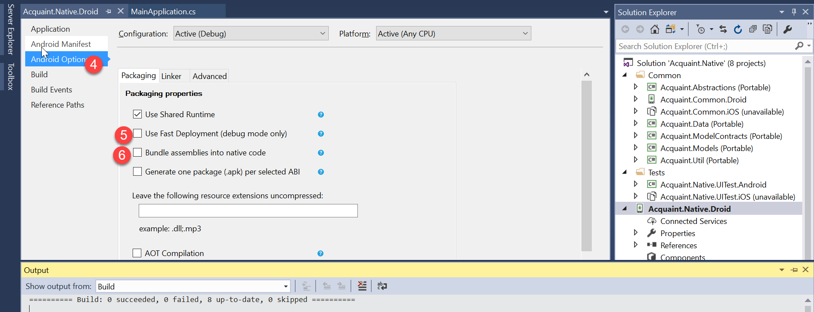

# Xamarin Embedded Assemblies

## Overview

Data security is critical to enterprises. In an increasingly app-ified enterprise environment, some apps contain sensitive data, such as proprietary algorithms, or perhaps private web API endpoint URLs. Unlike server-side web apps and services, which have their potentially sensitive code safely hosted behind firewalls and protected by enterprise grade IIS servers, mobile apps carry the risk of having potentially enterprise-sensitive code shipped into users' pockets on their devices. And with the wide variety of device and operating system combinations available, it's important to consider that not all runtime enviroments can be expected to be secure. Though a very popular operating system, Android in particular is quite vulnerable. Motivated malicous parties may be interested in decompiling your app in order to discover sensitive data or algorithms that exist in its code. Since they have the app on a device in their pocket, this threat is much greater than if your data and algorithms are running on a server behind a firewell. Even though these are considerstions that a good software engineering team will consider, it is sometimes unavoidable to keep sensitive data and algorithms in your app.

The Embedded Assemblies enterprise feature of Xamarin.Android provides an additional layer of protection for sensitive app data. The feature embeds your compiled assemblies into the app bundle in order to protect them from would-be attackers. This decreases the liklihood that malicious parties will be successful in efforts to decompile and reverse-engineer your code. This is generally of particular interest to enterprises, who tend to be more risk-averse and are looking for greater security measures.

## Pre-Requisite
- Visual Studio Enterprise 2017 with Xamarin
- Download the [sample app code](https://github.com/xamarinhq/app-acquaint)
- Install the [Android NDK](https://developer.android.com/ndk/downloads/index.html)

## Demo Steps
|Screenshot | Action| Talking Points
|------|---------------|--------------|
|  |Locate the APK file. Right-click on the Android project and select "Open Folder in File Explorer". Navigate to the `bin/AnyCPU/Debug` folder. Look for a file with the APK file extension. There may be two APKs, it doesn't matter which one you choose. Rename the APK by adding `.zip` to the end of it, so that it's something like com.xamarin.acquantnative.apk.zip.||
||Unzip this newly renamed file. Inside, you will see the contents of the app, including an `asssemblies` folder. It is inside this `assemblies` folder that all the DLLs of your app and all your NuGet references can be found. These are the files that a motivated individual would attempt to decompile to find your sensitive data and algorithms.||
||Go back into Visual Studio. Right-click on the Acquaint.Native.Droid project node and select "Properties".||
||With the project properties open, select the "Android Options" tab on the left. Check the box that says "Bundle assemblies into native code". Note that this requires an Enterprise license and requires that the Fast Deployment feature is disabled.||
||Run the app in the emulator in order to create an APK.||
||As before, locate the APK, rename it to a zip file, and extract the zip file.||
||This time, you will see the `assemblies` folder is now gone, and its contents have been bundled into the native Android app.||

## <a name="demoprep">Demo Preparation</a>
1. Download the code and open the solution in Visual Studio
1. Right-click the Acquaint.Native.Droid project node and set it as the startup project.
    
1. Right click the Acquaint.Native.Droid project, and select Properties (step 3 above)
1. Select **Android Options** and ensure neither **Bundle assemblies into native code** nor **Use Fast Deploymnet** is selected.
      
1. Run the app in the simulator just long enough for it to run, then stop the app. This will ensure that the app is bundled into an APK.