# Scenario Overview 
In today's world, software development is no longer just about code – it’s more than that. In the past, when organizations hired employees for IT jobs, they would hire them based on a particular IT skill set to perform a particular task. Web developers were paid to write Web apps, Mobile developers to write mobile apps. There was little or no incentive learn new skill sets. But in the modern business climate, every company is a technology driven company -even companies that make and sell hard goods rely on software. Developers are at the core of the continouos innovation that business expects from IT. With the shift to DevOps culture, the expectation of developers have changed significantly - not only do they need to help the company move to a faster test and 
deployment rhythm but more importantly, develop more diverse skill sets gained through continuous learning in order to move the business forward by giving it a stronger technological advantage.

In this scenario, we are going to demo how Visual Studio Enterprise    
- Simplifies the adoption of DevOps pracitices 
- Help them develop more diverse skill sets
- Enable continuous learning
    
for developement teams. We are going to do this in **"a day in a life of a software engineer"** scenario 

**Estimated Duration:** 30 minutes    
**Intended Audience:** IT Decision Makers    
**Technical Level:** Level 100   

## Prerequisites
1. Start up the VSE VM in Azure
    - Please refer to [these instructions](../../../demovm/readme.md) to set up your demo VM.
1. Prepare the PartsUnlimited solution
    - Load the solution (found on the VM here: C:\source\VS2017Demo\PartsUnlimited-aspnet45\PartsUnlimited.sln)
    - Build or rebuild the solution (Ctrl-Shift-B)
    - Ensure the Test Explorer is visible (Test -> Windows -> Test Explorer)
    - Run all tests (note that the Selenium tests will not run by default)
1. Preload the PartsUnlimted website
    - Open a browser
    - Navigate to http://localhost (the first load takes a while, so we're getting it done early)
1. Prepare VSTS 
    - Open a browser and navigate to your PartsUnlimited VSTS project (for example: https://devopsconferences.visualstudio.com/PartsUnlimited)
    - Ensure you're on the Home -> Overview tab (where you can see the Critical Bugs widget)
    - If you want to provision the Parts Unlimited project in your VSTS account, you can use the [VSTS Demo Generator](http://vstsdemogenerator.azurewebsites.net) 
        - Make sure you name your project as **PartsUnlimited**
        - After the prject is provisoned, you will need to add a WI query to your project with the following filters:    
        `Work Item Type = Bug`, `State<>closed`, `Board Lane=Expedite`     
        - Add ***Query tile*** widget to your dashboard that points to the above query    
        - Attach the [App Inisghts screenshot](images/appInsights.png) to the bug 
        - Move the PBI "Recommended Products must be based on customer purchase pattern history" to the top of the backlog.
## Introduction - setting up the stage    

Hi my name is ***\<Sachin\>***, I am a software engineer lead at Parts Unlimited, a company that sells car parts and accessesories online. Being in a highly competitive business, software innovation and time to market are the crucial factors to the business. Here is my story as it happened:

It's a beautiful Monday morning and beginning of a new sprint. We had just successfully pushed out a deployment last night. Here I am at my
desktop, beginning my day with a cup of coffee looking at my Visual Studio Team Services dashboard to take a glance at the task status to
prepare myself for the sprint meeting and team daily standup. As I open up my dashboard- The query tile here in red color captures my attention
immediately – this is a bug and I can see that it is in the `expedite` swim lane on the `Kanban board` which means that it is a severe bug and
needs attention.. I open the bug- this is from our sales manager and it reads that the team is noticing a sharp decline in the orders in the last
few hours, asking my team to investigate immediately.

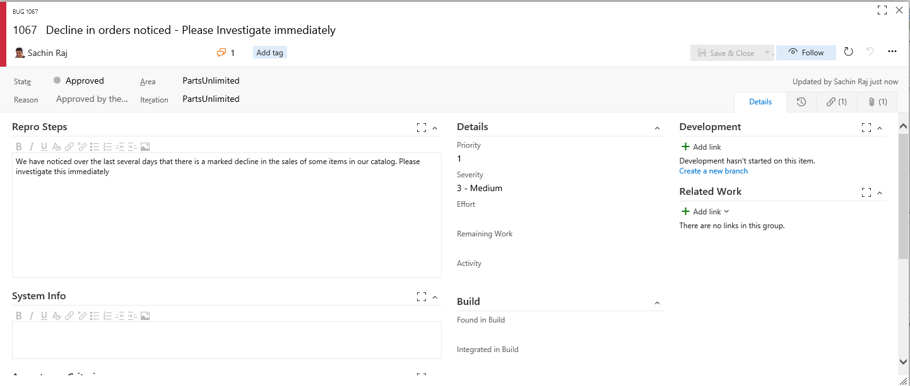

## How do we capture issues even before our customers know about it?

**Challenges:** *But the million dollar question is where do I start?, Teams often struggle to get real-time information on their application, customer usage, etc. A typical issue like this often takes time- days if not weeks in most cases, to be first identified. By the team this is realized, the business would have lost not just the revenue but also the customer forever.Typical monitoring solutions are either Ops oriented or Dev Oriented*

Thanks to **Application Insights**, we at Parts Unlimited,get rich performance monitoring, powerful alerting, and easy-to-consume dashboards to help ensure our applications are available and performing as we expect. With App Insights, we quickly identify if we have a problem, how many users are impacted, and perform a root cause analysis to find and fix the issue. Here I see a screenshot of Application Insights attached to my bug…    

1. Open the bug and open the attachment. I can see from this screenshot that customers are indeed dropping off after doing some product search on the site… simply meaning that they are not finding the products they are looking for - we know we have all our items in stock so there must be some issue with the search funcationality
    
    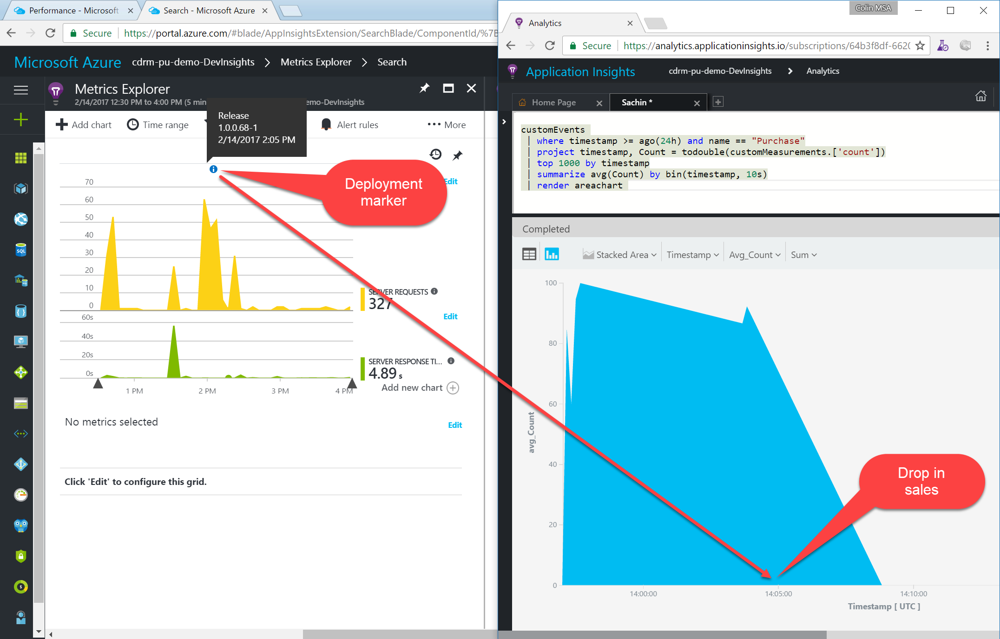

## How do we handle the "works on my machine" issue?

Now I have some idea where I could possibly start my investigation…so, I am going to go to my
application and start my investigation from the the search window… let me see if I could confirm my assumption. Let me search for “batteries” –
it's working fine, jump lead- its working fine too… I know if I can reproduce it, I can easily fixit but it's always hard to reproduce
issues. It’s the moment that a developer would wish that they could attach a debugger to production system but that is not feasible. 


**Challenges:** *Debugging is hard for a few reasons; first, it's frustrating. You just wrote a bunch of code, and it doesn't work even though you're pretty sure it should. Damn! Second, it can be tedious; debugging often requires a lot of effort to narrow in on the problem, and until you have some practice, it can be hard to efficiently narrow it down. A recent survey shows 43% of app developers waste up to 25% of their time debugging Application Errors discovered in Production. </b><cite>[ClusterHQ Survey, November 03, 2016](http://www.marketwired.com/press-release/43-app-developers-waste-up-25-their-time-debugging-application-errors-discovered-production-2172434.htm)</cite>*


Luckily we use **IntelliTrace** - IntelliTrace helps developers track down bugs that they might not be able to reproduce in their managed code application.

IntelliTrace offers a stand alone collector that lets us collect IntelliTrace diagnostic data for our apps on production servers or other environments without installing Visual Studio on the target machine and without changing the target system's environment. 
I ask my ops team to turn on IntelliTrace for me and after 10 minutes, I get the file from my ops
team. Hoping that it would give my some clue, I open the file in Visual Studio.I can see a few exceptions that captured by IntelliTrace since it
was turned on…Most of these errors are 400 errors that occur when users enter wrong URL – these are common in a web system. I am not interested
in these errors but I see an “argument out of index value” this is an exception that I am not expecting here and I am going to open this and
see.. Also from the ***Web Requests*** view, I can see the different requests 

   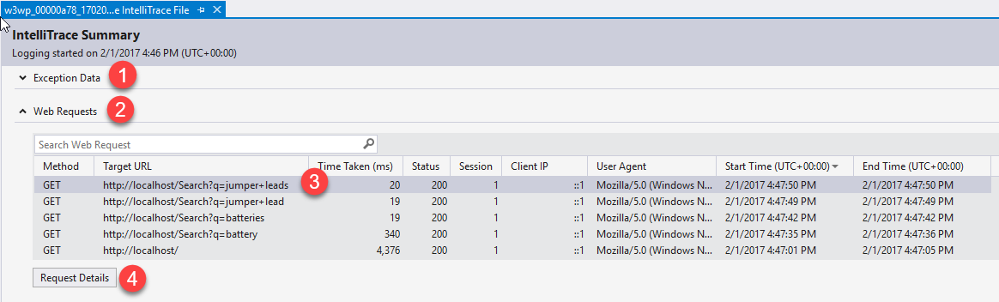

I double click this web request and I can see all the requests that were logged during the session. Let's drill into the detail for this request. 
I click on the  ***Exception thrown***  event.

   

We can see the exception being thrown - but the site doesn't report an error. This is a really hard scenario to debug if we don't have IntelliTrace since it's an intermittent issue (the search worked for  batteries  but not for  jumper leads ). We can see that the exception is a  ***System.ArgumentOutOfRangeException***. When I click on the ***Debug this Event*** button, it takes me to the line of code that caused the exception. We can view the Call Stack and locals - and even see what value variables had at this point in the log. 
Mouse-over `query` somewhere in the `Depluralize` method to show the tooltip with the value.

## How do you deal with unfamiliar code?

Now I know where to go to write a fix. It is this method - I can see here in one of the conditional statements, we try to extract the length of the query but start from a position other than 0. This is an easy fix but 
this method is not written by me but I think by my colleague Colin but he is out of
office today – he is on a week holiday starting today and probably he is relaxing in one of the beatutiful beaches in  Hawaii. We can't wait until he comes back – so,
I will need to do this myself. But first, I need to understand the code - 

**Challenges:** *It's very risky to make changes to an unfamiliar code without understanding it. If the code base is large, it gets only worse as understanding the code could take several hours*
    
   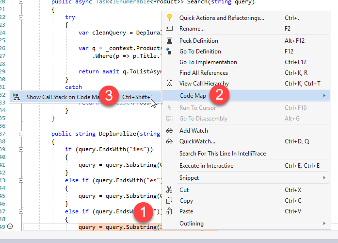

So, I turn to **Code Map** - a feature that is great for easily understanding other people’s code by following the hierarchy without getting lost along the way.
Code Map allows me to map out the structure of the application by connecting the methods to see what methods link to each others - I can visually see how my application flows. 

Right-click on the line of code that is highlighted and click  `Code Map->Show Call Stack on Code Map` .

   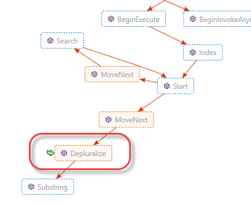

I have spent just 15 minutes and I have found where the issue is and I have a understanding of what fix is needed. I am starting to feel a bit relaxed now. I stop my debugging and open my
solution. I open the cs file and I can see the search code here. From code lens, I can more detailed information about the code, like how heavily is the
method used, who wrote it, when was the coast change and how it is associate to work items and bugs. I can clearly see that it was indeed Colin who made the last change a few days back

1. Open Visual Studio and click on the PartsUnlimited solution in the Startup page. Alternatively, open `C:\source\VS2017Demo\PartsUnlimited-aspnet45\PartsUnlimited.sln`.
2. In the Solution Explorer, open `PartsUnlimitedWebsite\ProductSearch\StringContainsProductSearch.cs`.
3. Scroll to the `Depluralize` method.

    > **Talking Point**:<br/> Let's see if there are any tests for the Depluralize method.

4. Note how the CodeLens isn't showing any test information.
5. Open the Test Explorer window if it is not open (`Test->Windows->Test Explorer`). Click `Run All` to run all the unit tests.
6. When the tests complete, the CodeLens indicator above the `Depluralize` method still has no test indicators. Open the `PartsUnlimitedWebsite\Controllers\HomeController.cs` file to contrast.

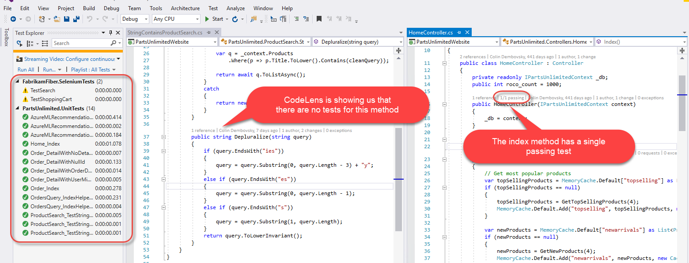

    > **Talking Point**:<br/> It appears we have no tests for the `Depluralize` method. No wonder there are bugs! Let's generate some unit tests using IntelliTest.

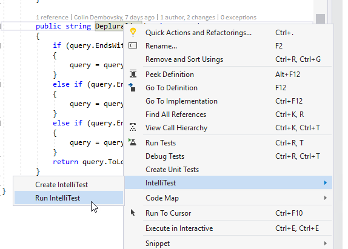

I know code lens shows if a method is covered by a test case and if yes, the status of the test right here but I don't see any tests here which
means Colin has not unit tested his code. He must sure have been in a hurry to finish off the code to go home and start packing for his vacation. 

## How do we get developers to write really "intelligent" test cases?

**Challenges:** *why do developers, like Colin in this case, don't bother about writing unit testing or simply ignore even though they are well aware it is such a fundamental best practice in software development.
It's simply because writing unit test is both laborious and time consuming. Developer need to have a good understanding of the code which is  why writing unit test for a legacy code or a code not written by you is even far more challenging*

You don't have to be a born-genius or a whizz kid to write unit testing now. With **IntelliTest**, writing unit testing is so easy; IntelliTest reduces the effort in writing tests by automatically generating tests cases from analyzing the code. It looks at the various inputs, conditional branches, etc. and generates tests cases using these inputs and capturing any observed output from the code under test. 

1. Right-click anywhere in the `Depluralize` method and select ` IntelliTest\|Run IntelliTest`

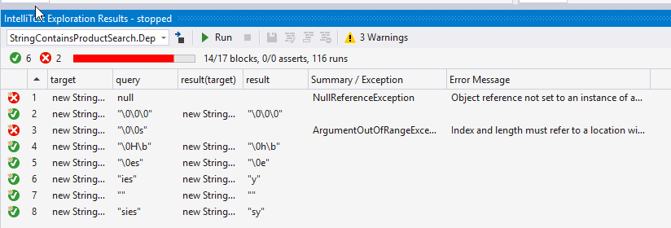

Here I have selected to create and run IntelliTest. I can see that it has captured 8 different
tests. I notice 2 failures. I see the ` ArgumentOutOfRangeException ` that caused the production bug in the first place. I also notice that 
there is a ` NullReferenceException` – something that I did not realize the code is missing - handling null inputs. This only tells me that had Colin run this
unit test, this whole situation could have been avoided.

1. 1.Left-click the top test, hold shift and left click the bottom test (in other words select all the tests.) Right-click and select `Save` to generate the tests.


I can now select all these test cases and save them for future regressions.  

1. In the `Test Explorer`, click Run All to run all the tests.

   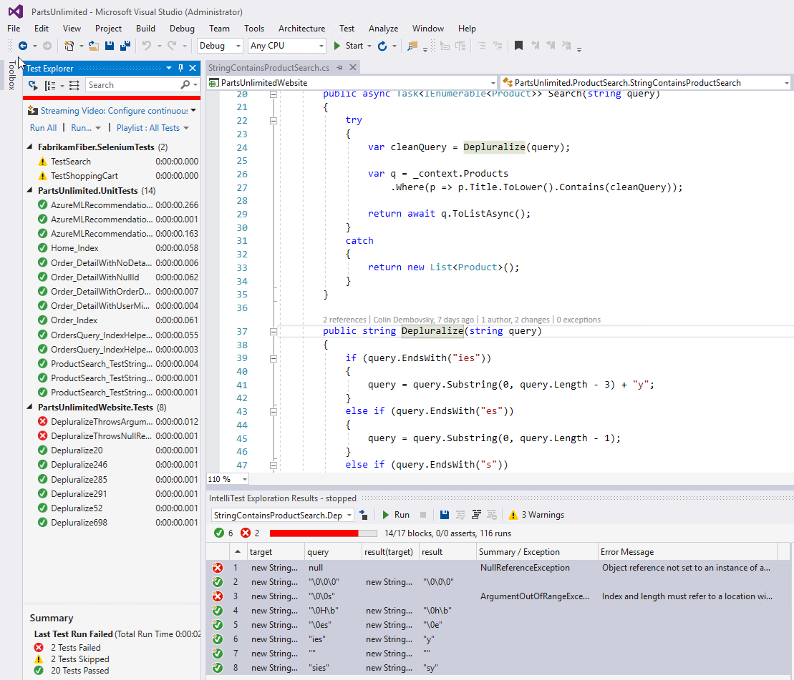

I can run all these unit tests from the `Test Explorer` window. ***It's just that simple!***


## How can we enforce developers to do continuous testing?

Now we have written unit tests for the code but how do make this as a practice for all the developers like Colin.

**Challenge:** *Developers feel motivated when they code faster and get discouraged when they have to deal with poor code and bugs as it breaks their rythm.*

With a new feature added in 2017 called **Live Unit Testing**, developers can know right away, as they are making edits to code, that they did not break any other part of the system. 
Getting this feedback, in-situ, as they type will give them extra confidence, make them more productive and why not, even enjoying fixing bugs and writing unit tests!

Let me turn on `Live Unit Testing`

1. Let me remove the old library first - remove  `Microsoft.VisualStudio.QualityTools.UnitTestFramework` assembly from the unit test project (generated by IntelliTest)
    
    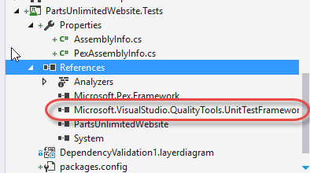

1. Right-click the solution node at the top of the Solution Explorer and click  `Manage NuGet Packages` for Solution.

1. Enter `test`  in the search box to filter and click on the  `MSTest.Framework`  package. Then click the  `PartsUnlimitedWebsite.Tests`  node in the list of projects and click Install to install this package onto the test project. Click accept for both the Changes dialog as well as the License Terms dialog
    
    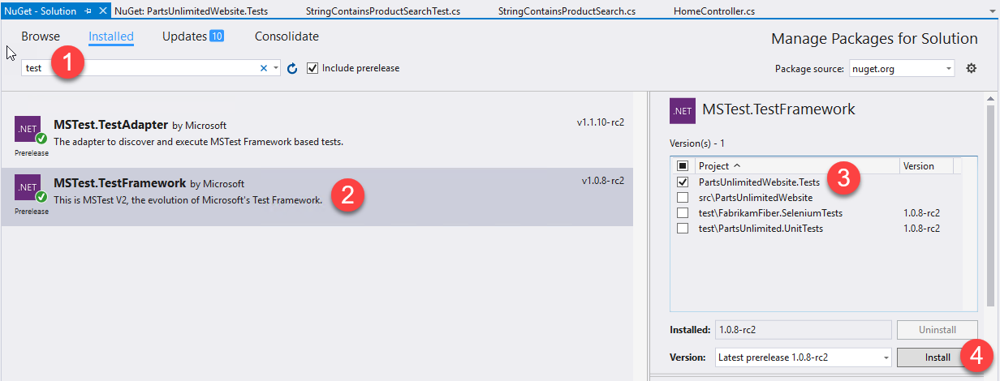

1. Close the NuGet manager and **build** the solution

1. Open the  `StringContainsProductSearch.cs`  file and scroll to the  `Depluralize`  method.

1. Start Live Unit Testing by clicking  `Test->Live Unit Testing->Start` .
    
    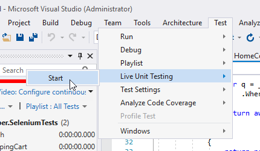

Live Unit Testing is showing us which lines of code are causing our tests to fail.     


Let me fix the null exception first. I should add a guard to make sure that the object is not null before we call methods on it.

Change the first line of the `Depluralize` method from:

````
if (query.EndsWith("ies"))
````

to

```
if (string.IsNullOrEmpty(query)) return "";
    else if (query.EndsWith("ies"))
 ```

5. Fix the bug seen in the production - Let's fix the code and make sure that nothing breaks as we go.

Change line 50 from:

```
query = query.Substring(1, query.Length);
```     
to    
```
 query = query.Substring(0, query.Length - 1);
```

When I am done with my edit, you can see that all unit tests impacting the code has been executed and I get to see the results immediately. A green at the beginning of the line indicates that all tests have successfully passed, a red cross indicates failures and a black dash indicates the line is not covered by any tests.
    
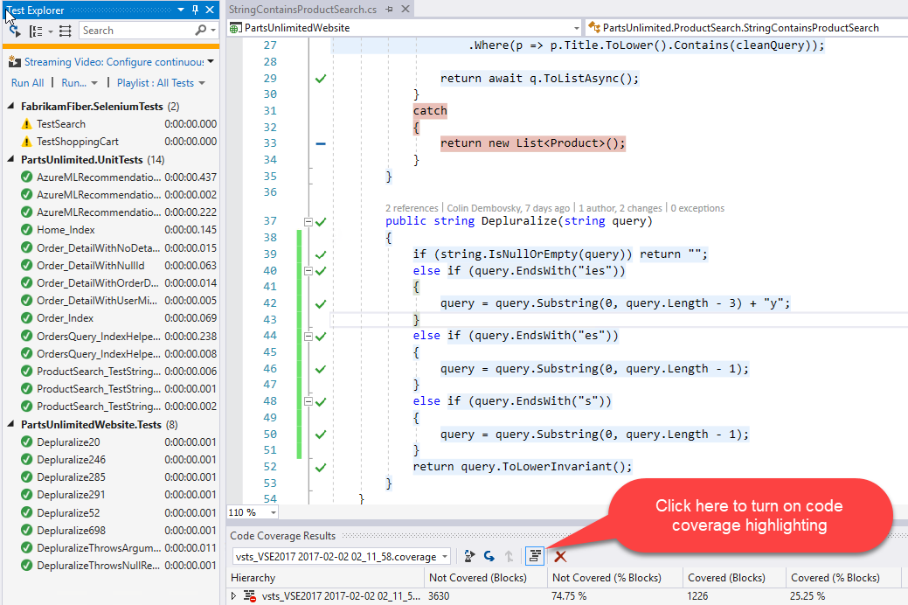

## How do we prevent developers from making architectural violations, even accidentally

As I was waiting for the live unit test to complete the test, I noticed that the Search method is returning a list of  `Product`  objects. 
However, I feel we could return a list of  `ProductViewModels`  so that our search functionality can take advantage of the recommendations logic (you can show the `ProductViewModel`  and show how it has an additional  `ShowRecommendations`  property).

1. Change the method signature to  `public async Task<IEnumerable<ProductViewModel>> Search(string query)`  

1. Resolve the namespace by adding the `using` statement.

It would be a great enhancement to the application and the business would love this. But wait... I see red squiggles - that indicates an error. Mouse over the squiggly under  ProducViewModel  to show the dependency failure.
    
    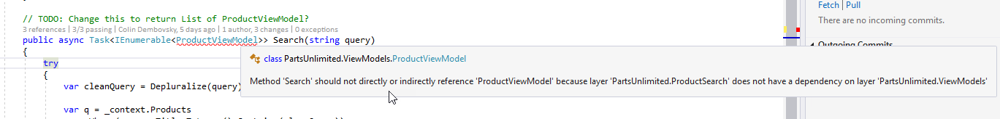

Ah! It is a dependency violation. It says I cannot call the `ProductViewModel` directly or indeirectly from the search method. Let me check the ***Layer Dependency Diagram***

1. 1.Open  `DependencyValidation1.layerdiagram`  in the  `PartsUnlimited.DepValidation`  project.

I believe there must have been a reason for not allowing to have the model called from the method that would have defintely been a violation, the search
is not supposed to call the model directly. I would have broken the architecture but luckily thank to Live dependency validation, I am
straightaway warned about it…which could have resulted in security violation or added unnecessary maintenance issues. I should not make
this in a rush so I am going to roll back the change.

With all looking good, I push my changes to my source control that will kick my continuous integration and deployment.

````
Note: from this point, it is preffered you just do a "show and tell" unless 
you have set this up and using your own VSTS instance.
````

## How do we enforce code quality and change management standards?


**Challenges:** *It's vital for any team to ensure that the key branches of the source code - say that contains the production code for instance, be protected from accidental changes and deletions. 
Teams will need to have a rigourous but yet the same time easy to follow, policies to protect such branches.*

At Parts Unlimited, we protect our `master` branch with **branch policies**. Any code that needs to be committed to the `master` branch is allowed only via
**Pull Request** - a mechanism that fosters code review and collobaration among the team members. At least one member other than person who made the change has to approve the changes.
Team members can comment, ask questions, provide suggestions on the changes submitted. 
1. show the **Pull Request** view in VSTS   
2. Select the `StringContainsProductSearch.cs` file and highlight the code change and the comment    

   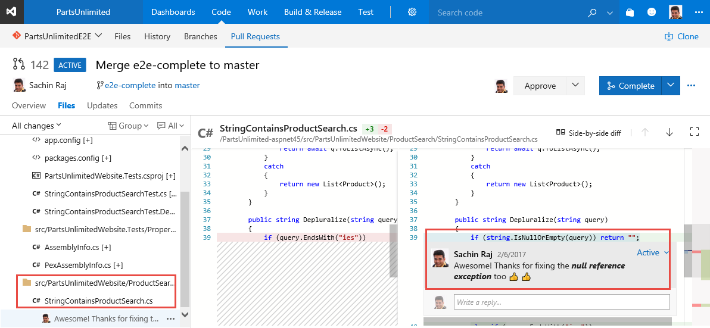

    We also have a policy that mandates all changes in a pull request to build successfully before the pull request can be completed. This helps to reduce build breaks and keep test results passing. 

1. My pull request is approved and the build is successful. Now I can complete the pull request and merge the changes with the `master` branch.

   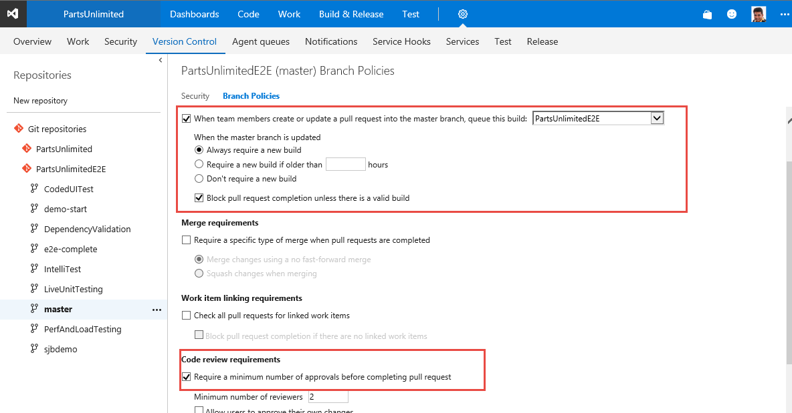

## How do we automate the continouos integration and deployment pipeline?

Every update to the `master` branch triggers **Continouos Integration** with an automated build and testing process. We include unit testing, code coverage, code analysis, etc., in very build. Implementing CI this way ensures bugs are caught earlier in the development cycle, which makes them less expensive to fix.  Automated tests run for every build to ensure builds maintain a consistent quality. 

1. Open the PartsUnlimitedE2E build and select one of the recent successful build

   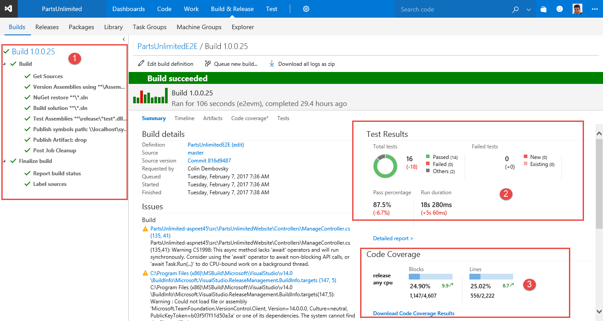

1. I can see the summary of one of my build runs here and as you can see here, tests and code coverage section provides the results of the test. I can see all my unit tests have passed including those new unit tests that was created earlier with IntelliTest. I can also see the code coverage has been assessed as well and I notice the coverage has now increased than before.

1. Once the CI succeeds, it triggers a **Continouos Deployment** pipeline, where the application is deployed to different environemnts, such as `staging`, `pre-prod`, `production` and so on.

1. More tests including automated regression, performance, load testing are run on the app on the staging environments 

   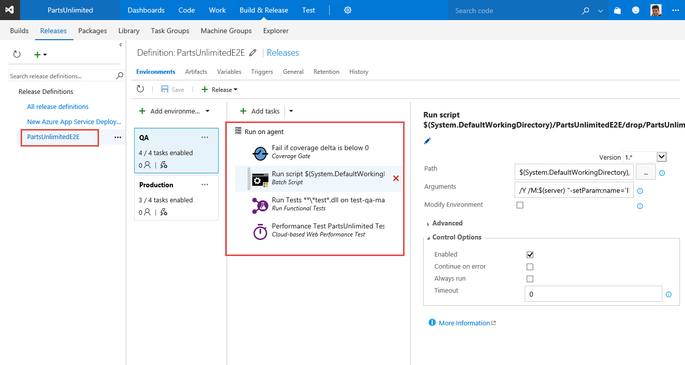

1. When all tests pass, the change is deployed to the production.

Phew, in 30 minutes, I have managed to fix the bug and push it to production. Thanks to DevOps practices and to Visual Studio Enterprise for simplifying the adoption of these best practices. 


Well, if you think that is the end of the story , it's not! Life is a continouos journey - so, is application innovation. 


## How do we create a culture of continuous learning and improvement?

**Challenges:** *A culture of continuous learning is vital to an organization that strives to be innovative. But creating the culture is is a difficult task and the key obstacle, apart from time is the cost. Firstly, the cost to get quality training for the engineers and secondly the cost to give them environments (machines, storage,etc,) for experimentation and self-learning.* 

As I look at my backlog for my next sprint plans, I see that the business wants to apply intelligence in making product recommendations to customers based on their search and purchase history. 
I need to gain skills on **Azure Machine Learning**.

I am thrilled… I know it is a cool technology. I know I have the VSE benefits - I am going to go and sign up on the **PluralSight** course and I have the **Azure benefits** that I can use for self-learning and experimentation.

   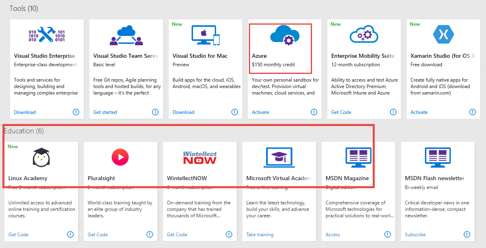

With Visual Studio Enterprise, making continuous learning part of the company culture is a relatively simple step towards that end

Time for my sprint meeting... 


