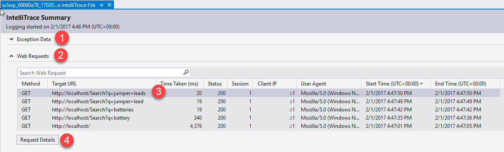
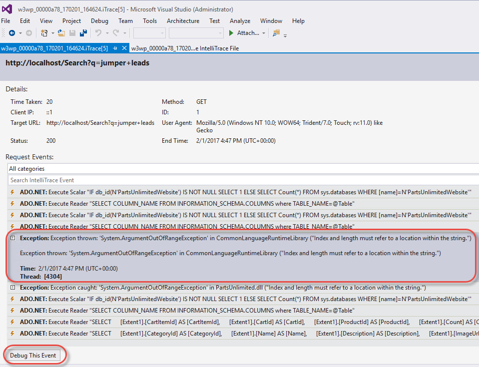
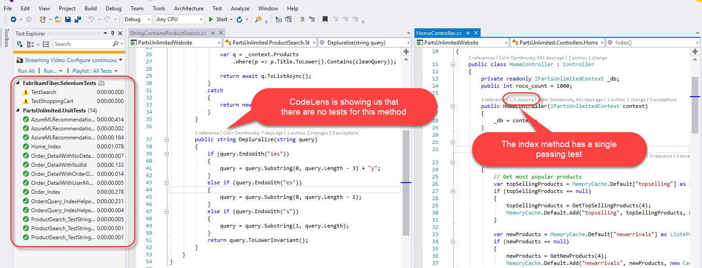
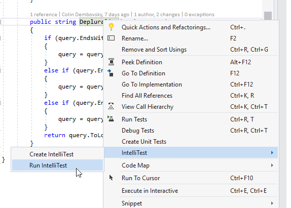
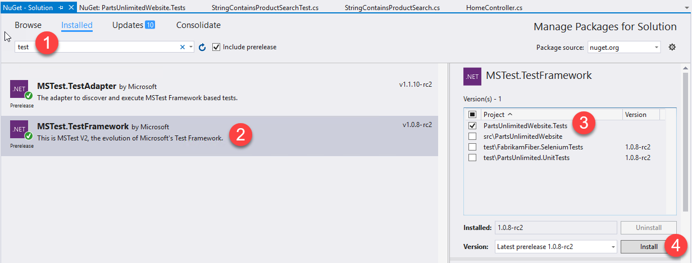

# Visual Studio Enterprise Scenario: A Day in the Life of a Productive Developer

## Scenario Overview
This demo shows a 'day in the life of a _productive_ developer'. It is important not to get bogged down on a single feature - the Feature Demos are meant
to show each feature in depth. The point of this demo is to show how Visual Studio Enterprise (VSE) can make a developer productive in a typical day-to-day
workflow.

Scenario
========
Business has determined that sales of certain products are down since 4 days ago. They've requested that you 
investigate and determine what the cause of this drop in sales is.

### Overview of Developer Solution to the problem
The developer needs to determine what the cause of decline in daily orders. Is this a bug? What changed that
caused the issue? The developer needs to start _at production_.

The "developer" (you) will walk through the following steps to resolve the problem:

| Step | Feature | Value Prop |
|--------------------|---------|------------|
| Open up the Bug that business has logged - this is the Critical Bug in VSTS (from the PartsUnlimited dashboard). | VSTS Bug Tracking | Work Item Tracking in VSTS. |
| [TODO] View the attachment on the bug. This is an App Insights image showing custom telemetry that demonstrates the drop in sales. Note the deployment marker showing that the drop coincides with the latest deployment, which was a feature to enhance the search functionality on the site. | App Insights | Telemetry in production. |
| Open an iTrace file that was gathered on the Production server and notice an exception and the line of code that caused the exception. | IntelliTrace, CodeMap | Diagnosing issues in production. |
| Generate unit tests and good coverage using IntelliTest. One of the tests uncovers the same exception we saw in production in the iTrace. | IntelliTest | Automatically generating good tests for code. |
| Turn on Live Unit Testing and fix the bug. | Live Unit Testing | Real-time feedback on code quality _as we code_. |
| Attempt to refactor the Search method to return a list of `ProductViewModel` instead of a list of `Product`. This fails because it violates the dependency validation diagram. We open the diagram to see it, then decide to back out of the changes. | Live Dependency Validation | Discovering issues in architecture _as we code_ so that we know immediately. |

> **Note**: Remember not to get bogged down on a particular feature. You're demonstrating the flow and how the tool assists you become _more productive_. Try not to even mention the work 'Intelli-*' and just let the tool wow the audience!

## Prerequisites
1. Start up the VSE VM in Azure
    - Please refere to [these instructions](../../../demovm/readme.md) to set up your demo VM.
1. Prepare the PartsUnlimited solution
    - Load the solution (found on the VM here: C:\source\VS2017Demo\PartsUnlimited-aspnet45\PartsUnlimited.sln)
    - Build or rebuild the solution (Ctrl-Shift-B)
    - Ensure the Test Explorer is visible (Test -> Windows -> Test Explorer)
    - Run all tests (note that the Selenium tests will not run by default)
1. Preload the PartsUnlimted website
    - Open a browser
    - Navigate to http://localhost (the first load takes a while, so we're getting it done early)
1. Prepare VSTS 
    - Open a browser (or an additional tab) 
    - Navigate to your PartsUnlimited VSTS project (for example: https://devopsconferences.visualstudio.com/PartsUnlimited)
    - Ensure you're on the Home -> Overview tab (where you can see the Critical Bugs widget)


Talk Track and Demo Script
==========================
## Open the Bug from the Dashboard of VSTS
Connect to your VSTS account and navigate to the PartsUnlimited dashboard. There is a red tile showing 1 critical bug. Click it to open the query and double click the bug to open the work item form. In the description field, business has noted that the sales of Jumper Leads appear to be down for the last few days.


_Business has logged a bug for us to investigate_

## [TODO] Open the appInsights.png attachment
> **Talking Point**:<br/> App Insights can track telemetry that will allow us to feed back into the Product Backlog - effectively closing the loop from Ops back to Dev once deployment is completed. Having custom telemetry allows us to track the metrics we care about beyond just raw performance. This helps us better understand how our software is being used and if features are effective. Monitoring production apps effectively can be hard if you have to code it yourself. App Insights give you incredibly rich monitoring virtually "for free".

> **Talking Point**:<br/> We know that the last deployment was extended functionality to the Search capabilities of our site. Perhaps we can start there and see if this caused an issue?

## [OPTIONAL] Create a Branch to Fix the Bug
> **Note**: You can skip this part if you are just showing Visual Studio Enterprise or need to be quick. However, linking the work in Visual Studio Enterprise to the ALM capabilities paints a compelling story.

1. In the Bug form, click "Create Branch" to create a branch that is linked to the Bug.
1. Make sure you create the branch from `master` and call it something like `salesFix`

## Reproducing Hard to Reproduce bugs
> **Talking Point**:<br/> It can be really hard to reproduce bugs in production. We're all too familiar with the saying, "It works on my machine!"

1. Show how you can't seem to repro the issue
    - Open a browser and navigate to `http://localhost` to open the production site
    - Enter `battery` in the search bar and note that you get results
    - Enter `batteries` in the search bar and note that you get results
    - Enter `jumper lead` in the search bar and note that you get a result

> **Talking Point**:<br/> It seems that everything is working! If only there was a way to see exactly what was happening in Production at the point in time when potential errors occurred!

### Find the Bug by Debugging the iTrace File
> **Talking Point**:<br/> Even though we were unable to repro the bug ourselves, our Ops team ran the IntelliTrace Standalone collector on our production server to collect an iTrace file. We can open it in Visual Studio and diagnose what is going on in Production. We'll see call stacks, locals and variable values as though we were debugging the Production site!

1. Open up the File Explorer and navigate to `c:\intellitrace\logs` and double-click `example.iTrace` to open it in Visual Studio.

1. Shrink the `Exception Data` section and expand the Web Requests section. Click on the top request (the one with `q=jumper+leads` in the request).  Click on the Request Details button.


_Navigate to the Web Request_

> **Talking Point**:<br/> We can see all the requests that were logged during the session. Let's drill into the detail for this request.

2. Note the Exception (they are the same - the events are for the throw and for the catch of the exception). Click on the `Exception thrown` event.


_Notice the exception within the session_

> **Talking Point**:<br/> We can see the exception being thrown - but the site doesn't report an error. This is a really hard scenario to debug if we don't have IntelliTrace since it's an intermittent issue (the search worked for `batteries` but not for `jumper leads`). We can see that the exception is a `System.ArgumentOutOfRangeException`.

3. Click on the Debug this Event button.


_It looks like we're debugging - but this is disconnected from Production!_

> **Talking Point**:<br/> We're taken to the exact line of code that caused the exception. We can view the Call Stack and locals - and even see what value variables had at this point in the log.

Mouse-over `query` somewhere in the `Depluralize` method to show the tooltip with the value.


_Tooltips for variables - from the log_

4. Generate a Code Map for the call stack
Right-click on the line of code that is highlighted and click `Code Map->Show Call Stack on Code Map`.


_Generate a Code Map from the Call Stack_

> **Talking Point**:<br/> We may want to visualize how we got to this point in the code. Let's generate a Code Map from the Call Stack.

Zoom in and show how the exception is pointed out on the map.


_Visualizing the exception on the Code Map_

5. Stop Debugging
Click on the Stop icon in the Toolbar to stop debugging. You should close Visual Studio completely since the source file is not in a solution (it was opened via the symbol indexing when we started debugging from the IntelliTrace).

> **Talking Point**:<br/> We now know where the problem is - we're indexing past the length of the string. This is a classic off-by-one error. We can now stop debugging and figure out how to fix the bug.

## Fix the Bug - Without Breaking Anything Else

## Generate Unit Tests with IntelliTest

> **Talking Point**:<br/> A good principle in development is "you touch it, you test it!". This helps to grow the unit test suite over time and keep quality high at the beginning of the development process (also known as "shift left"). We also want to try to use the principle of "red-green-refactor" so that we don't introduce more bugs as we code. However, manually generating the tests is hard - what if there was a tool that could generate tests that covered all code paths for us?

1. Open Visual Studio and click on the PartsUnlimited solution in the Startup page. Alternatively, open `C:\source\VS2017Demo\PartsUnlimited-aspnet45\PartsUnlimited.sln`.
2. In the Solution Explorer, open `PartsUnlimitedWebsite\ProductSearch\StringContainsProductSearch.cs`.
3. Scroll to the `Depluralize` method.

> **Talking Point**:<br/> Let's see if there are any tests for the Depluralize method.

4. Note how the CodeLens isn't showing any test information.
5. Open the Test Explorer window if it is not open (`Test->Windows->Test Explorer`). Click `Run All` to run all the unit tests.
6. When the tests complete, the CodeLens indicator above the `Depluralize` method still has no test indicators. Open the `PartsUnlimitedWebsite\Controllers\HomeController.cs` file to contrast.


_CodeLens shows no tests covering the Depluralize method_

> **Talking Point**:<br/> It appears we have no tests for the `Depluralize` method. No wonder there are bugs! Let's generate some unit tests using IntelliTest.


_Run IntelliTest_

> **Talking Point**:<br/> IntelliTest has discovered 8 tests. There are 2 failures - a `NullReferenceException` as well as the `ArgumentOutOfRangeException` that caused the Production Bug in the first place!

7. Create tests from the IntelliTest results.


_IntelliTest uncovers tests as well as the bug!_

8. Left-click the top test, hold shift and left click the bottom test (in other words select all the tests.) Right-click and select Save to generate the tests.


_Generating a new Test Project from IntelliTest result_

9. Open the newly generated IntelliTest by opening `PartsUnlimitedWebsite.Test\StringContainsProductSearchTest.cs` in the solution explorer.

> **Talking Point**:<br/> We see that IntelliTest generates a single harness that ends up creating 8 unit tests. Two are currently failing: one for a `NullReferenceException` and one for an `ArgumentOutOfRangeException` - the very exception that caused our bug in the first place.

10. In the Test Explorer, click Run All to run all the tests.


_Final results of running IntelliTest_

> **Talking Point**:<br/> In Test Driven Development, a good practice is _red-green-refactor_. We now have some red tests along with our green ones. We can now fix the bug and make sure we don't break anything else in the process!

## Live Unit Testing

> **Talking Point**:<br/> Now that we have tests to cover our method, it would be great to have immediate feedback on our tests as we change the code.

1. Fix the reference to the "old" `QualityTools` framework. (**Note: This may only apply to VS2017 RCs**)

> **Talking Point**:<br/> Unfortunately the IntelliTests are generated using the `Microsoft.VisualStudio.QualityTools.UnitTestFramework` assembly. In order to make use of Live Unit Testing (which is a Roslyn-enabled feature) we need to change the framework to the new Roslyn-compatible unit test framework.

In Solution Explorer, expand the References node of the `PartsUnlimitedWebsite.Tests` project. Delete the reference to `Microsoft.VisualStudio.QualityTools.UnitTestFramework`.


_Delete the reference to `Microsoft.VisualStudio.QualityTools.UnitTestFramework`_

Right-click the solution node at the top of the Solution Explorer and click `Manage NuGet Packages for Solution`.

Enter `test` in the search box to filter and click on the `MSTest.TestFramework` package. Then click the `PartsUnlimitedWebsite.Tests` node in the list of projects and click Install to install this package onto the test project. Click accept for both the Changes dialog as well as the License Terms dialog.


_Adding the Live Unit Testing compatible test framework to the IntelliTest project_

Close the NuGet manager and build the solution.

2. Open the `StringContainsProductSearch.cs` file and scroll to the `Depluralize` method.
3. Start Live Unit Testing by clicking `Test->Live Unit Testing->Start`.


_Start Live Unit Testing_

Live Unit Testing is showing us which lines of code are causing our tests to fail.


_Live Unit Testing showing which code is tested_

4. Fix the `NullReferenceExcetion`

> **Talking Point**:<br/> We uncovered another potential issue which is very common - if `query` is null, a `NullReferenceException` is thrown since we're calling methods on the object (like `EndsWith`). We should add a guard to make sure that the object is not null before we call methods on it.

Change the first line of the `Depluralize` method from:

```
        if (query.EndsWith("ies"))
```

to

```
        if (string.IsNullOrEmpty(query)) return "";
        else if (query.EndsWith("ies"))
```

5. Fix the bug

> **Talking Point**:<br/> Let's fix the code and make sure that nothing breaks as we go.

Change line 50 from:

```
query = query.Substring(1, query.Length);
```

to

```
query = query.Substring(0, query.Length - 1);
```

and save the file.

Wait a few seconds to see the Live Unit Test indicators refresh.


_Live Unit Testing showing that our code is correct_

> **Talking Point**:<br/> Live Unit Testing gives us immediate feedback - not only did we fix the bug and the null reference, but we are more confident that we didn't break anything else in the process!

5. Check coverage

In the Test Explorer window, click `Run->Analyze Code Coverage for All Tests`. When the coverage run completes, click on the Show Coverage Highlighting button in the Code Coverage Results Window.

This will highlight that all the code in the `Depluralize` method has been tested! 

> **Talking Point**:<br/> We were able to cover all of the code paths in the `Depluralize` method without having to come up with scenarios ourselves.


_We have 100% coverage of the Depluralize method_

## Live Dependency Validation

> **Talking Point**:<br/> As we change code, we may uncover opportunities to refactor. If we are not careful, we can end up introducing changes that will lead to problems in the future. Dependency validation allows us to create a diagram detailing our design considerations so that this doesn't occur. However, this is generally run ad-hoc or at best in the build process. However, Live Dependency Validation allows us to get feedback on dependency violations as we code, again "shifting left" to make sure we get fast feedback when we make changes.

1. Scoll to line 19 of `StringContainsProductSearch.cs` and note the comment.

> **Talking Point**:<br/> Looking at the Search method, we can see that it's returning a list of `Product` objects. However, we could return a list of `ProductViewModels` so that our search functionality can take advantage of the recommendations logic (you can show the `ProductViewModel` and show how it has an additional `ShowRecommendations` property).

2. Change the method signature to `public async Task<IEnumerable<ProductViewModel>> Search(string query)` and resolve the namespace

> **Talking Point**:<br/> We are going to refactor! Especially now that we have some tests.

3. We get red squigglies that indicate an error. Mouse over the squiggly under `ProducViewModel` to show the dependency failure.


_We cannot proceed since we're violating dependencies that the architect has described_

4. Open `DependencyValidation1.layerdiagram` in the `PartsUnlimited.DepValidation` project.

> **Talking Point**:<br/> We note how, for whatever reason, the architect has explicitly noted that the ProductSearch namespace should not directly reference the ViewModels namespace. We should back out and discuss this in the next standup.

5. Undo the changes.

## [OPTIONAL] Commit to Trigger the Build/Deploy Pipeline
> **Note**: If you don't want to show the integration into VSTS, you can now just mention the steps below.

If you started the demo by creating a branch from the Bug, then you can complete the demo as follows:

1. Commit the code changes in Visual Studio in the Team Explorer window or using Git.
1. Navigate to the Code Hub in VSTS and open the PartsUnlimited repo.
1. At the top of the Files view, a blue bar informs you that a branch was pushed and prompts you to create a Pull Request.
1. Navigate to the Pull Request. Approve and Complete the Pull Request, selecting "Delete branch" so that you maintain a clean repo.
1. This triggers the build - navigate to the build tab and click the build that's in progress to follow it.
1. When the build completes, note the tests and code coverate and the link to the Bug on the summary page.
1. The build will trigger a Release - you can open the release to show that the code has been deployed.
1. Open the site and show that searching for `jumper leads` now yields results.

> **Talking Point**:<br/> The automated build and release pipelines gives us added confidence in the quality of our code. We don't need people sitting around manually copying files - the build/release automate the process for us. The build and/or release is also running our automated tests. Finally, we're building a natural code review mechanism into our daily flow by using Pull Requests - this ensures that our code is checked even before it goes into the pipeline - and it's done in a very unobtrusive manner.

> **Note**: If you commit the changes and Pull Request in this manner, don't forget to reset your demo environment by following the steps in the section `Preparing for a Demo` in [these instructions](../../../demovm/readme.md).
 
