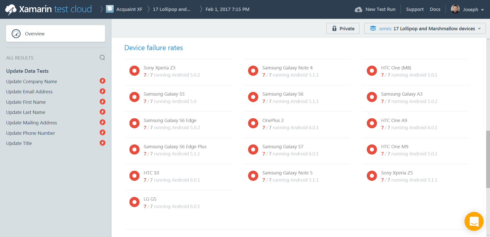
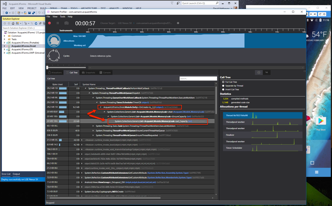
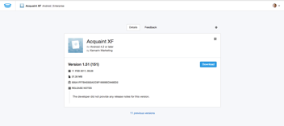

# Xamarin Demo Scenario

## Overview     
| Narrative | Screenshot |
|---|---|---|
| Today we’re talking about the importance of DevOps in mobile development, and the Microsoft DevOps solution. | 
| There has been a mobile explosion since the advent of the mobile revolution, and mobile has grown at a faster rate than PCs, the internet, and social networking. |  |
| Because of this mobile explosion, consumers and employees are arriving in the marketplace and at work with the expectation that they’ll be able experience the,same convenience that they’ve come to expect from their other mobile experiences. |  |
| Mobile DevOps is a set of tools and practices that enable developers and stakeholders to deliver higher quality apps faster, and rapidly respond to users’ demands. |  |
| Microsoft’s mobile DevOps offering is a full-featured end-to-end solution that enables development teams to deliver quality, automate delivery, and continuously improve user experiences. Three individually available Microsoft solutions work in concert: Visual Studio Team Services (VSTS), Xamarin Test Cloud, and Hockey App. |  |
| Visual Studio Team Services serves as the hub for all DevOps activities such as managing continuous building of apps and project management tracking. Test Cloud allows teams to test their app against thousands of configurations on hundreds of real physical devices in the cloud. HockeyApp allows you to push your app to beta testers before deploying to your users, and provides gathering of crash and analytics telemetry after release. The insights gained via the telemetry data informs the dev team on bugs and usage, which are tracked in the VSTS project management backlog. The solution is a loop, providing continuous feedback, and improving app quality. Better app quality translates to better user experiences, and better user experiences translate to greater user engagement. |  |

## Demo Script     

1. **Step:** Show the VSTS dashboard ( devops-mobile.visualstudio.com/[your project name] )      

    Let’s see what it actually looks like to use the Microsoft DevOps solution to help deliver higher quality apps faster. Here we see a dashboard for our app project in VSTS. At a glance, we can get an overview of build health, planning tasks, assigned work, and tracked bugs. This dashboard is completely customizable to suit the specific needs of any team. 
     

1. **Step:** Click on “Code” in the top navigation of VSTS      

    In the Code section of this VSTS project, you’ll see that we have of the app’s code hosted right here within VSTS as a Git repository. You may also link to other providers, such as Github or Team Foundation Server. 
    

1. **Step:** Click on “Work” in the top navigation of VSTS. Click the chevron next to each story in iteration 2, showing the tasks in each story. Click on the “Board” tab at the top of the iteration 2 screen, showing the work status swim lanes.

    The Work section of VSTS contains a robust project management system that can be configured for either Agile or Scrum methodologies. In here, team members can manage the app’s work units, such as features, stories, tasks, and bugs. Managers have access to typical planning tools, such as burndown charts, and work status swim lanes. 
      

1. **Step:** Click on “Build & Release” in the top navigation of VSTS, then click on “Explorer” in the sub-navigation. As you begin to talk about the distinction between build defs and release defs, you can click “Releases” in the sub-navigation. As you begin to talk about creating build defs, you can navigate to the “Explorer” section again, click on the “XTC\master\Acquaint.XForms.Droid-XTC-master” definition, then click “Edit” at the top of the detail screen; this will reveal a nice view of the definition edit screen while you talk about how VSTS is very customizable.   

    The Build & Release section of VSTS is where we define and manage build processes for continuous integration and delivery. Build definitions and release definitions are nearly identical, being distinguished from one another in that one is intended for development build tasks like build health and automated testing, whereas the other is intended for managing the deployment process. Creating build definitions is made easy with the large collection of pre-built build tasks that VSTS to provides. These range from building a Xamarin.Android app, to executing a custom script, to sending your app to Xamarin Test Cloud. The flexibility to create build processes that fit your app and development workflow is one of the greatest strengths of VSTS, and is arguably the core of the Microsoft DevOps solution. 
      

1. **Step:** Click on “Work” in the top navigation of VSTS. In Iteration 2, expand the story named “Bug Triage”. Double-click the item that starts with “Intermittent crashing…”.     

    For the remainder of this presentation, I’m going to put us in the seat of the developer, demonstrating how we use VSTS, Test Cloud, and HockeyApp together. So, as a developer, one of the first things I may do with my day is sit down at my desk and look at the Work section of VSTS to find out what development efforts our app may need. The first thing on my agenda today is taking care of any bugs that have been reported. I can see here under my Bug Triage story that there’s a bug, and it says that there is an intermittent crash, but that it will always happen eventually. This detail screen for the bug gives me some more context about it, and it looks like one of the developers on the team suspects a memory leak and suggests using Xamarin Profiler to confirm this. So, what I’m going to do first is take a look at the build and test history for this app. 
     

1. **Step:** Click on “Build & Release” on the top navigation, then click on the “Builds” sub-navigation item, then click on “All Definitions”. Select the “XTC” folder, then select the “master” folder, then select the “Acquaint.XForms.Droid-XTC-master” build definition.    

    We’re going to navigate the build history of the Android version of this app. Here, you can see an overview of the status of past builds, and if the build is configured for automated testing, we’ll see a chart indicating the health of the most recent test run.
     |

1. **Step:** Click on one of the recent builds under the “Recently completed” column.    

    Let’s select one of the most recent test runs to investigate it for crashes. In the build report, we can see that we ran automated tests, and one or more of those tests failed. 
     

1. **Step:** Open this XTC link: https://testcloud.xamarin.com/test/acquaint-xf_5920c978-326c-438c-af30-b805aaae42bb/          

    Further down on the page, we’ll find a URL to the XTC test run. Let’s investigate that test run and see if there are any crashes that will give us a clue as to what may be going on. 

1. **Step:**  Provide a brief review of Test Cloud value props and a quick tour of the Overview screen        

    Xamarin Test Cloud allows us to run automated tests on our app across hundreds of REAL devices and thousands of operating system combinations. The benefit is three fold. 1) We get to test our app against the vast variety of device configurations that our user base holds. 2) We get to ensure that the app looks and performs the way we intend before deploying. 3) We get to prevent regressions from making their way into production by having a suite of tests that run nightly, or on every commit, or any other interval we desire. Here we see an overview of this test run, which presents us with some high-level information about failure rate by test and by devices. There's also some interesting stats on total device time, run time, number of devices, OS versions, etc. We can see that we’re presented with more detailed failure breakdowns, categorized by OS version, device form factor, and manufacturer.       
     

     
    
     
    
     |

1. **Step:** Click on a failed test. Any one will do, since they're all failing.    

    On the left, we see a list of tests that have been performed on the app. We can see that there have been some failures in these tests, so let’s drill into one for greater detail. 

    

1. **Step:** Click on one of the devices that failed

    On this screen, we see one of Test Cloud’s greatest strengths, which is being able to see the app running step by step on each device, side by side. On the left, the test has expanded to reveal each step that it contains. And as we click through each of these steps, we see that the screens of each app updates to show us the state the app was in during that step. If you didn’t notice already, this crash is only happening on devices running Android 5.0 and lower; it’s not crashing on Android 6.0+ devices. That’s one of the great things about Xamarin Test Cloud: testing against real physical devices that we may not have access to. For example, if I only had an Android 6.0 device to test on, then I never would have known about this particular crash. 

     

1. In the device detail screen for this step, we can inspect the individual device log of this real physical device, as well as it’s test script failures, and even stack traces. Let’s take a look at the stack trace for clues about our reported memory leak.  
  |

1. **Step:** Search for the text “Out of memory”, and highlight the areas where the logcat file shows that the app has run out of memory.
    Here in the stack trace, we can see that we have a crash, and we even get a clear idea of where this is happening in the code.
    

1. **Step:** So, now that we’ve used Test Cloud to confirm the crash, let’s use Visual Studio and the Xamarin Profiler to confirm it and try to narrow down the cause. Xamarin Profiler is an Enterprise feature of Visual Studio, and is only available with an Enterprise license. While the normal Visual Studio profiler cannot be used with Xamarin apps, the Xamarin Profiler can, and is packed with the features you’d expect to find in other profilers: memory tracing, CPU usage, and stack investigation.

1. **Step:** Search for the text “Out of memory”, and highlight the areas where the logcat file shows that the app has run out of memory.

    Let’s start up our app and observe what Profiler tells us about it. As the app starts up, we can see the memory footprint is jumping up rapidly and continues to grow, out of control. So, we can definitely confirm that there is some kind of memory leak occurring. In fact, in our allocations, we can see there’s actually an object named “MemoryLeak”. Sounds suspicious. Let’s go back to the place in our source code that was indicated in the stack trace from Xamarin Test Cloud. | Make sure that the “Acquaint.XForms.Droid” app is your startup app, and recompile the app.  Once compiled, select “Analyze > Xamarin Profiler” to launch profiler.
     
    
     
    
     
    
     
    
     

1. Here in Visual Studio, I’ve opened the file in which our offending code seems to live. This is the MainActivity class of our Anrdroid project. And when we scroll down to the OnCreate() method, we’ll find a suspicious block of code that seems to be creating the memory leak that we’re seeing. (I really hope that you never actually find something like this in your app’s code!) So, what we’ve been able to demonstrate here is going from a bug report in our VSTS work backlog, then confirming the bug in a Xamarin Test Cloud run, isolating and confirming the memory leak with Xamarin Profiler, and then finally locating and remedying the offending code in our app. One of the strengths of Test Cloud that we demonstrated was that it helped us to know what are to focus in on; in this case, the fact that the crash was only happening on Android 5.0 and lower devices. Profiler provided us with the instrumentation to be able to confirm the leaking behavior and to identity the actual object type that growing out of control. These are really powerful tools to aid developers in rapidly improving apps and user experiences.      
     

     

1. So, now that we’ve fixed the bug that we had on our plate, let’s move on to another work item from our backlog. This time, we’ll be working with a task instead of a bug. Let’s look at this one titled “As a user, I want the brand colors of the app…”    
     

1. The details of this task say that the design team would like to see how the background of a list item looks in light blue rather than its current color of white. They’d like to see a screenshot of what it will look like. The was this would traditionally be done is to make a code change in the app’s source code, compile the app, run it on a device or emulator, and then take a screenshot to send to the design team for review.

1. Instead of that tedious development work, we’re going to instead use another Enterprise feature of Visual Studio called Xamarin Inspector. Inspector is a powerful tool for investigating and manipulating the UI of your app in real-time at run-time. Let’s check it out. | Switch to Acquaint.Native solution, and make sure the Acquaint.Native.iOS app is set is the startup project.

1. **Step:** Select a Simulator from the devices dropdown, and launch the app.  Once the app is launched, and you can see the iOS simulator on your desktop, select the Inspector icon from your toolbar to launch a new instance of Xamarin Inspector.
    
    Let’s start up our app in an emulator. Then we’ll start Inspector by selecting it from the Tools menu in Visual Studio. Once Inspector has connected to the app, we’ll click “View Inspector” at the bottom of the window. The View Inspector presents us with an exploded 3D view of all the UI layers contained within our app.          
     
    
     

1. **Step:** Once inspector is running, click the “View Inspector button on the bottom left corner, and then select the “Select View” button.,Mouse over the 3D view of your app, and select the background element of the first view.
    
    Now, since our design team is interested in seeing what the cells in our list will look like in a light blue, let’s select the list to inspect it. You can see that as we select the list from the 3D view, we are presented with the view hierarchy on the left, with the list selected for us. On the right, we see all the UI properties that this list has. And the really cool thing is that we can modify any of those properties on the fly right here.     
    
     

1. **Step:** Point out that you can see properties in the right hand pane, and even make changes, but for this case, we’re going to “new up” a new instance of the UIColor object, which takes code.,So we’re going to test this change in the “REPL” window,(Click the “REPL” button in the bottom left corner),

    Type in the line of code: 
    `selectedView.BackgroundColor = new UIColor(red:0.84f, green:0.92f, blue:0.97f, alpha:1.0f)` 

    So, let’s set this list’s background color to blue…and then take a screenshot to send to our design team. This was much easier than having to go into code, find the list, change its background color, wait for the app to compile, and then open it on the emulator I order to see that changes. If we were iterating on this process with multiple colors, it would be even more painstaking. Inspector makes it possible to do rapid iteration of UI design, and test new concepts, without ever having to change a single line of code to do so. And this is not only limited to UI elements. Inspector contains a full C# REPL, so that you can perform all kinds of live code interactions with your app. Again, Inspector is an Enterprise feature of Visual Studio, available only with an Enterprise license.    
         
            

1. Now, we’re going to assume that our design team liked the light blue color, so we’ll update our code to reflect those changes.    
         

1. Now that we’ve fixed a bug and completed a task, we’re going to commit our work, and push it to the remote instance of our repository. In the Team Explorer window, we’re going to commit our changes with some simple comment about what we did: “Fixed memory leak and updated list color”. Then we’ll click Commit All. Now our changes have been committed locally and remotely. Now let’s associate that commit to the work items in the VSTS work backlog.

1. In VSTS, we’ll go back to the Work section and find the bug that we worked on, and double click to open it. Under the Development section of the bug detail, I’ll click “Add link”. A dialog appears that allows me to attach in several ways by selecting branches or even being able to cherry pick commits. In this case, I’m just going to use the defaults, and click “OK”. Then I’ll set the status of bug to “closed”. Now we can see in the bug detail that the commit has been linked to this work item. Now we can go into the task that we worked on and do the same thing, attaching the commit and marking it as closed.      
     

1. Now once we’ve made out changes, committed our code, marked the work items completed, and had automated tests re-run successfully, we’re ready to deploy to our beta testers. That’s where HockeyApp comes in. 

1. **Step:** Browse to Build & Release > Releases in your VSTS navigation menu,Select one of your successful releases, and click the “…” button, then select “Open” 

    Let’s go back to the Build & Release section again, and specifically we’ll be looking at the Releases. Remember that releases are very similar to builds, except that the actions that they take are geared more towards deploying as opposed to just compiling and packaging.
    
        

         

1. In the right-hand side of this release summary screen, we see a link to the app out on HockeyApp. We’ll click this to navigate to this app on the HockeyApp site.     
         

1. The two core features of HockeyApp are telemetry collection from production apps and beta tester deployment. Distribution to beta testers is often one of the best ways to gather feedback and perform real-world testing of an application before going to market, and HockeyApp makes that incredibly easy.

1. For our app, this is the download page that you can send to users to get them rolling with your app. This page can even be made public in order to aid in recruitment of beta testers, but most organization will probably keep this private for their beta testing.     
       

1. Let’s take a look at the same page on our Android emulator. We also have full control over whether or not users are notified when new versions of the app are available. If I click that notification in email, it opens the HockeyApp page for this app, and allows me to download the new version right here in the browser. There’s even some really powerful per-version settings that we control, such as enabling and disabling crash reports or even marking a version as mandatory so that,user is forced to use a new version when it’s released.      
       

1. Now that we’ve talked about distribution, let’s discuss the other valuable features of HockeyApp: crash reporting and telemetry. This particular app has the HockeyApp SDK bundled in, which means that when the app is out in the wild, the SDK can silently transmit very useful data back to the developer to help improve the app. This is not personally-identifying data, but rather crash reports and aggregate metrics on performance and usage. Notice that we have several different versions of the app listed. These are all the different versions that are available for deploying to users, and we may have, for example, set these up to force users to download the latest one. Below that, we have some aggregate metrics on crashes, downloads, user volume, session volume, and crashes per day.      
         

1. Diving into the Crashes section, we see detailed stacktraces for crashes that have occurred on the devices of beta users and production users in the wild. These crash reports inform the development team of new bugs and new tasks that they may need to be entering into their backlog.      
            

1. It should be becoming clear that we now have a very productive development workflow loop:,- The work in VSTS informs the development efforts. - Development is supported by world-class tools like Visual Studio and Xamarin Profiler. - The testing efforts help prevent regressions and help reduce marginalization of end users. - HockeyApp helps get your app into beta testers’ hands and collects telemetry and crash data to inform the work backlog in VSTS.,These are the pieces that make up the Microsoft Mobile DevOps solution, and work together to help development teams deliver higher quality apps and user experiences more rapidly. Each part of the solution is available independently, but the real benefits are realized when used together to deliver value to users and stakeholders.       
         