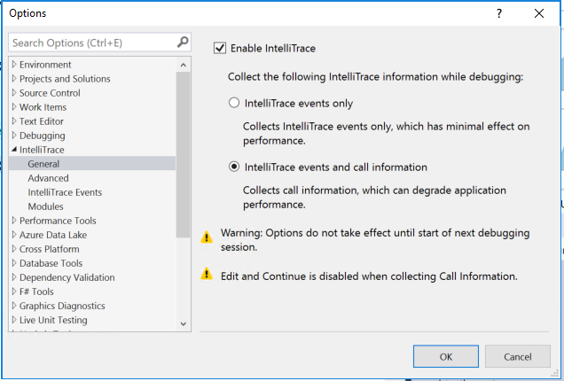
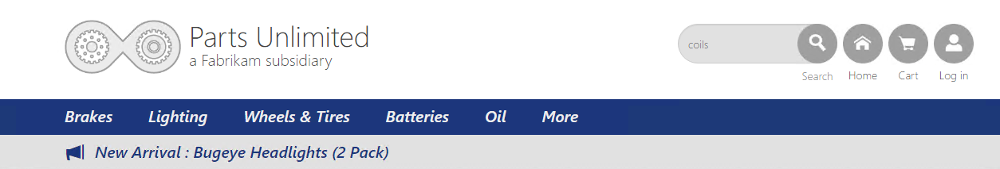
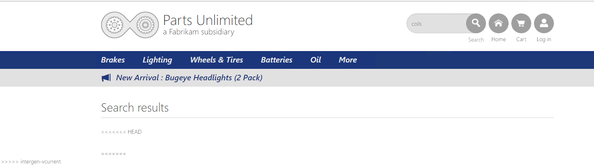
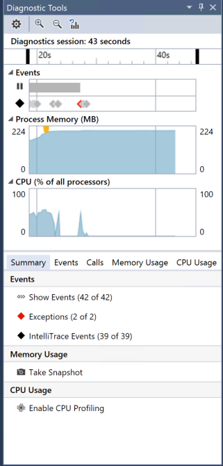
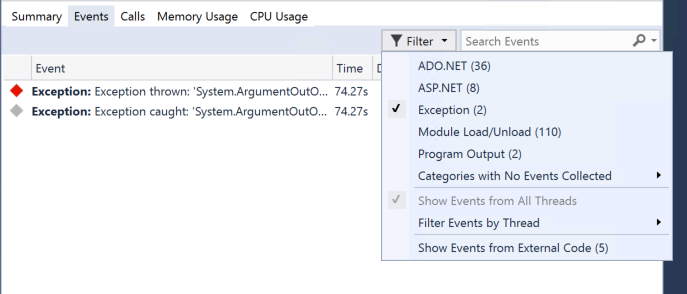
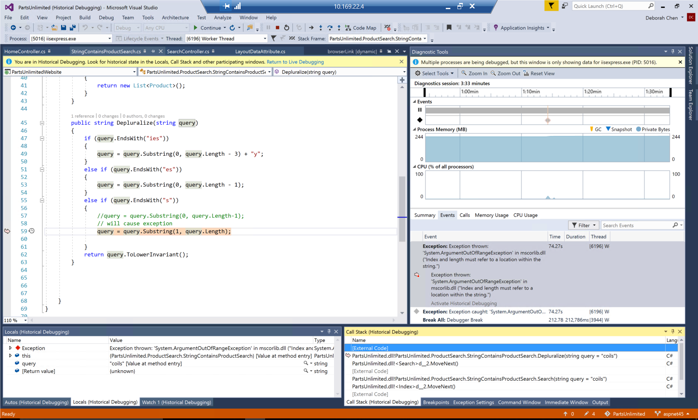
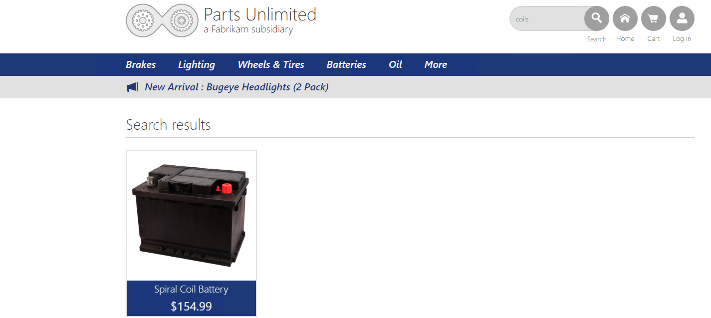
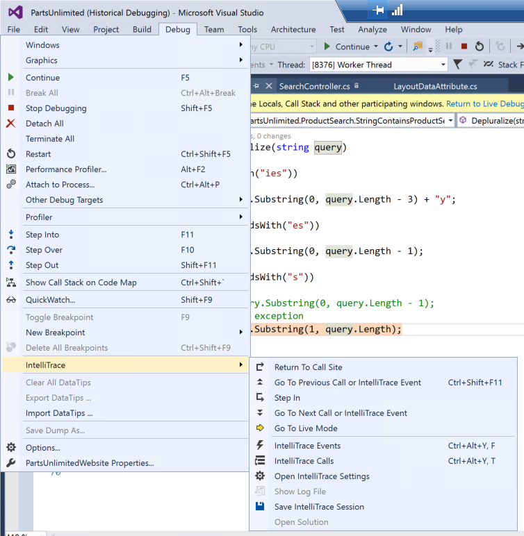
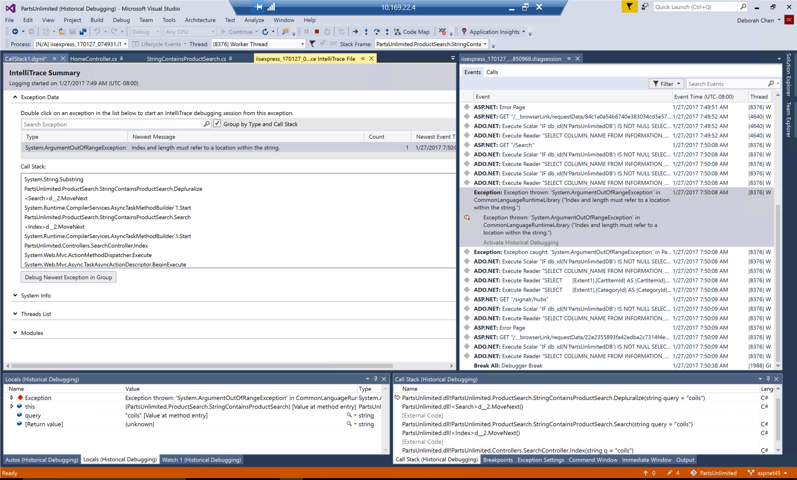

# Debugging with IntelliTrace

## Overview
The idea around DevOps is to deliver high quality applications, to do it at speed and with ease.   The problem is that IT has bought into a ideal that holds them back from getting there. This ideal is that the measure of success is better Mean Time to Repair (MTTR). MTTR has been touted as the measuring stick of operational efficiency. Conventional wisdom has stated that the faster you can find a problem and fix it, the better IT performs. <cite>[The Chains that Bind IT -Stephen Wilson ](https://turbonomic.com/blog/on-technology/devops-challenge-mttr-chain-binds/)</cite>

Many developers still rely on traditional or live debugging techniques which shows only your applications current state with limited data about past events. You either have to guess what happened based on your current state, or you have to recreate these events by rerunning your app. Developers rely on breakpoints to try capturing some of the errors that might appear because of unknown events, sometimes even a breakpoint won’t be able to reach the issue – after all, maybe the breakpoint won’t be hit at all.

IntelliTrace expands this traditional debugging experience by recording specific events and data at these points in time. This lets you see what happened in your application without restarting it, especially if you step past where the bug is. IntelliTrace enables you to seek to a large number of execution points, that occurred in the past, and drill into any of them, comparing variables, call stacks, etc. in order to help pinpoint causes of issues without having to restart the application to reproduce the problem. IntelliTrace automatically collects various events in your application (e.g. ASP.NET, ADO.NET, etc), enabling you to view the historical state of the application at those points in time. 
 
 In this lab, you will learn about the IntelliTrace debugging feature in Visual Studio Enterprise. 

## Pre-Requisites   
- Visual Studio 2017 Enterprise - download [here](https://www.visualstudio.com/vs/visual-studio-2017-rc/)
- Download the Parts Unlimited project [here](https://github.com/Microsoft/PartsUnlimited/tree/aspnet45)

## Demo Script

1. Enable IntelliTrace to collect events and calls information. Tools -> Options -> IntelliTrace -> General.
    

1. Run the PartsUnlimited website (branch aspnet45) to start debugging. (F5)
1. Type "coils" into the Search bar on the homepage.
    

1. PartsUnlimited will return no search results, even though we'd expect it to. 
    

1. Inside Visual Studio, view the Diagnostic Tools Window. Note that in the Summary Tab (new in VS 2017), there are 2 Exceptions that occurred in the application, and the corresponding red diamonds in the Events track.  
    

1. Click Show Events to be taken to the Events Tab.
1. Filter the Events view to show only the 2 exceptions.
    

1. Double click on the red Exception thrown event.
    

9. Visual Studio takes you to the line of source code at which the exception was thrown. Note that VS is in "Historical Debugging" mode. Note that in the Locals window, the value of the query variable is "coils," the input we typed into the search bar. Note the pink arrow at Line 59, indicating we are in that historical time context. 
10. From reading the description of the exception, we suspect that there is an index out of range error. Replace query = query.Substring(1, query.Length) with query = query.Substring(0, query.Length-1); 
11. Restart the application and note that searching for "coils" now returns the correct result. Note that with IntelliTrace, we were able to go from an exception directly to the source code. With regular debugging, we would have had to guess where the relevant line of code is, set a breakpoint, step through the code, and continue until we find the bug. 
    

1. In the above steps, we debugged the problem as we were developing locally. Suppose you repro'd the error, but wanted to send the problem to another developer to debug. We can save an iTrace file with a repro of this problem. Debug -> IntelliTrace -> Save IntelliTrace Session.   
   

1. Open the iTrace file in Visual Studio. Double click on the Exception under Exception Data to be taken to Source code. Note, in a real world use case, the source and symbols locally must match the source and symbols on the machine on which the application was deployed. In this case, we created and recorded the iTrace file locally, so all the source and symbols will match. 
   

## Summary
You can spend less time debugging your application when you use IntelliTrace to record and trace your code's execution history. You can find bugs easily because IntelliTrace lets you record specific events and debug errors that are hard to reproduce or that happen in deployment 

Here are some examples of how IntelliTrace can help you with debugging:
- ***Your application has corrupted a data file, but you don't know where this event happened***: Without IntelliTrace, you have to look through the code to find all possible file accesses, put breakpoints on those accesses, and rerun your application to find where the problem happened. With IntelliTrace, you can see all the collected file-access events and specific details about your application when each event happened.

- ***An exception happens***:Without IntelliTrace, you get a message about an exception but you don’t have much information about the events that led to the exception. You can examine the call stack to see the chain of calls that led to the exception, but you can’t see the sequence of events that happened during those calls. With IntelliTrace, you can examine the events that happened before the exception.

- ***Your application crashes on a test computer but runs successfully on a development computer*** or ***A bug or crash happens in a deployed application***: You can configure IntelliTrace data collection before you publish the application. While your application runs, IntelliTrace saves data to an .iTrace file or use Microsoft Monitoring Agent, either alone or with System Center 2012, to save IntelliTrace data to an .iTrace file.

