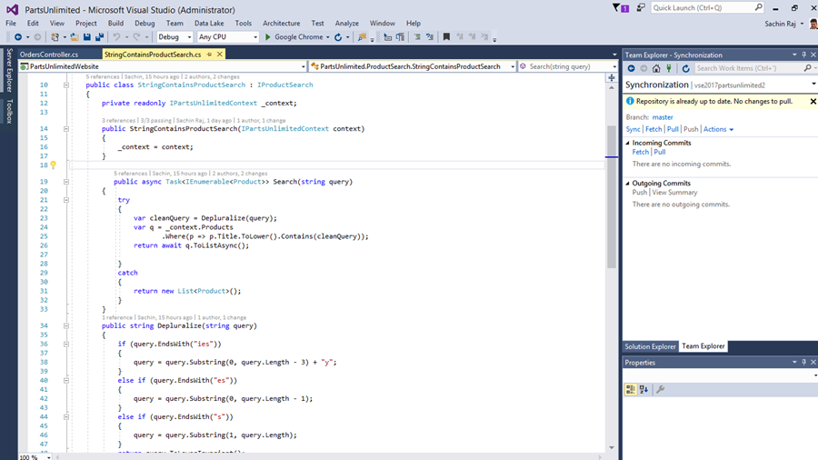
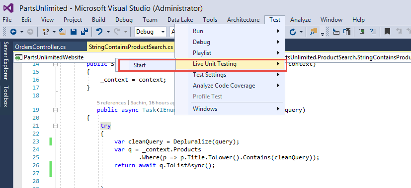
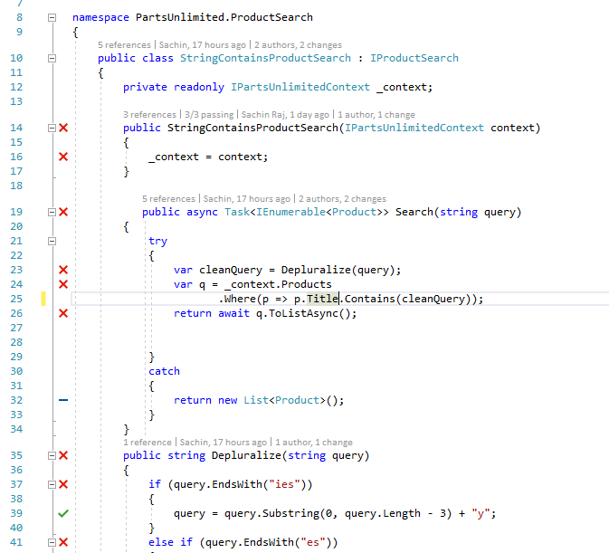
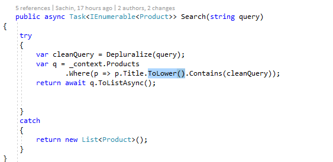
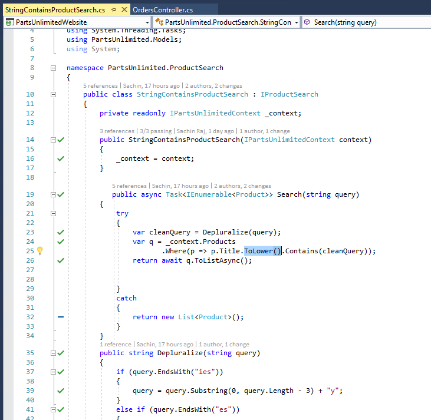

# Live Unit Testing

## Overview 
Live Unit Testing is a new feature introduced in Visual Studio 2017. This feature visualizes unit test results and code coverage live on the editor, while you are coding. It works with C\#/VB projects for .NET framework and supports three test frameworks of MSTest, xUnit and NUnit.

This feature will make it easy for you to maintain quality and test coverage during rapid development and take your productivity to a whole new level. Imagine you are fixing a bug in a code base which you may not be completely familiar with. With Live Unit Testing you can know right away, as you are making edits to fix the bug, that you did not break any other part of the system. Getting this feedback, in-situ, as you type will give you extra confidence, make you more productive and why not, even enjoying fixing bugs and writing unit tests!


Live Unit Testing automatically runs the impacted unit tests in the background as you edit code, and visualizes the results and code coverage live, in the editor, in real-time. In addition to giving feedback on the impact that your changes had on the existing tests, you also get imimageste feedback on whether the new code you added is already covered by one or more existing tests. This will gently remind you to write unit tests as you are making bug fixes or adding features. You will be on your way to the promised land where there is no test debt in your code base!

## Related News
[Live Unit Testing on MSDN blog](https://blogs.msdn.microsoft.com/visualstudio/2016/11/18/live-unit-testing-visual-studio-2017-rc/)

## **Setup:** 
 - Visual Studio 2017 (download [here](https://www.visualstudio.com/vs/visual-studio-2017-rc/))
 - Download the Parts Unlimited project [here](https://github.com/Microsoft/PartsUnlimited/tree/aspnet45)

## Demo Steps
1. Let us start with the introduction of Live Unit Testing - Live Unit Testing is a new feature introduced in Visual Studio 2017 and is and it’s available for C# and VB projects that target the .NET Framework. It uses VB and C# compilers to instrument the code at compile time. Next, it runs unit tests on the instrumented code to generate data which it analyzes to understand which tests are covering which lines of code. It then uses this data to run just those tests that were impacted by the given edit providing imimageste feedback on the results in the editor itself. As more edits are made or more tests are added or removed, it continuously updates the data which is used to identify the impacted tests.

1. Here I am going to use the Parts Unlimited - an ASP.NET based e-commerce application for the demo.

1. Open the *PartsUnlimited.sln* in Visual Studio 
    
    

1. In Solution Explorer, navigate to project **PartsUnlimitedWebsite** and open file ***StringContainsProductSearch.cs***

1. Walk thru the code at a high-level to help audience understand the logic 

1. Let's look at this method that I am working on - I was working on this method called ***Search*** that returns products that has the names matching the query    
    

1. I have written some unit tests for this ***Search*** method already, and instead of Doing a “Run All Tests” to see what is passing, I am going to go to ***Tests/Live Unit Testing/Start***

1. Go to Menu **Tests/Live Unit Testing/Start**. Wait till the unit test coverage glyphs appear.
    

1. I can see Red Xs Green Checks and Blue Dashes. Each of these glyphs tells me my test coverage and if any tests touching that line are failing - Blue Dashes indicate no unit test coverage - Red Xs indicate unit test code is failing - Green checks indicate unit test code is passing 

1. When I click on an X or a check, I can see which tests specifically are passing or failing. I can select a test to navigate to my TestMethod.

1. Open ***StringContainsProductSearch.cs*** and ***ProductSearchTests.cs*** side-by-side.
       

1. Let's say we are trying to modify the search method and you can see there are tests failing on this method

1. Make the following edit in the method to add ToLower() to the change the product title to lower case 
    ````C#
    var q = _context.Products
              .Where(p => p.Title.ToLower().Contains(cleanQuery));
    ````
1. After you make the code change, wait for a couple of seconds and show how ***Search()*** is passing the unit test now and the coverage glyph turns from Red X to Green check. 
Point out how it was all live and you did not have to manually go and run the unit test.
    


-------
### Conclusion 
 Live Unit Testing will improve your developer productivity, test coverage and quality of software. .NET developers out there, please do check out this feature in Visual Studio 2017. For developers who are part of a team that practices test-driven development, Live Unit Testing gamifies their workflow; in other words, all their tests will be failing at first, and as they implement each method they will see them turn green. It will evoke the same feeling as a nod of approval from your coach, who is watching you intently from the sidelines, as you practice your art!


