# ReadyRoll

## Overview

Development teams adopting DevOps often struggle to apply DevOps processes to their SQL Server databases.  ReadyRoll is a tool designed to make this easy, so teams can safely automate their database deployments.
Development teams use ReadyRoll to develop, source control, build, validate, test, package, review and release database changes alongside application changes with precision and control.

**ReadyRoll includes a new project type in visual studio that can be used as an alternative to the standard SQL Server Database Project, if
used it allows you to:**

-   Easily and accurately automate deployments of SQL Server
    database changes alongside application changes.

-   Keep up with the pace of application development and deliver value
    to users quickly and efficiently.

-   Extend DevOps practices from your application to your database

## Task 1: Create a ReadyRoll Project

1.  In the Visual Studio menu: File &gt; New &gt; Project…

2.  From the SQL Server template section, choose ReadyRoll SQL Server
    Database Project

3.  In the Name textbox type ‘PartsUnlimitedDB’

4.  Edit the Solution name textbox to be ‘PartsUnlimited’

5.  Click OK

    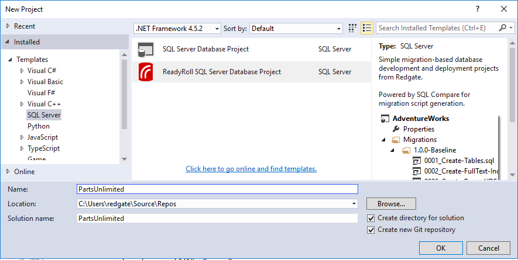

## Task 2: Connect the ReadyRoll project to a SQL Server database and then import the schema

1.  In the ReadyRoll window, click ‘Connect Database…’

2.  Browse to the PartsUnlimited development database and click OK

    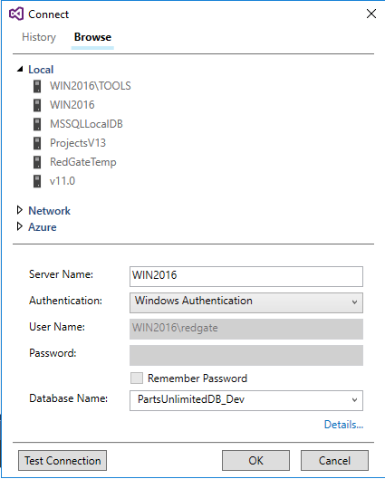

1.  In the ReadyRoll window, click ‘Import Database…’

    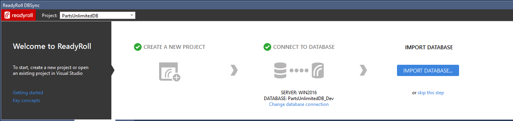

    Once the process has completed you’ll see an initial database migration
script added to the project.

    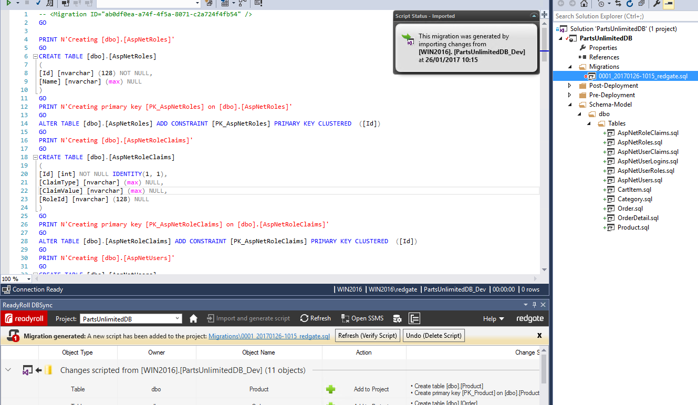

1.  In the ReadyRoll window, click ‘Refresh (Verify Script)’

    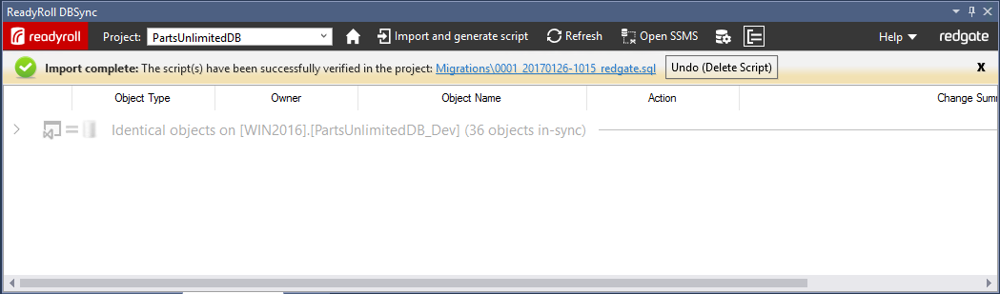

Your project is now ready to use.


<b>Making changes</b>

    When making changes to the database, there are a number of supported workflows, we will use a range of approaches for a series of changes we’d like to make.

    Our database currently has a ‘Price’ column in the ‘Product’ table, but the business has decided that they would like to be able to price products independently depending on region. As a first step we will introduce a new ‘PriceGBP’ column for the British market and rename our existing ‘Price’ column to ‘PriceUSD’ for the US market.

## Task 3: Making a change using SQL Server Object Explorer

1.  Open SQL Server Object Explorer from the View menu

2.  Browse to the PartUnlimited\_Dev database

3.  Expand ‘Tables’, ‘Product’ and ‘Columns’ to find the ‘Price’ column

4.  Right click ‘Rename’, and change the name to ‘PriceUSD’

    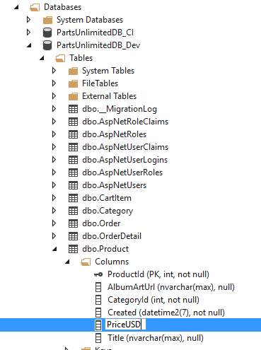

5.  When the preview Database Update window launches, click ‘Generate Script’

    This adds the new migration script to our solution

1.  Click ‘Deploy Project’

    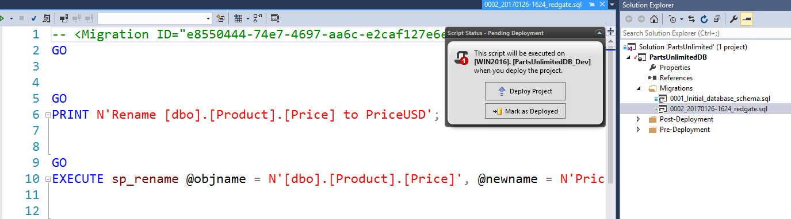

    This applies the change to the database

1.  In the Object Explorer, right click on ‘Columns’ and click ‘Refresh’
    to check the change.

    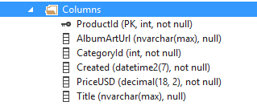

1.  In the Solution Explorer, we can rename the produced migration
    script to something more descriptive such as
    ‘Rename\_Price\_To\_USD’

    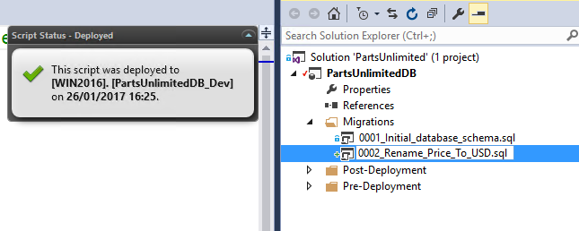

Now let’s use a query window to add our new column and populate it with
some data

## Task 4: Make a change using a query window

1.  In the Object explorer, right click on the same database and select
    New Query…

2.  In the query window, type the code to add the new ‘PriceGBP’ column
    and execute

    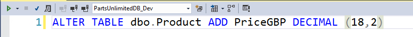

1.  Check it’s been added by typing and executing ‘SELECT \* FROM
    Product’ in the query window

    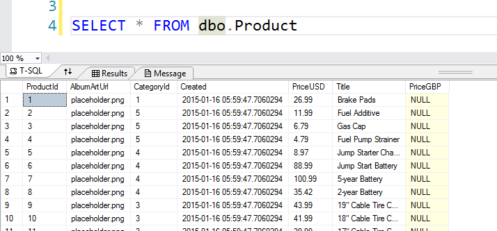

    We can see that the ‘PriceGBP’ column now exists but all or the values null. We would like to set this new price to the correct amount based upon the current exchange rate.

1.  In the query window, type the code to add update the values and execute

    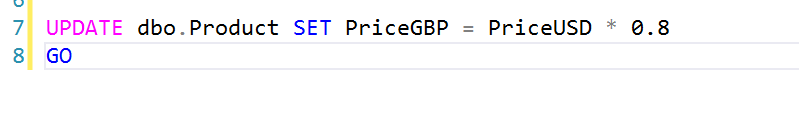

1.  Rerun the select statement from earlier to check the new values

    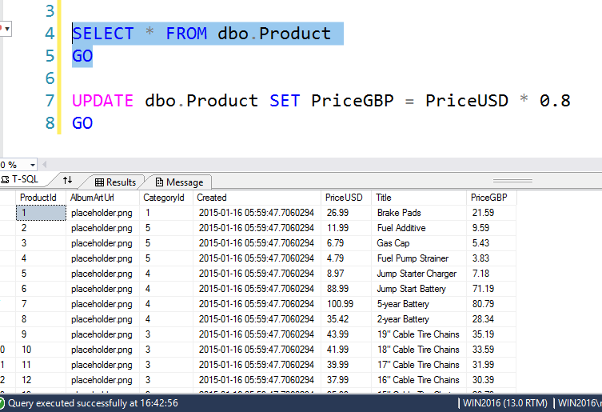

1.  Open the ReadyRoll window and click ***‘Refresh’***

    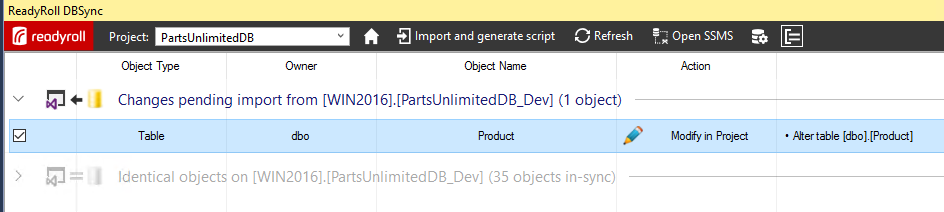

    This will list the changes made to the database ready for us to import them into our project

1.  Click ‘Import and generate script’ to generate and add the script to
    the project

    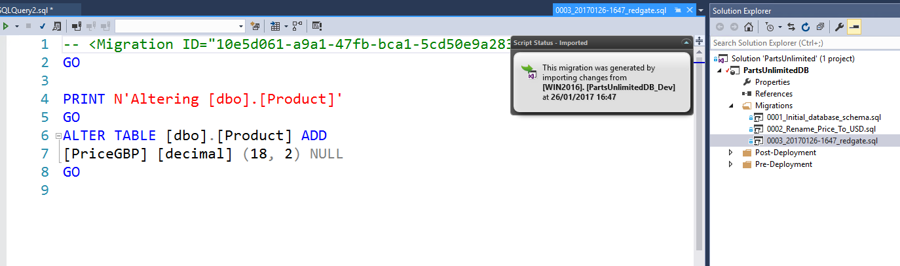

    SSDT would generate this script at deployment time but as ReadyRoll produces the script here, at development time, we can add to or amend the deployment script. In this case to include the missing detail of updating the PriceGBP values

1.  Copy and paste the update statement from your query to add it to the
    generated script

    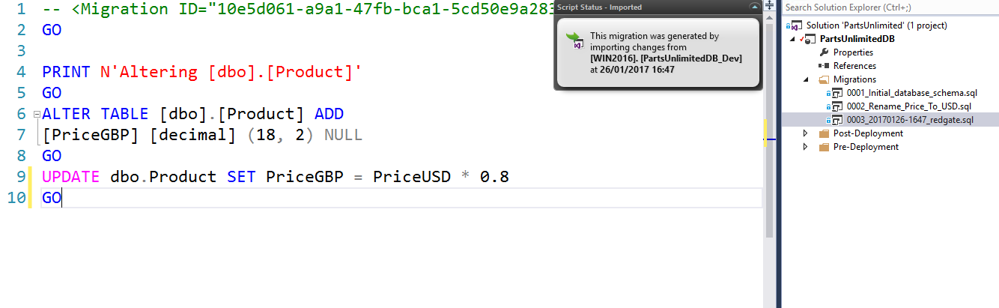

1.  We can now save this new version of the change script by pressing
    Ctrl+S

1.  Click ***‘Mark as Deployed’*** to tell ReadyRoll that we’ve already
    applied this change to the database

    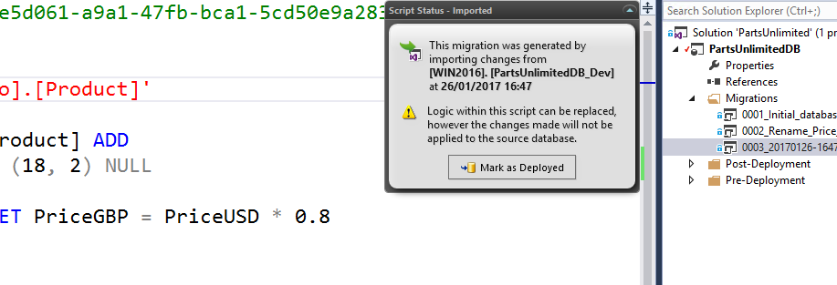

1.  Then rename the script in the project descriptively to
    ‘Add\_PriceGBP’

1.  In the ReadyRoll window, click ‘Refresh (Verify Script)’ to verify
    the amended migration script

    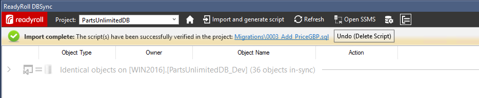

    Now that we’ve updated the values, we need to update this column to not allow null values so that it matches the original ‘Price’ column. 
    This time we’ll use the designer.

## Task 5:

1.  In the Object Explorer, right click on the ‘Product’ table and click ***‘View Designer’***

2.  Uncheck the ‘Allow Nulls’ box for the ‘PriceGBP’ column to stop this
    column from allowing empty values

    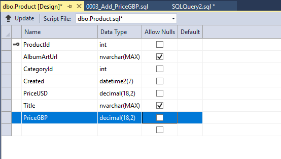

1.  Click ‘Update’ and then click ‘Generate Script’ in the ‘Preview
    Database Updates’ window

    >This has again updated our project with the new migration script

1.  Click ‘Deploy Project’ to update the database

2.  Once again we can rename the migration script in the project to
    something descriptive

    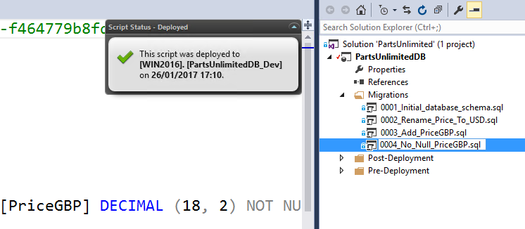

    If these changes were to be deployed on to testing or production using the standard SSDT approach then our update would fail. This is because the data update would not be included and it would be unable to create
    the new ‘not null’ column (PriceGBP) we’ve added to our development database. However, with ReadyRoll we simply concatenate these verified
    migration scripts into a single transaction which ensures a successful deployment.

## Task 6: Configuring builds with VSTS 

**Create a build definition**

1.  In VSTS, from the main menu, select Build.

2.  Click + and enter a name for the definition.

3.  Click Save.

    Add a Visual Studio Build task

    Add this task to the build definition, and then edit it to display database deployment preview information. To do this: 

1.  In your build definition, click Add build step.

2.  Find the Visual Studio Build task and click Add.  
    You can now edit the task.  

3.  Update the MSBuild Arguments field to include the following
    ReadyRoll-specific properties:
    ````
    /p:TargetServer="&lt;TargetServer&gt;" /p:ShadowServer="&lt;ShadowServer&gt;" /p:TargetDatabase="&lt;TargetDatabase&gt;"

     /p:GenerateSqlPackage=True /p:ReportStyle=Simple
     ````

-   **TargetServer**: Target instance of SQL Server to generate the preview against.   
    This is usually the SQL Server instance in your Production environment. You'll need Read (db\_datareader membership)
    and VIEW DEFINITION permissions set in the target database(s).

-   **ShadowServer**: An instance of SQL Server where ReadyRoll may create a temporary copy of your database based on the project
    sources. This is usually an instance of SQL Server in a Development environment. The schema in this database is compared
    with the TargetServer schema to determine what schema changes are waiting to be deployment. You'll need Sysadmin permissions on
    this server.

-   **TargetDatabase**: The name of a database on the target server to
    generate the preview against.

**Using SQL Server Auth instead of Windows Auth**

By default, ReadyRoll will connect to the specified **TargetServer** and **ShadowServer** using Windows
Authentication. If you would prefer to use SQL Server Authentication, add the **TargetUsername**/**TargetPassword** and **ShadowUsername**/**ShadowPassword** properties
to the MSBuild Arguments, e.g:

    ````
    /p:TargetUsername="$(TargetUsername)" /p:TargetPassword="$(TargetPassword)"
     /p:ShadowUsername="$(ShadowUsername)" /p:ShadowPassword="$(ShadowPassword)"
    ````

Alternatively, you can use variables in the MSBuild arguments as we have below-

Build:

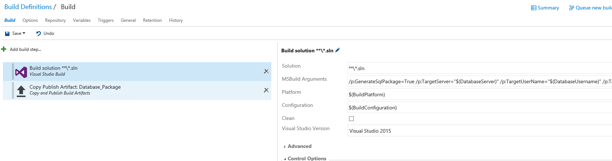

Variables:

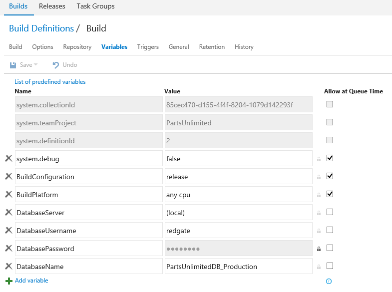

1.  Leave the default settings for the other fields.

**Add a Copy Publish Artifact task**

1.  In your build definition, click Add build step.

2.  Find the Copy Publish Artifact task and click Add.  
    You can now edit the task.  

3.  In the Contents field, enter the location of your build artifacts.

4.  This location will vary depending on your solution configuration.
    It's usually in the bin folder corresponding to your project and
    build configuration. To help construct the path, use the default
    variable, $(BuildConfiguration).

5.  In the Artifact Name field, enter Database\_Package. 

6.  Leave the default settings for the other fields.

    Your task settings should look similar to this:  
        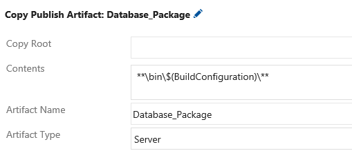  
    Your build definition now looks like this:  
        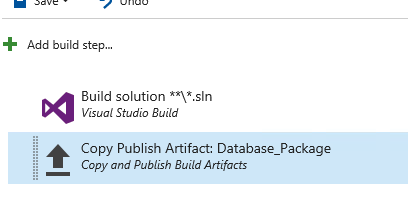

**Create a release definition**

1.  In VSTS, from the main menu, select Release.

2.  Click + and enter a name for the definition.

3.  Click Save.

    Add a Deploy ReadyRoll Database Package task

1.  In your release definition, click Add release step.

2.  Find the Deploy ReadyRoll Database Package task and click Add.  
    You can now edit the task.  

3.  In the Package to deploy field, enter the name of the PowerShell
    script created by the build, for example,
    &lt;project\_name&gt;\_DeployPackage.ps1

4.  In Release version, enter the release number that'll be stored
    against deployed migrations in the
    \[dbo\].\[\_\_MigrationLog\] table. For example, you could use the
    release id with the variable $(Release.Releaseid).

5.  In Target SQL Server instance, enter the fully-qualified SQL Server
    instance name for the target database.

6.  (Optional) In Target database name, if you want to deploy to an
    existing database, enter the database name. If you don't enter a
    name, ReadyRoll will create a new database.

7.  (Optional) Select Use Windows authentication if you want to connect
    using the Windows account that runs the agent. If you don't select
    it, you'll use SQL Server authentication and will need to enter the
    following:

    -   **Database username**: The SQL Server username used to connect
        to the database.

    -   **Database password**: The SQL Server password used to connect
        to the database.

Your task settings should look similar to this:  
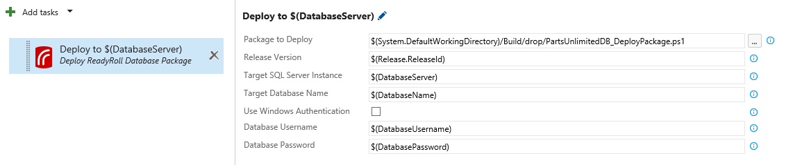

You've now successfully set up ReadyRoll and Visual Studio Team Services
(VSTS) to build and deploy databases.

## Summary and Close - TBC
