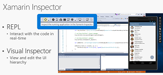

# Inspecting Live Applications with Xamarin Live Inspector 

## Overview
Xamarin Workbooks & Inspector bring an interactive C# console with tools to users. The Inspector integrates with the app debugging workflow of your IDE, serving as a debugging or diagnostics aid when inspecting your running app.

Inspector leverages a tool called Workbooks which is generally available to the public.  

Workbooks uses markdown files to rapidly prototype on concepts. For example, if a developer wants to see what the app would look like if they added a UI collection view, or changed a few specific colors or text placement, usually they would re-build the app and then re-compile it. A compile will usually take some time and will cause extra overhead where developers are just waiting for results. This can be time consuming. Inspector brings the power of iteration directly inside the app. With Inspector, you remove the whole compile step, and can immediately see the impact of your changes and be much faster.   

Inspector allows developers to interact with the app live – start the app in a simulator or real device and launch the Inspector icon at the top. Then Workbooks opens up, and this is a GUI that allows them to execute commands and immediately see the result of those commands. Unique to Inspector is also a live visual tree of the app – select the element that you want to interact with – once selected, it's assigned to the left hand side and you can quickly type in code changes and use Intellisense as needed. Iterate on concepts to give users what they expect.  

The main advantage of Inspector is that it reduces the amount of time to build an app, and makes developers more productive, and developers love this.  

----
## Example scenario:  

Developer is building an app that is very graphically intensive. This means they iterate often on the number of changes being made to simple UI elements and testing out different combinations of these to see which looks best and which provides the best user experience. 

For each of these changes let's take an average build + compile time of 30 seconds. It's very common for developers to make such changes at least 100 times a day, if not a lot more, especially in graphically intensive apps. This means they are spending at least 50 minutes (100 * .5 seconds) a day waiting for results from their build + compile process. Add to this the additional time of 15 seconds to navigate back to the code each time to make new changes (100 * .25), they are spending 75 minutes (50 + 25) of their day on average just waiting for results.  

Across a team of 5 developers, the team collectively spends 375 minutes or 6.25 hours a day waiting for results. At the median developer hourly rate of $47, the total cost of the 6.25 hours for 5 developers is $293.75. This works out to a monthly cost of $5,875 (@20 working days in a month) or $70,500 per year.   

Yearly wasted cost per developer = $14,100 

An enterprise wastes $14,100 every year per developer in waiting for results and twiddling their thumbs.  

By using a tool that will greatly reduce the amount of time wasted, they can realize significant cost savings.  

-----
## Pre-Requisite
- Visual Studio Enterprise 2017
- Download the [sample code](https://github.com/xamarinhq/app-acquaint)

## Demo Steps
|Screenshot | Action| Talking Points
|------|---------------|--------------|
|||There are two main features of the Inspector, programmatic and interactive access to the apps user interface visual tree. Programmatic access is exposed via the REPL – short for Read Eval Print Loop – which lets you to write code that affects the app in real time. Interactive access is available in the Visual Inspector – this window shows a 3D view of the user interface, the complete visual tree, and a panel to update control properties.|
||Open the application in Visual Studio and hit F5 to start debugging|I’ve already started debugging this app, so I just hit the scope icon, and wait for the Inspector window to appear.|
||Click the "Inspect" button from the "Tools" menu|Once this window appears, you have an interactive C# prompt that you can use to execute and evaluate C# statements and expressions. What makes this unique is that the code is evaluated in the context of the target process. In this case, we are showing the code running against the iOS application displayed.   Any changes that you make to the state of the application are actually happening on the target process, so you can use C# to change the application live, or you can inspect the state of the application live.|
||Wait for the app to be loaded |Once the app is loaded and connected to the app, the REPL automatically references the root view for the app. I can explore the object here, and interact with the application via live code. 
||Switch to the **Visual Inspector** view|I can also switch to the Visual Inspector and interactively select a control in the user interface, right on the simulator. |
||Select the ***Company Name*** field on the simulator|I’m choosing the company name, because I think it’s a little hard to read. On the left, the visual tree locates that control, on the right I can use the text filter to find different properties. 
||Select ***Size***|In this case, I’m looking for the size, so I can make it bigger. Notice the simulator reflects this change immediately.
||Select some icons|These icons look a little too dark, so I’m going to select each one and update the Alpha value. They can be selected in the visual tree, the exploded 3D view, or on the simulator.

Iterating over your design has never been faster or easier – but don’t forget you’ll need to go back and update your source code yourself! 
