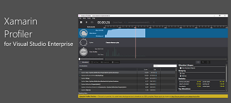
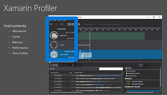
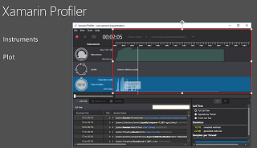
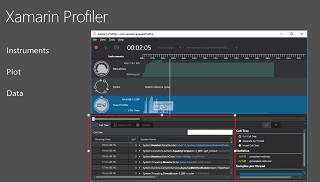
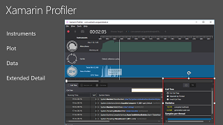

# Xamarin Profiler

## Overview
The aim of developers is to build high quality apps right out of the door, but it’s inevitable that there will be some performance issues that creep up when the app is live. For example, there might be things like memory leaks from time to time. 

Xamarin’s code sharing uniqueness also results in a unique architecture. We generate our own garbage collections for instance which means that memory allocations can't be seen by the native SDKs like iOS and Android. Unlike the desktop and server which have lots of resources like extensive RAM and high performing processors, mobile devices are limited in these kinds of resources. So developers need unique tools to help them understand how they cleaned up the memory object or if they have something in their code that might result in a crash.  

With Profiler, developers can track things like overall memory allocations and references cycles, and get time snapshots. They would launch the profiler and interact with the app like a user normally would. Profiler will give a summary of what's going on at any given point including a call tree of the different steps that took place. Developers can see individual memory allocations and where they reside, and if they are still live or have been deallocated. With snapshots they have the ability to take time snapshots to see how the object changed between two different actions or multiple actions. They can easily compare the object to make sure it’s performing as they expected. Profiler also gives them console information to understand what the debug output is. Another unique capability of Profiler is that it tracks exceptions and flags them along the timeline giving developers an easily visualized snapshot of exceptions, and when and where they occurred. 

The main advantage of Profiler is that it gives developers the tools they need to identify issues much faster than they normally would, and resolve it directly within the development workflow instead of waiting till after the app releases. 

----------

## Pre-Requisite
- Visual Studio Enterprise 2017
- Download the [sample code](https://github.com/xamarinhq/app-acquaint)
- Modify the code as intructed [below](#demoprep)

## Slides
- You can download the slides from [here](./XamarinProfiler.pptx)

|Slide | Talking Points|
|------|---------------|
||Xamarin Profiler includes a variety of instruments to help you measure runtime aspects of your app – from memory use (and memory leaks) to slow method executions and reference cycles. Finding and fixing these issues puts you on the path to a higher quality app|
||The profiler includes these five instruments: Allocations, Cycles, Memory, Performance, and the Time Profiler. Each lets you examine a different aspect of your app’s runtime performance, to help you find memory leaks, object cycles, long-running methods, and more When you’re using the profiler, it appears in a window similar to this one. It’s divided into four parts, each of which has a slightly different purpose depending on which instrument you’re using   At the top left is the instruments list, as well as the record, pause, and snapshot buttons. Click on a row to change the rest of the view.
|
||The data plot sits in the top right. You can see a graph of each instrument’s data – shown here are the Allocations and Time Profiler instruments. Memory use is shown as an area chart – you want to avoid this continually growing (which might indicate a leak). The time profiler shows bars for long running methods, which you can drill down into.|
||The third region is the data table – the contents of this change for each instrument. It will contain data relevant to the selected instrument, such as a list of objects and their sizes, or a list of methods and their execution times. You can drill down into the call stack to see how these objects and methods were executed.|
||The bottom right contains the extended detail panel. It’s a combination of settings and summary data.
As you can see there’s a lot of information to absorb when the profiler is running – let’s see it in action.
|

## Demo steps
|Screenshot | Action| Talking Points
|------|---------------|--------------|
||Open the solution in Visual Studio  Highlight the code where memory leak is introduced|For this demo I’ve added a memory leak into one of our sample apps, so that we can use the profiler to find it. |
||The app shouldn’t already be running – go to the ***Analyze*** menu and select ***Xamarin Profiler***|When the profiler starts, you can select which instruments you wish to monitor. It then deploys the app to a simulator and attaches to it. The instruments immediately start showing data – the Allocations graph shoots up as the app loads into memory, and the Time Profiler shows bars reflecting execution times|
||Click on the ***snapshot camera button***| I can sse the snapshot camera button to capture point-in-time data for comparison.|
||Highlight the area under Allocations Graph|Let’s fast forward a bit – and we can see that the area under Allocations graph continues to grow. This is a bad sign. The Allocations data table is sorted by size, and immediately I can see the largest allocations are being caused by a class called “MemoryLeak”. When I double-click on that, the table zooms in to each allocation, and from there I can right-click and jump to the Call Tree.
|||This view shows me the sequence of operations that lead to the allocation – looking closely I can see that the MemoryLeak objects are being created in the MainApplication class OnCreate method, in a Timer.|
||Switch to the code and go to the ***OnCreate*** method in ***MainApplication*** class|Using this information I can switch back to the code, to find and fix the memory leak. I’ll jump straight to the MainApplication class OnCreate method, and lo-and-behold there’s a timer running, madly allocating strings. 
||Comment out the code; rebuild the solution, and restart the profiler|When I comment that code out, rebuild the solution, and restart the profiler, the Allocations graph levels out after the initial application load, which is what you would expect.

It’s too bad that finding memory leaks is not always this easy – but **Xamarin Profiler** makes it a breeze compared to doing without.

## <a name="demoprep">Demo Preparation</a>
1. Download the code and open the solution in Visual Studio
1. Open ***AndroidNative/MainApplication.cs***
1. Add the ***MemoryLeak*** class and comment out the highlighted lines as shown below:

<pre>
using System;
using Acquaint.Abstractions;
using Acquaint.Common.Droid;
using Acquaint.Data;
using Acquaint.Models;
using Acquaint.Util;
using Android.App;
using Android.OS;
using Android.Runtime;
using Autofac;
using Autofac.Extras.CommonServiceLocator;
using HockeyApp.Android;
using Microsoft.Practices.ServiceLocation;
using Plugin.CurrentActivity;
 
namespace Acquaint.Native.Droid
{
    <b>class MemoryLeak
    {
        public string Message { get; set; }
    } </b>
           //You can specify additional application information in this attribute
           [Application]
    public class MainApplication : Application, Application.IActivityLifecycleCallbacks
    {
                      // an IoC Container
                      IContainer _IoCContainer;
 
        public MainApplication(IntPtr handle, JniHandleOwnership transer) :base(handle, transer) { }
 
        System.Threading.Timer _Timer;
        System.Collections.Generic.List<MemoryLeak> _LeakedStrings = new System.Collections.Generic.List<MemoryLeak>();
 
        public override void OnCreate()
        {
                                 RegisterDependencies();
 
                                 Settings.OnDataPartitionPhraseChanged += (sender, e) => {
                                            UpdateDataSourceIfNecessary();
                                 };
 
                                 // Azure Mobile Services initilization
                                 Microsoft.WindowsAzure.MobileServices.CurrentPlatform.Init();
 
            base.OnCreate();
 
                                 CrashManager.Register(this, Settings.HockeyAppId);
 <b>
            //_Timer = new System.Threading.Timer(
            //    e =>
            //    {
            //        for (int i = 0; i < 10000000; i++)
            //            _LeakedStrings.Add(new MemoryLeak { Message = "Leaky leak leak..." });
            //    },
            //    null,
            //    System.TimeSpan.Zero,
            //    System.TimeSpan.FromSeconds(5)
            //    );
 </b>
            RegisterActivityLifecycleCallbacks(this);
        }
 
        /// 

        /// Registers dependencies with an IoC container.
        /// 

        /// <remarks>
        /// Since some of our libraries are shared between the Forms and Native versions
        /// of this app, we're using an IoC/DI framework to provide access across implementations.
        /// </remarks>
        void RegisterDependencies()
        {
            var builder = new ContainerBuilder();
 
            builder.RegisterInstance(new EnvironmentService()).As<IEnvironmentService>();
 
            builder.RegisterInstance(new HttpClientHandlerFactory()).As<IHttpClientHandlerFactory>();
 
            builder.RegisterInstance(new DatastoreFolderPathProvider()).As<IDatastoreFolderPathProvider>();
 
                                 // Set the data source dependent on whether or not the data parition phrase is "UseLocalDataSource".
                                 // The local data source is mainly for use in TestCloud test runs, but the app can be used in local-only data mode if desired.
                                 if (Settings.IsUsingLocalDataSource)
                builder.RegisterInstance(_LazyFilesystemOnlyAcquaintanceDataSource.Value).As<IDataSource<Acquaintance>>();
            else
                builder.RegisterInstance(_LazyAzureAcquaintanceSource.Value).As<IDataSource<Acquaintance>>();
 
            _IoCContainer = builder.Build();
 
            var csl = new AutofacServiceLocator(_IoCContainer);
            ServiceLocator.SetLocatorProvider(() => csl);
        }
 
        /// 

                      /// Updates the data source if necessary.
                      /// 

                      void UpdateDataSourceIfNecessary()
        {
            var dataSource = ServiceLocator.Current.GetInstance<IDataSource<Acquaintance>>();
 
                                 // Set the data source dependent on whether or not the data parition phrase is "UseLocalDataSource".
                                 // The local data source is mainly for use in TestCloud test runs, but the app can be used in local-only data mode if desired.
 
                                 // if the settings dictate that a local data source should be used, then register the local data provider and update the IoC container
                                 if (Settings.IsUsingLocalDataSource && !(dataSource is FilesystemOnlyAcquaintanceDataSource))
            {
                var builder = new ContainerBuilder();
                builder.RegisterInstance(_LazyFilesystemOnlyAcquaintanceDataSource.Value).As<IDataSource<Acquaintance>>();
                builder.Update(_IoCContainer);
                return;
            }
 
            // if the settings dictate that a local data souce should not be used, then register the remote data source and update the IoC container
            if (!Settings.IsUsingLocalDataSource && !(dataSource is AzureAcquaintanceSource))
            {
                var builder = new ContainerBuilder();
                builder.RegisterInstance(_LazyAzureAcquaintanceSource.Value).As<IDataSource<Acquaintance>>();
                builder.Update(_IoCContainer);
            }
        }
 
        // We need lazy-loaded instances of these two types hanging around because if the registration on IoC container changes at runtime, we want the same instances.
                      // Using a static Lazy<T> is a nice way to create the instances only if and when we need them.
        static Lazy<FilesystemOnlyAcquaintanceDataSource> _LazyFilesystemOnlyAcquaintanceDataSource = new Lazy<FilesystemOnlyAcquaintanceDataSource>(() => new FilesystemOnlyAcquaintanceDataSource());
        static Lazy<AzureAcquaintanceSource> _LazyAzureAcquaintanceSource = new Lazy<AzureAcquaintanceSource>(() => new AzureAcquaintanceSource());
 
        public override void OnTerminate()
        {
            base.OnTerminate();
            UnregisterActivityLifecycleCallbacks(this);
        }
 
        public void OnActivityCreated(Activity activity, Bundle savedInstanceState)
        {
            CrossCurrentActivity.Current.Activity = activity;
        }
 
        public void OnActivityDestroyed(Activity activity)
        {
        }
 
        public void OnActivityPaused(Activity activity)
        {
        }
 
        public void OnActivityResumed(Activity activity)
        {
            CrossCurrentActivity.Current.Activity = activity;
        }
 
        public void OnActivitySaveInstanceState(Activity activity, Bundle outState)
        {
        }
 
        public void OnActivityStarted(Activity activity)
        {
            CrossCurrentActivity.Current.Activity = activity;
        }
 
        public void OnActivityStopped(Activity activity)
        {
        }
    }
}

</pre>
