# Test Recorder 

## Overview
Unlike web apps, which typically have a limited set of environments (browsers) that they can run in, the mobile landscape is a fragmented world with thousands of device and operating system combinations. It's impossible for developers to control the environment in which their app is going to run. In order to effectively solve this problem, mobile developers need to make sure their apps work as expected on the maximum number of devices in an effort to avoid marginalizing any users. And in order to ensure that their app will run on the widest variety of devices as possible, they should be performing testing before going to market. Testing manually on such a huge number of device combinations is not only time consuming, but also very costly. In the past, dev and QA teams had a collection of physical devices that they would periodically test their apps on. This is not very efficient and not very thorough, mainly because most teams don't have the funds to purchase such a large collection of ever-changing devices, let alone pay all the people necessary to perform the tests.

Fortunately, now there's **[Xamarin Test Cloud](https://www.xamarin.com/test-cloud)**, the cloud-based automated UI testing service from Microsoft. Test Cloud allows developers to test their app against **thousands of mobile device and operating system combinations**, helping them ensure **high quality apps** and **avoid marginalizing users** in the market. Writing the test scripts for test cloud is performed with either UITest (C#) or Calabash (Ruby). By uploading their app and test scripts to Xamarin Test Cloud either on every commit or some regular schedule, they can guard against regressions and **ensure the highest quality app experience across the greatest number of device configurations.**

**[Xamarin Test Recorder](https://www.xamarin.com/test-cloud/recorder)** makes the process of writing test scripts **even easier**, by letting developers and QA teams **create scripts by simply using the app.** Swipes, taps, scrolls, zooms, text entry, navigation, etc. are all captured as they are peformed, and are then tranlsted into a test script. The test script can then be used as is, or even manually customized to suit specific scenarios. This ease of use helps alleviate dev teams' perceptions of testing as a bottleneck, and helps **accelerate development efforts to deliver higher quality code.** Test Recorder integrates directly with Visual Studio and Xamarin Studio, and tests can even be run against local devices and simulators to ensure accuracy before uploading to Test Cloud.

-----
## Pre-Requisite
- Visual Studio Enterprise 2017
- An Android emulator. We recommend:
    - Install a modern Android SDK version and Android x86 system image (such as Android 6.0+ or 7.0+) via the Android SDK Manager.
    - Install Intel's [Hardware Accelerated Execution manager (HAXM)](https://software.intel.com/en-us/android/articles/intel-hardware-accelerated-execution-manager) (requires a computer that supports VT-x virtualization)
- Install [Xamarin Test Recorder](https://www.xamarin.com/test-cloud/recorder)
- Download the [sample app code](https://github.com/xamarinhq/app-acquaint)

## Demo Steps
|Screenshot | Action| Talking Points
|------|---------------|--------------|
|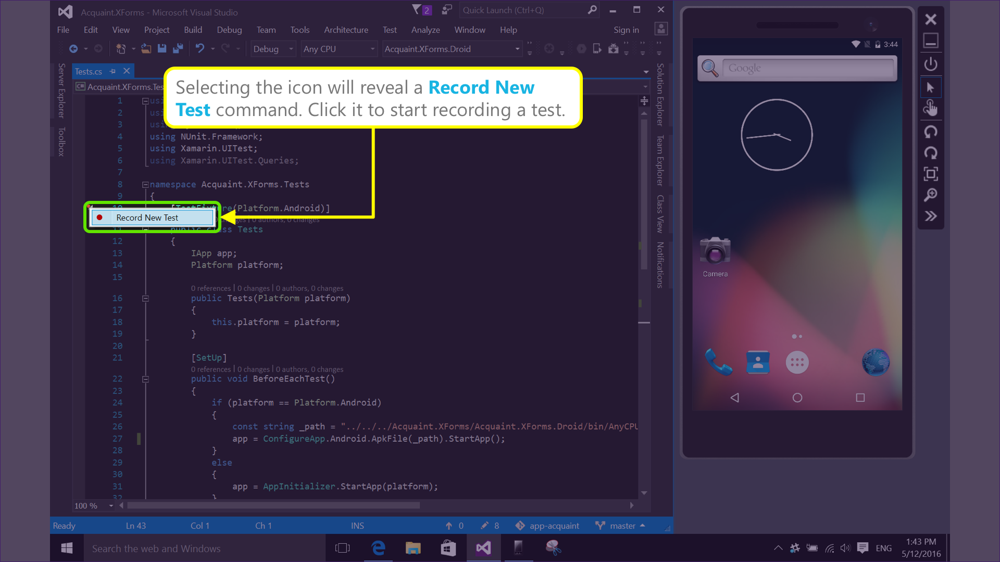|Select the lightning bolt icon that appears in the IDE margin to reveal the 'Record New Test" command.|Before Test Recorder, developers would need to manually write each line of their test scripts, needing to be familiar with the UITest API.|
|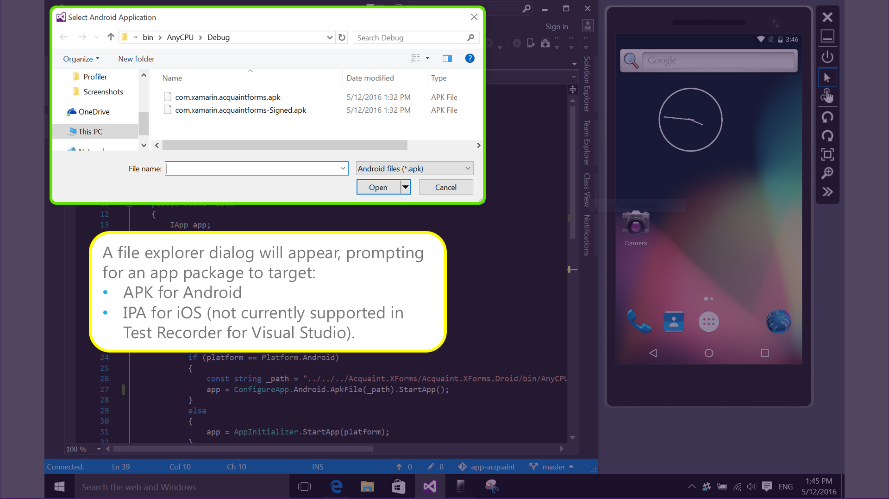|Select the APK of the app that you would like to record tests for. (You may need to run the app once in the emulator first in order to have APKs generated)|Now the process of writing tests is as easy as using the app, either in an emulator or on a connected device.|
|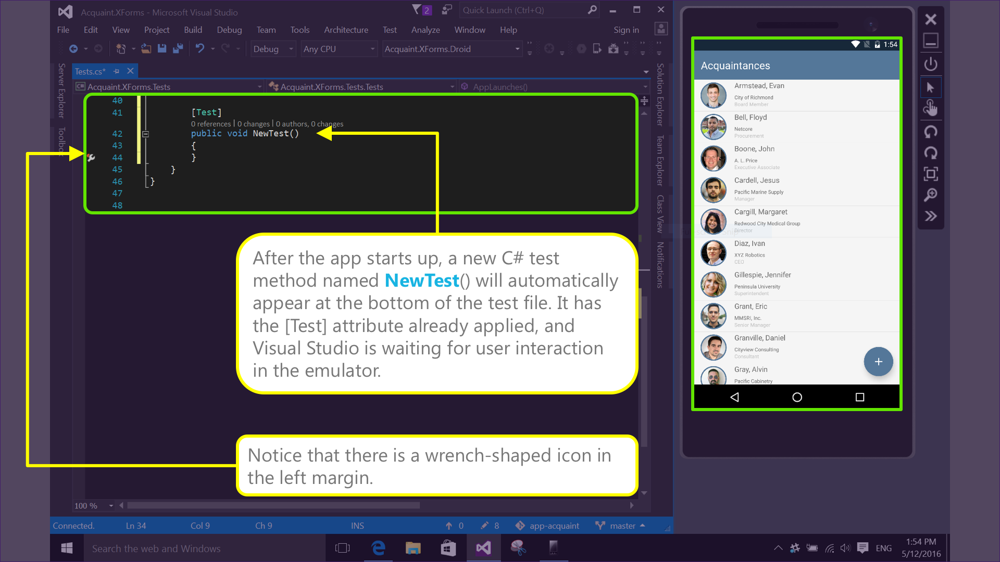|When the app has started, a `NewTest()` method will appear in the test file.|Test Recorder records UI interactions as they happen, and generates each test step as you go.
|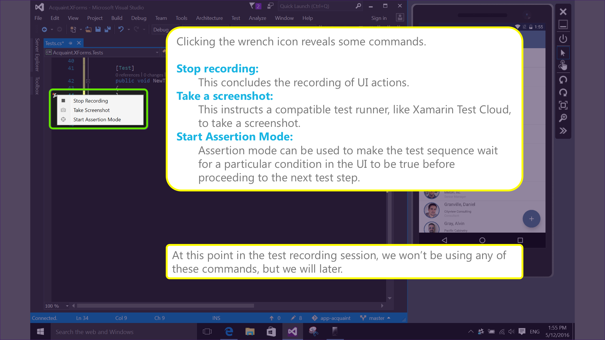|The lightning bolt icon has now become a wrench icon. Click it to see optional acrions that are available during the test recording.|The integration with Visual Studio makes it a breeze to manage the test creation process.|
|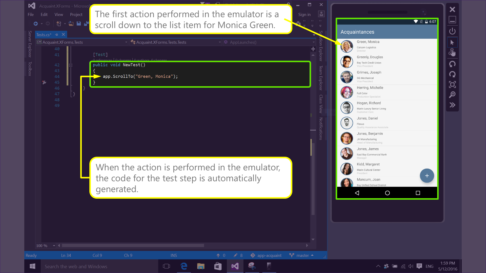|Perform a scroll action down to the "Green, Monica" item, and tap on it.|This tight integration allows for rapid test creation and iteration.|
|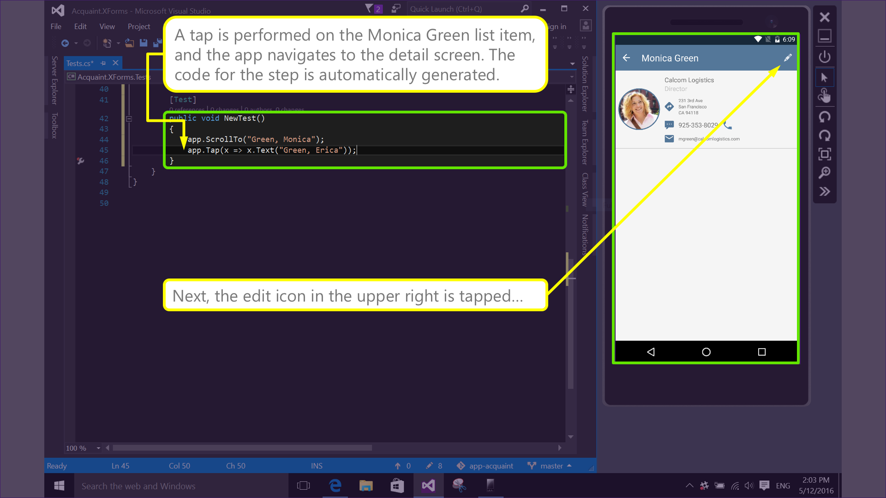|The detail screen will appear. Tap the edit icon on the upper right of the detail screen.|Test Recorder supports all the gestures that you'd expect: scrolling, zooming, tapping, swiping, etc.|
|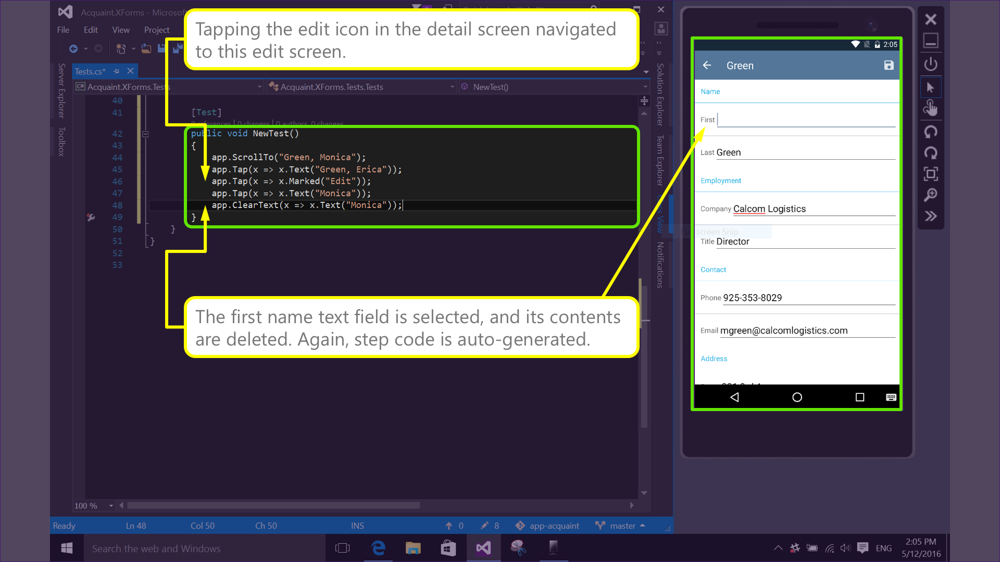|The edit screen appears. Select the first name field, delete its contents.|Even text editing is supported, so you can test not only UI, but also data.|
|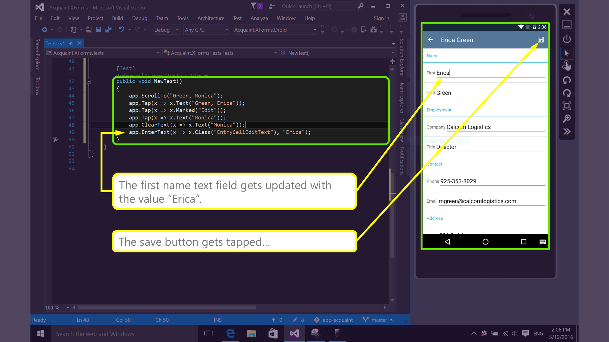|Enter a new value of Erica for the first name. Tap the save button. The app will navigate back to the detail screen.|As the test progesses, you can see the list of steps is growing in the test script file.|
|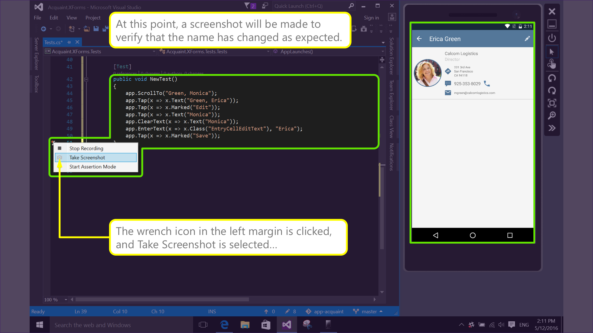|Click the wrench icon in the margin, and select "Take Screenshot". |The UITest framework supports taking screenshots, which Xamarin Test Cloud interprets and executes for all the devices you've targeted for testing.|
|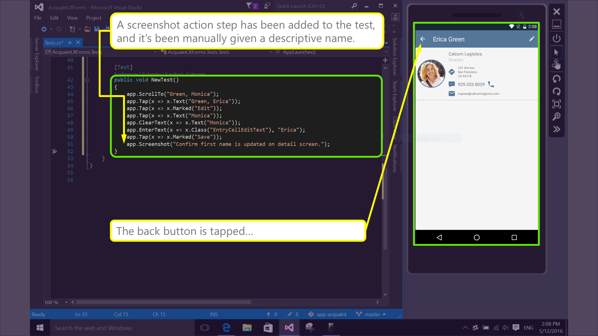|Note that a screenshot step has been added to the script. Name it something appropriate by manually editing the text for that step in the script. Tap the back button.|The tight integration with Visual Studio makes it easy to create screenshots anytime via this dialog of commands that is available in the margin of the IDE.
|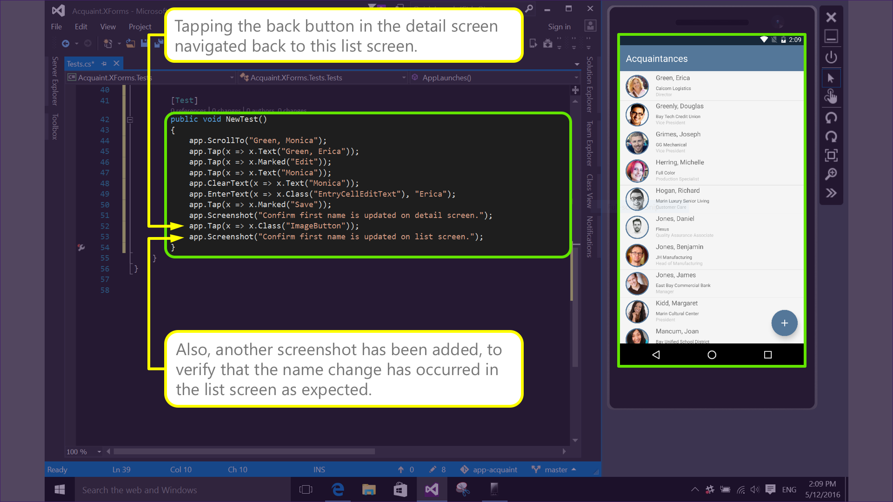|Take another screen shot, and name it something appropriate.|You can see how the number of steps has grown as Test Recorder has automatically added them one by one as we execute UI actions in the app.|
|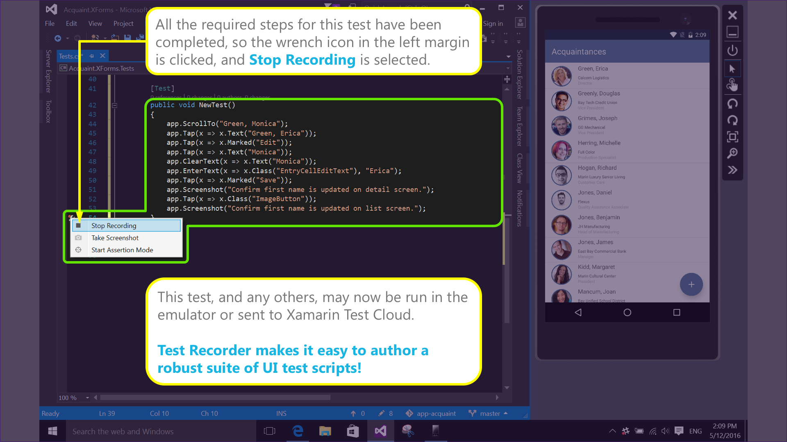|Conclude the test recording by clicking the wrench icon and selecting "Stop Recording".|The test is concluded when we click the icon in the margin that reveals test options and select "Stop Recording."|
||The test is complete and can now be either run locally on an emulator or device, or uploaded to Xamarin Test Cloud.||
