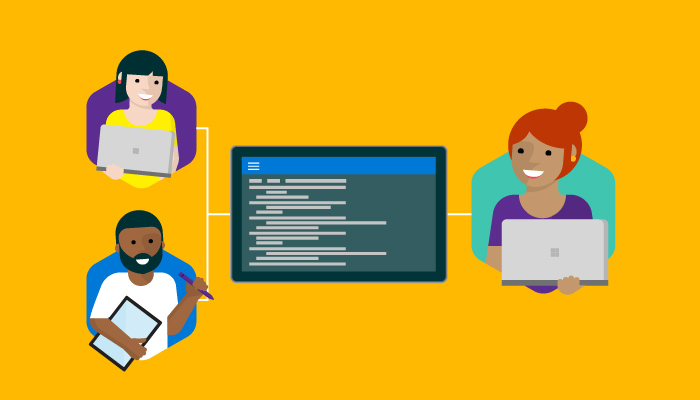

DevOps Scenarios

An organization’s custom software is its primary competitive differentiator and critical to providing rich experiences powered by critical, time-sensitive data to its customers and business users. In this fast-paced word of Cloud First, Mobile First, rapidly delivering quality software is no longer an option, it’s a requirement. Gone are the days of lengthy planning sessions and development iterations.  Cloud platforms such as Microsoft VSTS and Azure have removed traditional bottlenecks and helped commoditize infrastructure. Software reigns in every business as the key differentiator and factor in business outcomes. No organization, developer or IT worker can or should avoid the DevOps movement.

**DevOps** is defined from numerous points of view, but most often refers to removing both cultural and technology barriers between development and operations teams so software can move into production as efficiently as possible. Once software is running in production you need to ensure you can capture rich usage data and feed that data back into development teams and decision makers.

[Read More](https://msdn.microsoft.com/en-us/magazine/mt422586.aspx)

## Index of Scenarios

|Title|Scenario|Demo Assets|
|-----|--------|-----------|
|Getting started with DevOps| Accelerate innovation to develop and deploy applications faster & more frequently|[Link to Scenario](#gettingstarted)|
|Mobile DevOps| How to be Successful with Mobile DevOps |[Link to Scenario](#mobiledevops)|
|Java DevOps with VSTS and TFS| Microsoft DevOps for Java Developers |[Link to Scenario](#javadevops)|
|Database Devops| Extending DevOps Practices to SQL Server Databases|[Link to Scenario](#databasedevops)|

## Getting Started with DevOps
**Scenario Description**:   
DevOps helps teams drive toward continuous delivery and leverage data from running applications to help make better-informed decisions. 
Microsoft Visual Studio Team Services provides everything a team needs in a single solution including agile planning, source code control, package management, build, testing and release automation to continuously integrate, test, deliver and monitor application. It is a complete DevOps toolchain to help  deploy your application faster with confidence.

**Demo Assets:**   
 - The Microsoft DevOps Solution - [Pitch Deck](https://microsoft.sharepoint.com/sites/Infopedia_G01KC/_layouts/15/WopiFrame.aspx?sourcedoc={b25c73b4-e392-4ffa-91d9-704ea170f8c0}&action=default&DefaultItemOpen=1)
 - End to End DevOps [Demo](https://channel9.msdn.com/Events/Visual-Studio/Visual-Studio-Live-Redmond-2016/VSLive2016Keynote02) by ***Donovan Brown*** at VS Live 2016
 - [Hands-on-Labs/Demo Scripts](https://github.com/Microsoft/DevOps-Immersion/) for an E2E Devops using the MHC application 
 - [VSTS Demo Generator](http://vstsdemogenerator.azurewebsites.net) - a utility to populate data on your VSTS account  

[Back to Index](#index)

-------
##  End-to-end Mobile Development with Mobile DevOps
**Scenario description:**   
Mobile is more than just building the app. It includes testing, monitoring, iterating, and continuously maintaining the app. Mobile DevOps solves unique challenges at every stage of the mobile lifecycle. It simplifies mobile development by automating the entire release pipeline, from planning to Continuous Improvement, and accelerating release cycles, delivering high quality apps, and allowing customers to spend more time on new features. 

**Demo Assets:**
- Mobile DevOps high-level [pitch deck](https://microsoft.sharepoint.com/sites/Infopedia_G01KC/_layouts/15/WopiFrame.aspx?sourcedoc=%7B2e0b32f3-ca25-441b-a645-9a141888d357%7D&action=default&DefaultItemOpen=1)
- Mobile DevOps [FAQ](https://microsoft.sharepoint.com/sites/Infopedia_G01KC/_layouts/15/WopiFrame.aspx?sourcedoc=%7B88499356-b6a5-4069-9c13-0ae4b0bc5719%7D&action=default&DefaultItemOpen=1)
- Mobile DevOps [demo script](/Mobile DevOps/)
- Demo set up [instructions](https://microsoft.sharepoint.com/sites/Infopedia_G01KC/_layouts/15/WopiFrame.aspx?sourcedoc=%7B93390509-4221-4b94-8848-c1954f135477%7D&action=default&DefaultItemOpen=1)
- Mobile DevOps overview [whitepaper](https://microsoft.sharepoint.com/sites/Infopedia_G01KC/_layouts/15/WopiFrame.aspx?sourcedoc=%7Bcf12116e-f5c0-4426-bda9-70aa7d8d1247%7D&action=interactivepreview&DefaultItemOpen=1) (provides high-level understanding of Mobile DevOps for TDMs)

[Back to Index](#index)    

--------

##  Java DevOps with VSTS and TFS   

**Scenario description:**   
In this session, we will present many of the features available in Visual Studio Team Services (VSTS) to support end-to-ebd DevOps specifically to build and deploy a Java application running in the cloud.  We will utilize the Kanban board planning feature to select a task; use a Git workflow to make a change via a Pull Request (PR); utilize a PR build for a Maven project including running Junit tests, JaCoCo code coverage, and SonarQube analysis; utilize CI/CD to build and deploy the project POM file via a Linux agent to a Tomcat server running in Azure.  Traceability will be shown from the task through to the deployment.   Other cross-platform capabilities will be presented including the ability to interface with Jenkins and deploy using UrbanCode Deploy, JBoss/Wildfly and Websphere.
**Demo Assets:**
- Java Capabilities and Feature [Briefing](https://microsoft.sharepoint.com/teams/java/alm/Shared%20Documents/MS%20Presentations/Java_Jax_April.20.2016.pptx)
- Java DevOps End-to-End [Demo](https://www.youtube.com/watch?v=0MT6udEQTDw) by **Jamie Cool** presented at ***Connect 2016*** 
- Java How To [Training Video](https://microsoft.sharepoint.com/teams/java/alm/Shared%20Documents/Videos%20-%20INTERNAL) - ***Internal Only***

[Back to Index](#index)    

--------

##  Extending DevOps Practices to SQL Server Databases
**Scenario description:**   
Without the right processes in place, database change management slows things down, adding risk and uncertainty and getting in the way of development and operations working together to add value.

Redgate helps you remove the bottleneck by giving you a reliable, scalable and repeatable process for building, deploying and maintaining SQL Server databases, in the same way you do for your application code.
**Demo Assets:**
- Where's the database in DevOps? - [Video](https://www.youtube.com/watch?v=NRqgGqm98S4)

## Other Demo Assets
- [ALM VM](https://aka.ms/almvm) - A Windows based VM preconfigured with Team Foundation Server, Visual Studio Enterprise, SQL Server with supplmenting labs that covers a wide variety of DevOps topics
- [Java VM](https://github.com/nwcadence/java-dev-vsts/) - A Linux VM preconfigured with Eclipse, Apache Tomcat, MySQL and other supporting software and supplmenting labs to show how Microsoft DevOps solution accelerate Java development
- [DevOps Immersion Labs](https://github.com/Microsoft/DevOps-Immersion/) - A set of hands-on-labs covering DevOps topics using the My Health Clinic application

[Back to Index](#index)    

--------

[Back to main page](../..readme.md)

