Demo Overview
=============

This document describes the Mobile DevOps demo that will be used in S4
and MGX 2016. These demos focus on the end-to-end Microsoft Mobile
DevOps solution including Xamarin for Visual Studio, Xamarin Test Cloud,
Hockey App and VSTS.

The key things viewers should take away from this section/demo will be:
```
-   A good understanding of how the end-to-end Mobile DevOps demo is integrated together
and flows
-   Visual Studio and Xamarin provide a truly native cross platform development environment
-   VSTS, Visual Studio, Xamarin Test Cloud, and Hockey App integrated together provide a true 
DevOps platform for mobile application development teams
-   How the Mobile DevOps Solution connects to Azure and cloud services
-   Microsoft is the only cloud provider that provides end-to-end cloud infrastructure and cloud 
developer services for the entire development cycle
```


Talk track + demo script
========================

| Demo Screen  and Steps| Script|
|------------------|-------|
|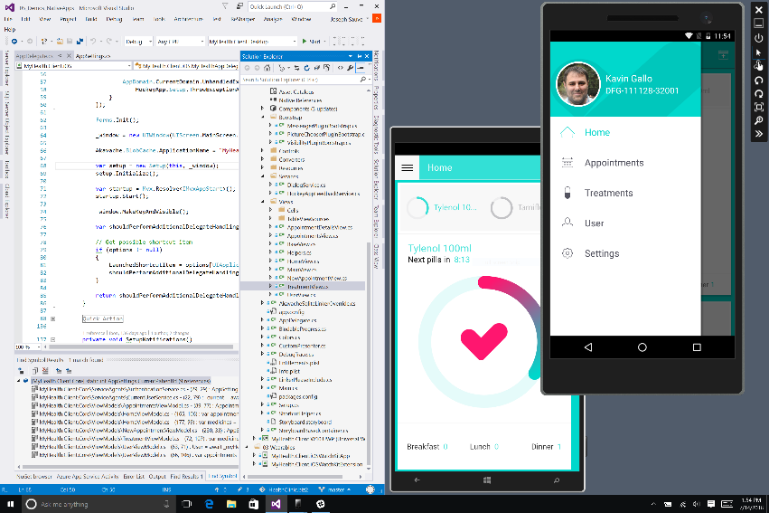 <br>-   Start Visual Studio<br>-   Ensure Android Emulator for Visual Studio is running with MyHealth app deployed<br>-   Ensure Windows Phone 10 emulator is running with MyHealth UWP app deployed.  <br>(Choose whatever emulator sizes best fit your screen)  | Xamarin empowers developers to create native apps for iOS, Android, and Windows, all in C\#. Anything that can be done in iOS with Obj-C or Android with Java can be done in C\# with Xamarin; every bit of the platform APIs is available for developers to create fast native apps that delight users. And because the apps are all written in C\#, developers can write large amounts of code that is shared across all platforms. Sharing code means less development effort, consolidated development teams, and fewer bugs to fix.<br> Let's take a look at an app in Visual Studio that runs on iOS, Android, and Windows. This app is called MyHealth. It allows patients to manage their appointments and treatments with their local clinic. Let's look at how this app is organized in Visual Studio. |                                                                                                                                                                                                                               
|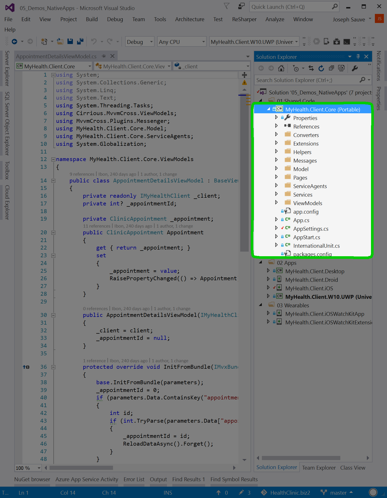 <br>-   Highlight core project  | Because code-sharing is central to Xamarin apps, one of the most important features of this app is the "Core" project. This project contains all of the shared code, and is central to the app's navigation flow and data operations. Each platform project in the solution has a reference to this Core project. Since we want all of our Azure services to be shared by all platforms, all of the Azure code lives in the Core project, and is consumed by all of the target platforms. |                
| 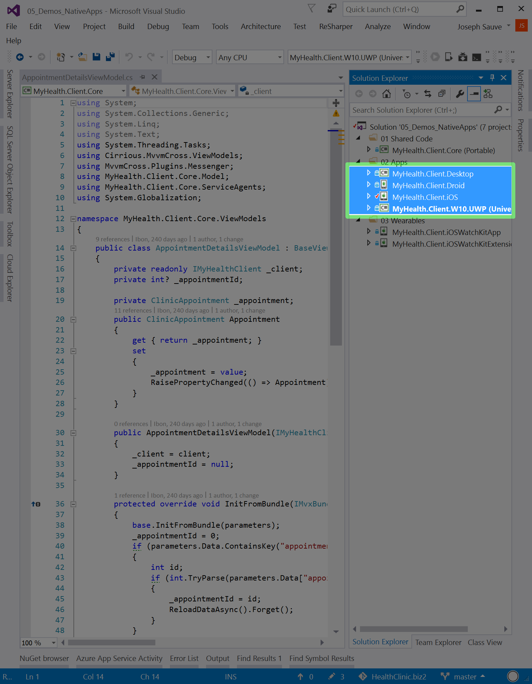 <br> -   Highlight individual platform projects   | The next important parts of a Xamarin app are the platform projects. Here you can see we have a project for each platform that the app runs on: iOS, Android, Windows, and even Apple Watch. Each of these platform projects contains code that "bootstraps" the app from the Core project. Depending on how the app is architected, the platform projects also contain some platform-specific UI code. This is where Xamarin's exposure of 100% of the platform APIs is important: anything that a developer would do in iOS with Obj-C or in Android with Java, they can do with C\# in these platform projects. This means that they are building 100% native apps for each of these platforms. In this particular app, much of the custom UI is defined in C\#, as well as the markup files for each respective platform (.axml, .xaml, and .storyboard files). Even with all that platform-specific UI code, an average of 75% of the C\# code for each app is contained in the Core project. Only 25% of the C\# is specific to each platform! All this shared code translates to less development effort, faster resolution of bugs, and overall better apps and user experiences.                                                                                                                                                                                                                                 |
| 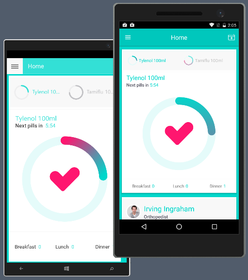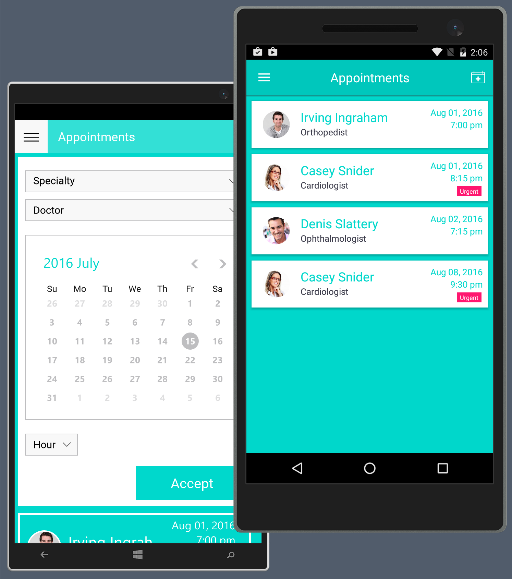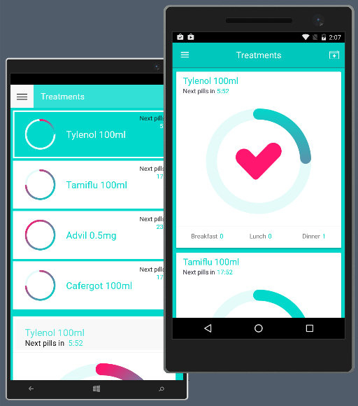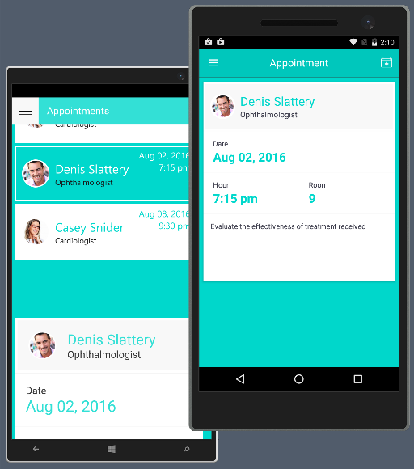 <br> -   Highlight emulators and UI/UX  | The development process results in these beautiful, performant, fully native apps. Let's take a quick look at some of the screens in this app, and how they look and feel on the emulators. The **Home screen** of MyHealth displays an at-a-glance summary of the patient's treatment care, medication tracking, and upcoming appointments. As I scroll this screen and click the menu button, we see that this app is fast and responsive, just as users expect their apps to be. The **Appointments section** of the app displays upcoming appointments, and allows us to schedule new ones. The **Treatments section** of the app displays the ongoing status of treatments that have been prescribed by the physician. The UI looks slightly different on each device because **each app adheres to the style guidelines of its respective platform**. On Android, things look and behave as a user expects on Android; likewise, on the other platforms. For example, the Appointment section's navigation hierarchy on Android provides a drill-down paradigm, navigating from screen to screen; whereas on Windows, the screens are presented in a single scrolling interface. Users of a particular operating system expect an app to behave in the way the other apps on their device behave. Xamarin's full access to the platform APIs allows developers to deliver that platform-consistent user experience. |
|   -   Transition to VSTS | But it doesn't end with development. Putting delightful apps in the hands of users also depends on processes that surround development efforts: build automation, testing, and continuous delivery. In a word: DevOps. Microsoft's Visual Studio Team Services provides these crucial tools of a successful development lifecycle through a comprehensive DevOps solution. |
| |Switch to **Safari**|                                                                                                                                                                                                            |
| 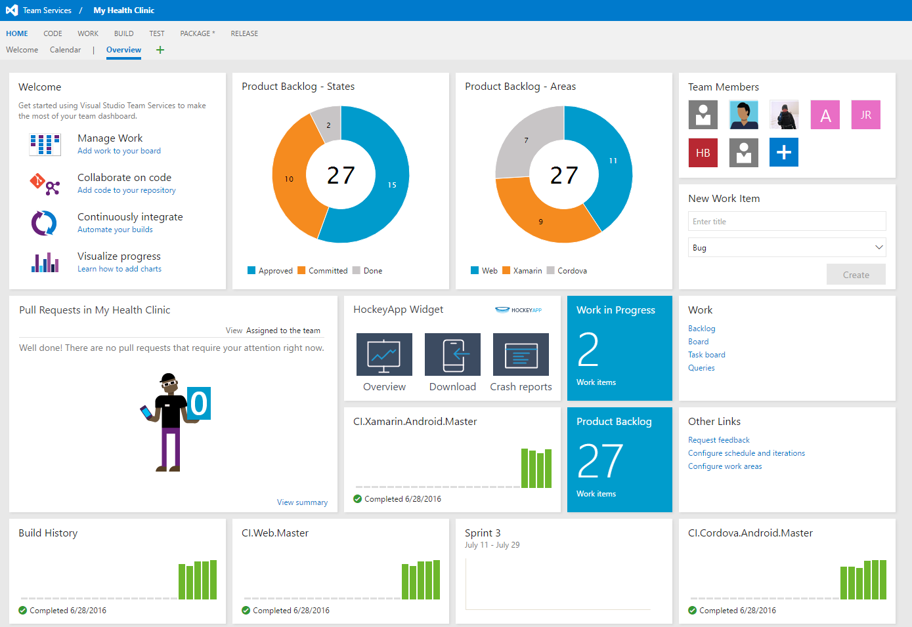 <br> -   Open URL in a separate tab <br><https://vstsdemos.visualstudio.com/My%20Health%20Clinic/_dashboards>                              | Visual Studio Team Services is a collaborative platform running in the cloud that provides development teams all they need to develop high-quality software – from work item tracking to source control, build, test and deploy.|                                                       |
| 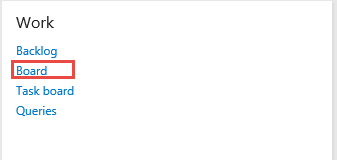 <br> -   Select **Board** || 
| 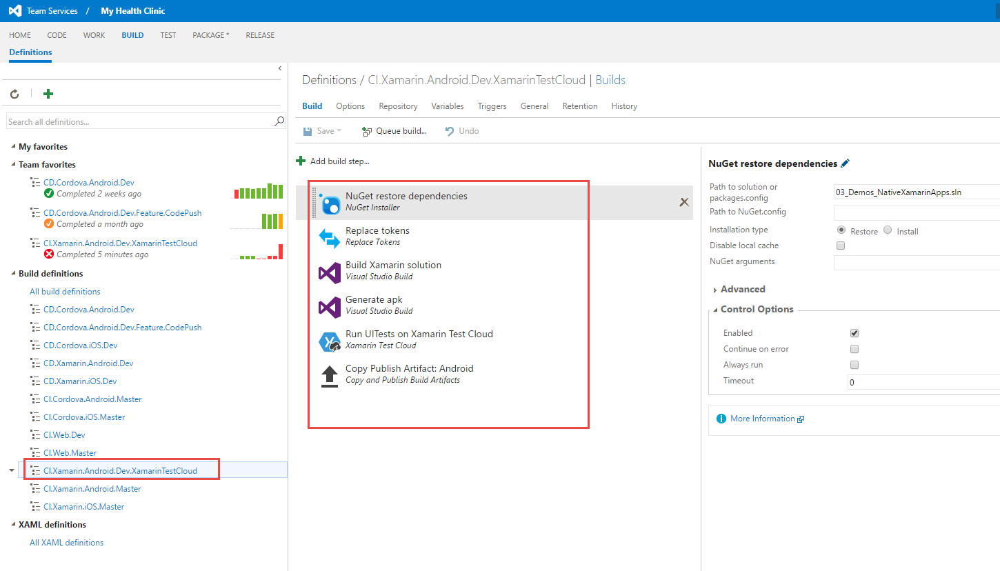 <br>-   Select **Build** <br>|-   URL: <https://vstsdemos.visualstudio.com/My%20Health%20Clinic/_build?definitionId=396&_a=simple-process>   <br> -   Select **Edit** if **CI.Xamarin.Android.Dev.XamarinTestCloud**definition is not already in Edit mode                   | This is the build pipeline for the Xamarin Android app. The build compiles the Xamarin app.|
| 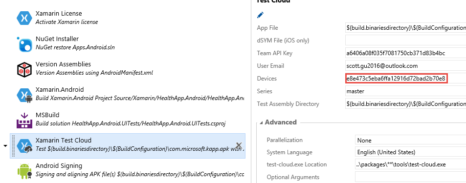 | Then using the Xamarin Test Cloud task, the app and the tests are uploaded to the Xamarin test cloud. <br> The entire build is done using Build agents on the cloud.|                                                                                                                                    |
| 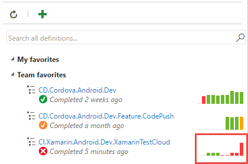<br>-   Pick a recent successful build run in **CI.Xamarin.Android.Dev.XamarinTestCloud** from the **Team Favorites** section | The entire build and test is automated in the build pipeline. |
| 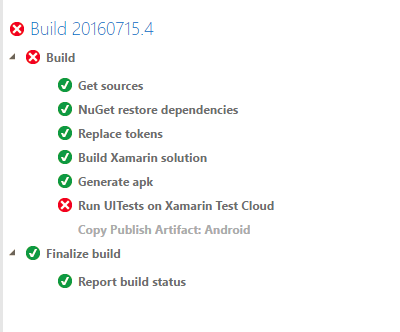<br>-   Walk through steps  |                                                                                                                                                                                                |
| 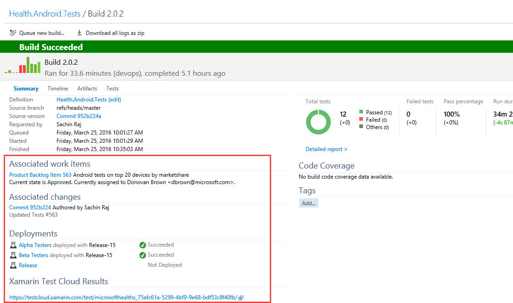  | When my test is complete, I get the link to the test cloud report that we saw earlier.  <br>In addition to the link, the test results are also published into VSTS. |
| 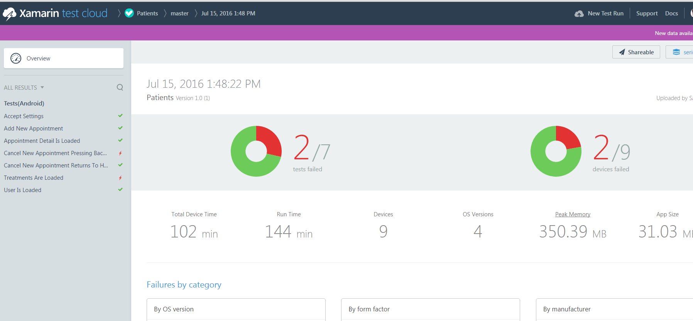<br> -   Show Xamarin Test Cloud<br>-   URL: <https://testcloud.xamarin.com>  | Given the huge diversity of mobile devices in the market, it is practically impossible to test a mobile application on every single device but you can also not guarantee that if a tested application works well on a given device, it will work 100% on another device even if it’s from the same product family because the screen resolution, CPU, Memory, OS optimization and hardware could be different. <br> With Xamarin Test Cloud, a cloud-based service that provides an automatable way to do UI acceptance testing of mobile applications, you can test your app across hundreds of different devices.|
|   | When I open the report, I can see the list of test cases that were executed and I can see two of my tests failed which is also shown on the right side chart. The right most chart tells me that tests failed on 2 of the 6 devices that it was run.|                                                                                                                                                                      |
| 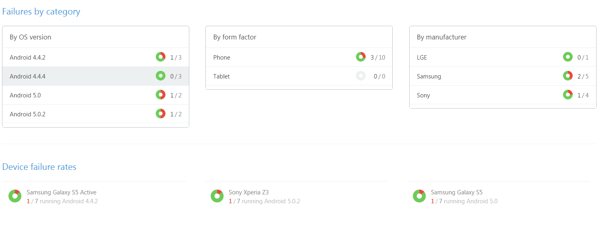 <br> -   Scroll down | Understanding failures can be tricky for developers and testers. Xamarin Test Cloud eliminates this issue by providing screen capture for every action on each device individually so teams can get important information including device logs, test logs.<br> Here I am looking at one of my failed test runs and I can see the failures by OS version, form factor and by manufacturer. I can see we have trouble with Android 4.4.4 and 5.0.1. Let’s dig deeper … |
| 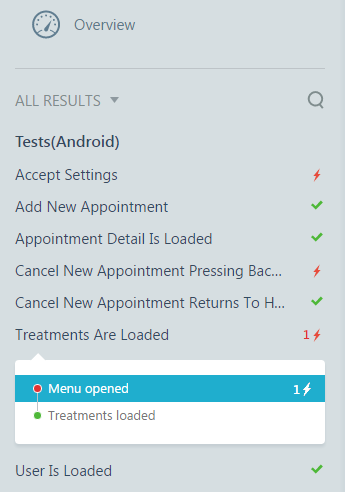 <br> -   Click **Test Steps** &gt; test cases from the left side navigation  | I pick the test case that failed and I can see which step has failed. Let me zoom into the device … |
| 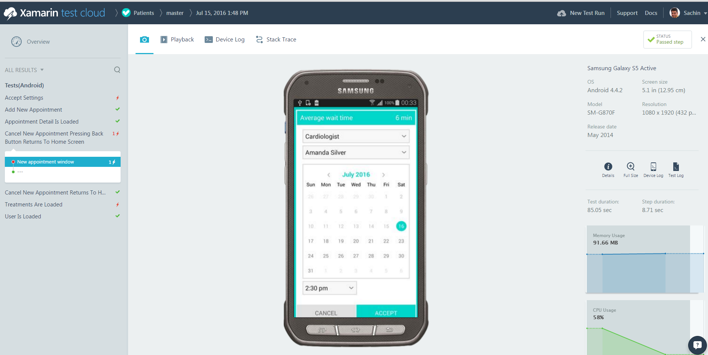 <br>-   Highlight the screen, click **playback** button | I can navigate through the test case and watch the screenshots and even watch the video captured for every action as if I have the device right in front of me. The green ticks indicate that the steps executed fine. I can also see CPU and memory usage on the device that can help me understand the performance of my application.|
| | -   Select the failed step | Here is the step that failed.| 
| 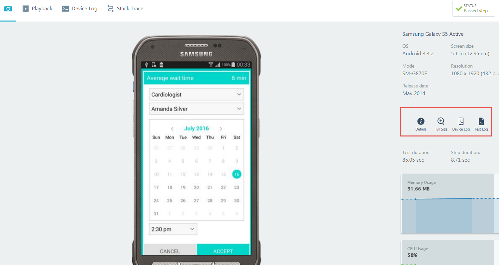<br>-   Select one of the devices that the test failed on | With XTC I can get a complete information on the device including <br> 1.  The specification of the device <br> 2.  The entire device log showing what actually happened on the device   <br> 3.  The stack trace on the test failure  |
| 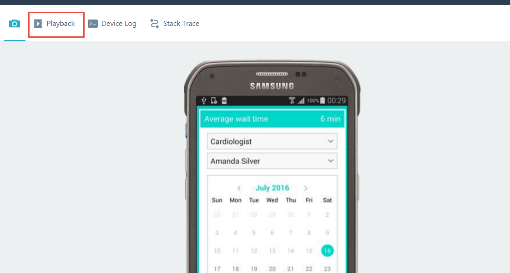<br> I can also download and watch the entire video recording for my test run by selecting the raw video link. <br> The rich set of information from XTC helps developers understand causes of failures and fix them quickly. Once issues are fixed and it’s time for release, you can use the Hockey App task to automatically publish the version to Hockey App and make it available to beta testers.   |
| | -   Open Hockey App Portal and choose the **Patient App**   |   
| 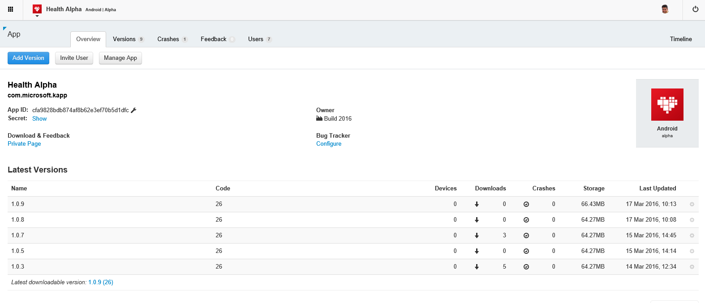| HockeyApp has recently released basic user metrics including Devices, users, sessions, etc.<br>With these metrics developers can understand adoption of the app and basic user engagement (through session count).  <br> We are releasing custom events as part of a Preview which will allow developers track specific user actions and better understand user behavior. <br> Also, Hockey App will provide “impacted users per crash group” information, which will allow teams to see how many users a crash has impacted in the last 30 days and to understand the impact of crashes.  |
| 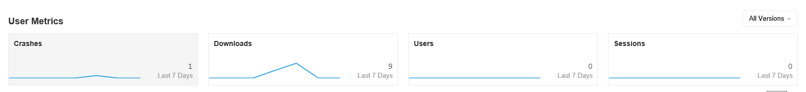 | -   Show User Metrics  |            
| 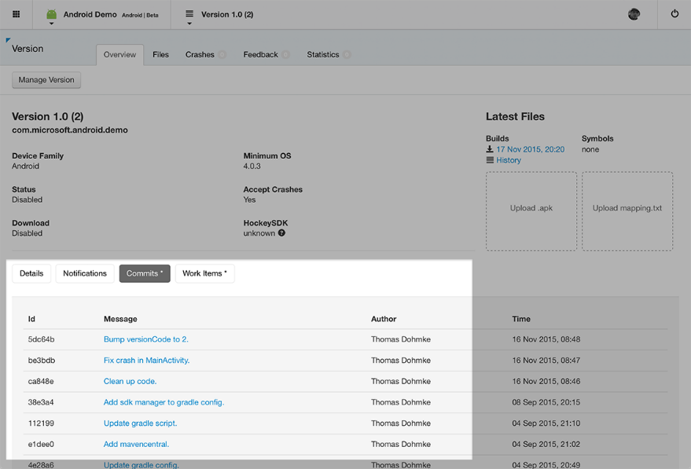 | Closing the loop, HockeyApp can automatically create work items for a new crash group or feedback thread in VSTS and keep the status in sync.   |


[Back to Mobile Scenarios](../../readme.md)