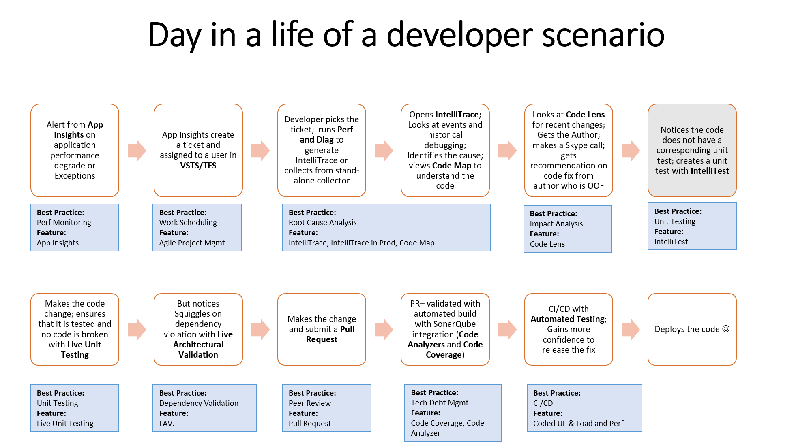

# Visual Studio Enterprise Productivity Scenario Demo

## Index of Scenarios
|Title|Description|Link|
|-----|-----------|----|
|Visual Studio Enterprise|Value Propistion of Visual Studio Enterprise Positioning Visual Studio as the DevOps SKU for Enterprise .NET Developers|[Link to Scenario](#vsentoverview)|
|

## Visual Studio Enterprise Overview
**Description**  
With Visual Studio Enterprise, .NET developers get the tools and services for all phases of the end-to-end DevOps lifecycle out of the box. For mobile developers, looking to meet the highest quality standards, VSE provides exclusive mobile-specific quality assurance tools that not only significantly speed up the developer inner loop but also enables effortless testing on thousands of real mobile devices, crash analytics, app distribution to beta testers, and user feedback collection.

In a DevOps world where continuous testing is the new normal, Visual Studio Enterprise enables teams to plan, execute and monitor the entire testing effort continuously with a full range of integrated testing tools, including test management, exploratory testing, performance testing, automated UI testing, and more. .NET teams embracing DevOps at scale or in complex environments can now benefit from learnings that Microsoft has productized and put as features into VSE exclusively. VSE unlocks massive productivity and quality gains and provides a complete end-to-end DevOps solution. With VSE, .NET teams of any size can leverage advanced tools and services to design, build, deploy and manage complex solutions, modern applications and services for Android, iOS, Windows, web, cloud and desktop.

Visual Studio Enterprise is a fully complete tool chainset for enterprise .NET developers; For just $9 a day, it comes packed with    
- **Plan and Manage:** Full ALM capabilities, including Project and Protfolio Management, Work Item Management, Version Control, Test Management, Package Management, Release Management, etc.,
- **Develop:** A fully integrated IDE that simplifies to encourage developers to adopt best practices for delivering quality software faster whether they are building Cloud, Mobile, Web or Desktop applications
- **Test:** Subscription benefits that allows teams to test their applications on MS Platform with no additional cost
- **Continuous Learning and Innovation:** Business needs Continuous Innovation and Developers are at the centre of Innovation. Helping developers to stay on top of current technologies such as Microservices, Docker, NoSQL, Big Data, Machine Learning, etc with partner offerings such as [PluralSight]() and [Wintellect]()
- **Cloud Infrastructure:** - When Developers learn new technologies, they need a infrastructure to practice and experiment; It is impossible for organizations to provide the infrastructure; With **$150 per month per developer** Azure benefits, Visual Studio Enterprise makes this a reality
- **Other benefits:**  - A lot more benefits for developers and development teams

**Sales Assets:**   
- Visual Studio Enterprise [Pitch Deck]()
- Day in the life of a developer scenario - [Demo Script]()
- [Demo mate]() for the VSE demo
- Visual Studio [ROI calculator]() - help customers understand the return on investements with VSE
- [Compete Battlecards]() -  when you get into a compete sitiuation

[Back to Index](#index)

----------

## Pre-Requisite
- Visual Studio 2017 (download [here](https://www.visualstudio.com/vs/visual-studio-2017-rc/))
- Download the Parts Unlimited project [here](https://github.com/Microsoft/PartsUnlimited/tree/aspnet45)

