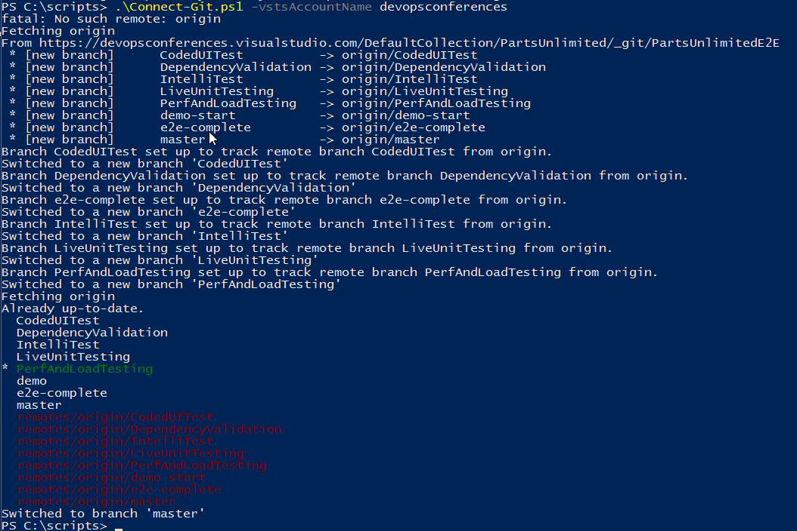
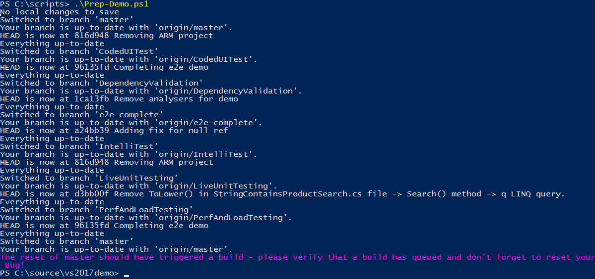

# Visual Studio 2017 Sales Enablement


### Prerequisites
    - An Azure subscription
    - AzureRM PowerShell - ***Make sure you have the latest version***
    - A VSTS project (TODO: get this detail from Sachin?)
    - Create a PAT for the VSTS project

Make sure that you have copied all the files in the folder .   
Start PowerShell as Administrator and run the following command to install Azure PowerShell

```
Install-Module AzureRM -Force
```

## Visual Studio Team Services

For VSTS, you can either 
- Use the **[devopsconferences](https://devopsconferences.visualstudio.com/partsunlimited)** account but you will have only read-only access to the project. 
- Choose to provision the project to your own VSTS account with **[VSTS Demo Data Generator](http://vstsdemogenerator.azurewebsites.net/Account/Verify?template=PartsUnlimited)**. 


## Creating a Demo VM in Azure

Run the following script to create the demo VM in Azure:

```
Create-DemoVM.ps1 -ResourceGroupName {rgName} -Location {azureLocation} -GloballyUniqueVMName {vmName} -GloballyUniqueStorageAccName {storageName} -VMSize {vmSize}
```

| Variable | Value |
|---|---|
| _{rgName}_ | the name of the resource group you want to create |
| _{azureLocation}_ | an Azure location (such as 'West US') |
| _{vmName}_ | the (globally unique) name for your VM |
| _{storageName}_  | the (globally unique) name for a storage account |
| _{vmSize}_ | the Azure VM size you want your VM to be (`Standard_D2_V2` recommended) |

The script will do the following:
1. Create a resource group
2. Create a storage account in the resource group
3. Copy the "golden vhd" to your storage account (this may take a few minutes)
4. Create a VM based on the vhd

Note:
1. The VM can be accessed at `{vnName}.{location}.cloudapp.azure.com`
1. The VM exposes the RDP port (for remote desktop) as well as port 80 for the website
1. The admin username is `vsts` and the password is `P@ssw0rdDemo`

If you wish to change the password, you must also change the password for the identity of the `DefaultAppPool` in IIS on the VM.

## Once off Preparation
Once you have created the VM, you need to connect it to your VSTS account.

You require a PAT for the rest of the tasks. Log in to your VSTS project and obtain a PAT.

RDP to the VM and open a PowerShell prompt.

<!--
### Connect the agent
The agent will run builds and deploy the site to the local IIS. The following commands will connect it to your VSTS to the e2evm queue (build and release are currently configured to run off this queue). The agent will be configured to run as a service. Before you run this command you must create an Agent Pool named e2evm in VSTS.

Run the following commands:
```
    cd \agent
    .\config.cmd --url https://{youraccount}.visualstudio.com --pool e2evm --agent VSE2017 --replace --unattended --runasservice --acceptteeeula --token {PAT}
```

| Variable | Value |
|---|---|
| _{youraccount}_ | your VSTS account name |
| _{pat}_ | your PAT |
-->

### Connect the Git Repo using the `Connect-Git.ps1` script
The Git repo has all the source code you need for the demos.

Copy the `Connect-Git.ps1` script in this folder to `c:\scripts` on the VM (overwrite the existing file to make sure you have the latest version).

Run the following command in the PowerShell console:
```
    cd \scripts
    .\Connect-Git.ps1 -VSTSAccountName {youraccount} -VSTSRepoName {yourRepoName}
```

| Variable | Value |
|---|---|
| _{youraccount}_ | your VSTS account name |
| _{yourProjectName}_ | the name of the VSTS project you created in the [VSTS Demo Generator](http://vstsdemogenerator.azurewebsites.net/Account/Verify?ReturnUrl=%2f)|



_Connecting the Git repo for the first time_

## Preparing for a Demo
To reset the code and website to the beginning of the demo, you need to undo and changes to code (including any you pushed) and run a build/release of the "broken" code.

To do this, run the following command in a PowerShell console:

```
cd \scripts
.\Prep-Demo.ps1
```


_Running the prep script to reset the Git repo and website_

You should also delete the bug you used in your demo and create a new bug with the same description as the bug from the demo (Bug 1065). Place the new Bug into the Develop column, Expedite swimlane on the Backlog board.
