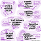
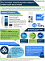

# Visual Studio 2017 Sales Enablement

## There is no ***Innovation without Developers*** and ;  There is no ***Business without Innovation***

This is the repository for Visual Studio 2017 Sales and Partner Enablement Resource for sellers and technical professionals. You will find sales and technical resources that will enable you to sell Visual Studio Enterprise 2017.

Note that this is a ***Private*** repository accessible only by Microsoft employees. For partners who need access, please send an email to [SPEED](mailto:vsedemoama@microsoft.com) -  Sales and Partner Enablement on Enterprise and DevOps. Please do not share this with external customers.

We would like to keep this repository dynamic; updated with latest assets - We welcome your feedback and suggestions and more importantly your contributions. Please feel free to send your contributions via a Pull request.

## Feature Demos
These are individual feature demos targetted towards developers. Each demo explains the feature and the value prop of the feature in detail. 

Note - All of the VSE features demo are based on the Parts Unlimited application and the Xamarin demos on Acquaint

|Labs|Demo Script|Demo Video|Demo Mate| Other Reference Video
|----|-----------|----------|---------|----------------------|
|Live Unit Testing|[Demo Script](Feature Demos/Live%20Unit%20Testing)|[Demo Video](https://microsoft.sharepoint.com/teams/DevOpsMarketing55/_layouts/15/guestaccess.aspx?guestaccesstoken=3FUNlw6hgZiQaPLYBmrLO+J9md3SZleHuyZUHqIifUQ=&docid=2_05b1302d8aa2c45e098f5fdb39c2982a7&rev=1)|[Demo Mate](https://microsoft.sharepoint.com/sites/infopedia/pages/layouts/KCDoc.aspx?k=G01KC-1-22055)|[Ref Video](https://channel9.msdn.com/Events/Connect/2016/171)|    
|Live Dependency Validation|[Demo Script](Feature Demos/Architecture%20Validation)|[Demo Video](https://microsoft.sharepoint.com/teams/DevOpsMarketing55/_layouts/15/guestaccess.aspx?guestaccesstoken=McKL4ZwrzKxTa7va+n7mSSpscDoXuHRN4fo92ITkMl4=&docid=2_0159bc67bdb004b158d3132972826ebe5&rev=1)|[Demo Mate](https://microsoft.sharepoint.com/sites/infopedia/pages/layouts/KCDoc.aspx?k=G01KC-1-22052)|[Ref Video](https://channel9.msdn.com/Events/Connect/2016/170)|    
|Coded UI|[Demo Script](Feature Demos/Coded UI Testing/)|[Demo Video](https://microsoft.sharepoint.com/teams/DevOpsMarketing55/_layouts/15/guestaccess.aspx?guestaccesstoken=rUMUavUZ/oP4tEl6bqk9vcrjpXcECbJWLHd6Lum67w4=&docid=2_0fbe35cc2ec334a3d8f15446f263c22b4&rev=1)|[Demo Mate](https://microsoft.sharepoint.com/sites/infopedia/pages/layouts/KCDoc.aspx?k=G01KC-1-22051)|[Ref Video](https://www.youtube.com/watch?v=TKgsMDiPWOs)|
|Load and Performance Testing|[Demo Script](Feature Demos/Load%20Testing/)|[Demo Video](https://microsoft.sharepoint.com/teams/DevOpsMarketing55/_layouts/15/guestaccess.aspx?guestaccesstoken=eFE+sdK5sVL3TlyfJqLMzAES0dfAaGtGhAmMVyzWtG8=&docid=2_050fa52b601694a08b4bd5920e8aaf21e&rev=1)|[Demo Mate](https://microsoft.sharepoint.com/sites/infopedia/pages/layouts/KCDoc.aspx?k=G01KC-1-22056)|[Ref Video](https://channel9.msdn.com/Series/Test-Tools-in-Visual-Studio/Cloud-Loading-Testing-in-Visual-Studio-Team-Services)|     
|IntelliTrace|[Demo Script](Feature Demos/IntelliTrace/)|[Demo Video](https://microsoft.sharepoint.com/teams/DevOpsMarketing55/_layouts/15/guestaccess.aspx?guestaccesstoken=OMIvhPWPci6Y9JlddXw9UpDnpLpTqPwTIPptxUfQEfI=&docid=2_0e82ab991b4064113ab915da0c0abe91f&rev=1)|[Demo Mate](https://microsoft.sharepoint.com/sites/infopedia/pages/layouts/KCDoc.aspx?k=G01KC-1-22054)|[Ref Video](https://www.youtube.com/watch?v=r2lIpuTowPg&t=2s)|     
|IntelliTest|[Demo Script](Feature Demos/IntelliTest/)|[Demo Video](https://microsoft.sharepoint.com/teams/DevOpsMarketing55/_layouts/15/guestaccess.aspx?guestaccesstoken=OxhyUkcNTs00ZnDxJolrDoF95yGLTWQ7QG/mEP+euzE=&docid=2_068c3ca61ba1d4251a7da4079d39a7ff9&rev=1)|[Demo Mate](https://microsoft.sharepoint.com/sites/infopedia/pages/layouts/KCDoc.aspx?k=G01KC-1-22053)|[Ref Video](https://channel9.msdn.com/Shows/Visual-Studio-Toolbox/Intellitest)|     
|Xamarin Profiler|[Demo Script](Feature Demos/Xamarin Profiler/)|[Demo Video](https://channel9.msdn.com/Events/Connect/2016/113)|TBA|[Ref Video](https://channel9.msdn.com/Events/Connect/2016/113)|         
|\*Xamarin Inspector|[Demo Script](Feature Demos/Xamarin Inspector/)|[Demo Video](https://channel9.msdn.com/Events/Connect/2016/113)|TBA|[Ref Video](https://channel9.msdn.com/Events/Connect/2016/113)|     
|\* Xamarin Test Recorder|[Demo Script](Feature Demos/Xamarin Test Recorder/)|[Demo Video](https://channel9.msdn.com/Events/Connect/2016/103)|TBA|TBA|    
|Xamarin Hidden Assemblies|[Demo Script](Feature Demos/Xamarin Assemblies/)|[Demo Video]()|TBA|TBA|   
|Redgate ReadyRoll|[Demo Script](Feature Demos/ReadyRoll/)|[Demo Video](https://microsoft.sharepoint.com/teams/DevOpsMarketing55/_layouts/15/guestaccess.aspx?guestaccesstoken=rx6lrtNvzKU/soinOG9Yat7P4YIgP6TEMcFNurqQ/9I=&docid=2_0c629ac63846640809feb68b8bc928ac7&rev=1)|[Demo Mate](https://microsoft.sharepoint.com/sites/infopedia/pages/layouts/KCDoc.aspx?k=G01KC-1-21904)|[Ref Video](https://youtu.be/KLPSXCB3iUo)|      
|Redgate SQL Prompt|[Demo Script](Feature Demos/SQLPrompt/)|[Demo Video](https://microsoft.sharepoint.com/teams/DevOpsMarketing55/_layouts/15/guestaccess.aspx?guestaccesstoken=lmCIWmoUGN4BBhwqwwmFeenCy1soOuYFMxdF6esU5pE=&docid=2_0661115f861ac4768a8166d6f37bca398&rev=1)|[Demo Mate](https://microsoft.sharepoint.com/sites/infopedia/pages/layouts/KCDoc.aspx?k=G01KC-1-21906)|[Ref Video](https://youtu.be/fQw8Uk61eF4 )|     

><cite>*\* Note that* ***Xamarin Inspector*** *is Alpha-mode Only* and ***Xamarin Test Recorder*** *is still not available in VS 2017*</cite>

## App Innovation and Productivity - Scenario Demos
These are scenario demos and are targeted towards IT Decision Makers. The objectives of the scenario demos are     
- **Targeted at ITDMs:** to position VSE as the SKU for enterprise .NET developers and get them to drive their teams to adopt the best practices   
- **Be more prescriptive:** covering DevOps aspects – increasing inner loop, continuous integration and testing, performance monitoring, etc.,

|Labs|Scenario|Links|
|----|--------|-----|
|Developer Productivity|**Day in the life of developer** Scenario showing VS productivity features|[Demo Assets Page](Scenario Demos/VSE Productivity/DayInTheLife)|
|DevOps|DevOps Scenarios with VSTS/TFS and Azure|[Demo Assets Page](Scenario Demos/DevOps/)|
|Mobile Scenario |Mobile Application Development Scenarios|[Demo Assets Page](Scenario Demos/Mobile/)|
|Modern Applications|Building Modern Intelligent Cloud-Powered Applications |[Demo Assets Page](Scenario Demos/Modern Apps)|

## Demo Resources 
<table width="100%">
<tr>
<td align="center" valign="bottom">
 <a href="http://aka.ms/almvm">  <b>ALM Virtual Machine</b></a>
</td>
<td align="center" valign="bottom">
<a href="https://github.com/nwcadence/java-dev-vsts/">   <b>Java Virtual Machine</b></a>
</td>
<td align="center" valign="bottom">
<a href="http://vstsdemogenerator.azurewebsites.net/">   <b>VSTS Demo Generator</b></a>
</td>
<td align="center" valign="bottom">
<a href="http://vstsdemos.visualstudio.com/">   <b>VSTS Demos Account</b></a>
</td>
</tr>
</table>

## Sales Resources 
<table width="100%">
<tr>
<td align="center" valign="bottom">
<a href="https://devopsassessment.azurewebsites.net/">   <b>DevOps Self Assessment</b></a>
</td>
<td align="center" valign="bottom">
<a href="https://aka.ms/devopstei">   <b>Forrester DevOps TEI Tool</b></a>
</td>
<td align="center" valign="bottom">
<a href="http://vstsdemogenerator.azurewebsites.net/">   <b>ROI Calculator</b></a>
</td>
</tr>
</table>
